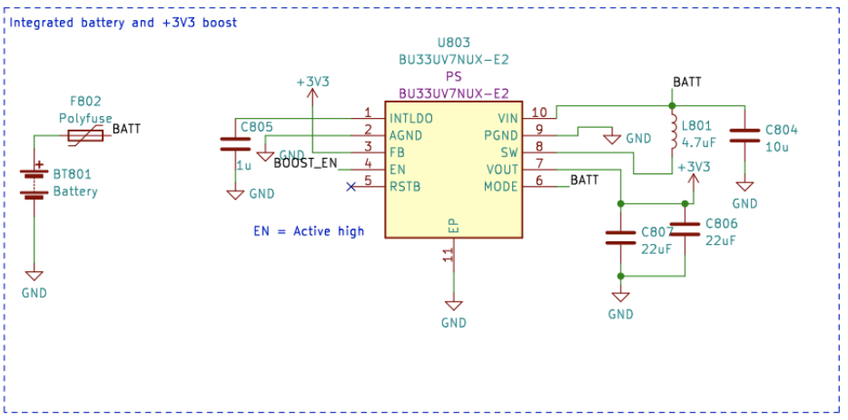

# Gestion de l'alimentation électrique

Cet article explique comment allumer la carte CanSat NeXT, comment connecter en toute sécurité des appareils externes à la carte, et enfin comment fonctionne le système d'alimentation.

## Commencer

Pour la plupart des utilisateurs, il suffit généralement d'ajouter deux piles AAA au support de piles intégré et de les fixer en place. Lorsque l'USB est connecté, CanSat NeXT passe automatiquement à l'alimentation USB au lieu des piles, afin de prolonger la durée de vie des piles. N'oubliez pas de passer à des piles neuves avant un vol.

## Système d'alimentation de CanSat NeXT

Il existe trois façons d'alimenter le CanSat NeXT. La méthode par défaut est de l'alimenter via USB, de sorte que lorsque l'utilisateur développe le logiciel, le PC alimente l'appareil et aucune alimentation externe n'est requise. La deuxième méthode consiste à utiliser les piles intégrées (OBB). Cela se fait en insérant deux piles AAA standard de 1,5 V dans le connecteur de piles situé sur le dessous de la carte principale. L'USB reste la méthode par défaut même si des piles sont insérées, c'est-à-dire que la capacité des piles n'est pas utilisée lorsque l'USB est branché.

Ce sont les options habituelles, et elles devraient couvrir la plupart des cas d'utilisation. Cependant, il existe également deux options "avancées" pour alimenter CanSat NeXT si nécessaire pour un usage spécial. Tout d'abord, la carte dispose de connecteurs traversants vides étiquetés EXT, qui peuvent être utilisés pour connecter une batterie externe. La tension de la batterie peut être de 3,2-6V. La ligne EXT est automatiquement déconnectée lorsque l'USB n'est pas présent pour prolonger la durée de vie de la batterie et protéger la batterie. Il existe une fonction de sécurité qui désactive l'OBB si une batterie est connectée, mais l'OBB ne doit toujours pas être présent lorsque des batteries externes sont utilisées.

Il existe également une dernière option qui donne toute la responsabilité à l'utilisateur, et c'est d'entrer 3V3 dans l'appareil via l'interface d'extension. Ce n'est pas une méthode sûre pour alimenter l'appareil, mais les utilisateurs avancés qui savent ce qu'ils font pourraient trouver cela le moyen le plus simple d'obtenir les fonctionnalités souhaitées.

En résumé, il existe trois façons sûres d'alimenter CanSat NeXT :

1. Utilisation de l'USB - méthode principale utilisée pour le développement
2. Utilisation des piles intégrées - méthode recommandée pour le vol
3. Utilisation d'une batterie externe - Pour les utilisateurs avancés

En utilisant des piles AAA ordinaires, une autonomie de 4 heures a été atteinte à température ambiante, et de 50 minutes à -40 degrés Celsius. Pendant le test, l'appareil lisait tous les capteurs et transmettait leurs données 10 fois par seconde. Il convient de noter que les piles alcalines ordinaires ne sont pas conçues pour fonctionner à de si basses températures, et elles commencent généralement à fuir du potassium après ce genre de tests de torture. Ce n'est pas dangereux, mais les piles alcalines doivent toujours être éliminées en toute sécurité par la suite, surtout si elles ont été utilisées dans un environnement inhabituel tel qu'un froid extrême, ou après avoir été larguées d'une fusée. Ou les deux.

Lors de l'utilisation de l'USB, la consommation de courant des broches d'extension ne doit pas dépasser 300 mA. Les OBB sont légèrement plus indulgents, fournissant au maximum 800 mA à partir des broches d'extension. Si plus de puissance est requise, une batterie externe devrait être envisagée. Cela n'est probablement pas le cas à moins que vous ne fassiez fonctionner des moteurs (les petits servos sont acceptables) ou des chauffages, par exemple. Les petites caméras, etc. sont toujours acceptables.

## Extra - comment fonctionne le schéma d'alimentation multi-source adaptatif

Pour atteindre les fonctionnalités souhaitées en toute sécurité, nous devons prendre en compte de nombreux éléments dans la conception du système d'alimentation. Tout d'abord, pour pouvoir connecter en toute sécurité l'USB, l'EXT et l'OBB en même temps, le système d'alimentation doit activer et désactiver les différentes sources d'alimentation. Cela est encore compliqué par le fait que cela ne peut pas être fait par logiciel, car l'utilisateur doit pouvoir avoir le logiciel qu'il souhaite sans compromettre la sécurité des opérations. De plus, l'OBB a une plage de tension assez différente de celle de l'USB et de la batterie externe. Cela nécessite que l'OBB utilise un régulateur de suralimentation, tandis que l'USB et l'EXT nécessitent soit un régulateur abaisseur, soit un LDO. Pour des raisons de simplicité et de fiabilité, un LDO est utilisé dans cette ligne. Enfin, un interrupteur d'alimentation devrait pouvoir déconnecter toutes les sources d'alimentation.

Ci-dessous se trouve le schéma du convertisseur boost. Le CI est le BU33UV7NUX, un convertisseur boost spécialement conçu pour fournir +3,3V à partir de deux piles alcalines. Il est activé lorsque la ligne BOOST_EN est haute, ou au-dessus de 0,6 V.

Toutes les lignes OBB, USB et EXT sont protégées par un fusible, une protection contre les surintensités, une protection contre les tensions inverses et les courants inverses, et une protection contre les surchauffes. De plus, l'OBB est protégé par un verrouillage de sous-tension et une protection contre les courts-circuits, car ces situations doivent être évitées avec des piles alcalines.

Notez dans la section suivante que la tension de la batterie externe est V_EXT, la tension USB est VBUS et la tension OBB est BATT.

La ligne BOOST_EN est contrôlée par un circuit de commutation, qui prend soit l'entrée de la ligne EN_MASTER (EN_M), soit l'ignore si V_EXT ou VBUS est présent. Cela est fait pour s'assurer que le boost est toujours désactivé lorsque VBUS et V_EXT sont présents, et il n'est activé que si VBUS et V_EXT sont à 0V et que l'EN_M est haut.

Ou sous forme de table de vérité :

| V_EXT | VBUS | EN_M | BOOST_EN |
|-------|------|------|----------|
| 1     | 1    | 1    | 0        |
| 1     | 1    | 0    | 0        |
| 0     | 0    | 0    | 0        |
| 0     | 0    | 1    | 1        |

Donc BOOST_EN = EN_M ∧ !(V_EXT ∨ V_BUS).

Ensuite, nous devons déconnecter V_EXT si VBUS est présent pour éviter une décharge indésirable ou une charge accidentelle. Cela se fait à l'aide d'un CI de commutation d'alimentation avec l'aide d'un circuit de transistor qui abaisse la ligne d'activation de l'interrupteur d'alimentation si VBUS est présent. Cela déconnecte la batterie. La ligne USB est toujours utilisée lorsqu'elle est présente, elle est donc acheminée vers le LDO avec une simple diode Schottky.

Dans l'ensemble, ce circuit conduit à une fonctionnalité où l'alimentation USB est utilisée si elle est présente, et V_EXT est utilisée lorsque l'USB n'est pas présent. Enfin, l'EN_M est utilisé pour activer ou désactiver le LDO.

L'EN_M est contrôlé par l'utilisateur via un interrupteur d'alimentation. L'interrupteur connecte EN_M soit à l'USB, soit à EXT, soit à la tension de la batterie lorsque seul l'OBB est utilisé. Lorsque l'interrupteur est éteint, il connecte EN_M à la masse, désactivant à la fois le LDO et le régulateur de suralimentation.

Donc, en pratique, l'interrupteur d'alimentation allume/éteint l'appareil, l'USB est utilisé s'il est présent, et V_EXT est préféré à l'OBB. Enfin, il y a un dernier détail à considérer. Quelle tension l'ESP32 doit-elle mesurer comme tension de la batterie ?

Cela a été résolu de manière simple. La tension connectée à l'ADC de l'ESP32 est toujours l'OBB, mais l'utilisateur peut sélectionner V_EXT à la place en coupant le cavalier avec un scalpel et en soudant le cavalier JP801 pour court-circuiter 2-3 à la place. Cela sélectionne V_EXT pour le BATT_MEAS à la place.

Le cavalier se trouve sur le dessous de la carte principale de CanSat NeXT. Le cavalier est assez facile à souder, alors n'ayez pas peur de couper la ligne 1-2 si vous utilisez une batterie externe. Il peut toujours être ressoudé pour à nouveau utiliser 1-2 à la place.