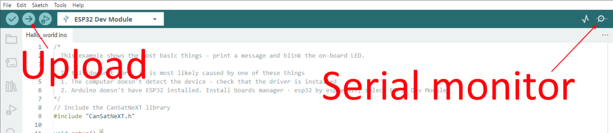

# Leçon 1 : Bonjour le monde !

Cette première leçon vous permet de commencer avec CanSat NeXT en vous montrant comment écrire et exécuter votre premier programme sur la carte.

Après cette leçon, vous aurez les outils nécessaires pour commencer à développer des logiciels pour votre CanSat.

## Installation des outils

Il est recommandé d'utiliser CanSat NeXT avec l'IDE Arduino, alors commençons par installer cela ainsi que les bibliothèques et cartes nécessaires.

### Installer l'IDE Arduino

Si ce n'est pas déjà fait, téléchargez et installez l'IDE Arduino depuis le site officiel https://www.arduino.cc/en/software.

### Ajouter le support ESP32

CanSat NeXT est basé sur le microcontrôleur ESP32, qui n'est pas inclus dans l'installation par défaut de l'IDE Arduino. Si vous n'avez pas encore utilisé de microcontrôleurs ESP32 avec Arduino, le support pour la carte doit d'abord être installé. Cela peut être fait dans l'IDE Arduino depuis *Outils->carte->Gestionnaire de cartes* (ou appuyez simplement sur (Ctrl+Shift+B) n'importe où). Dans le gestionnaire de cartes, recherchez ESP32 et installez l'esp32 par Espressif.

### Installer la bibliothèque CanSat NeXT

La bibliothèque CanSat NeXT peut être téléchargée depuis le Gestionnaire de Bibliothèques de l'IDE Arduino depuis *Croquis > Inclure des bibliothèques > Gérer les bibliothèques*.


*Source de l'image : Arduino Docs, https://docs.arduino.cc/software/ide-v1/tutorials/installing-libraries*

Dans la barre de recherche du Gestionnaire de Bibliothèques, tapez "CanSatNeXT" et choisissez "Installer". Si l'IDE vous demande si vous souhaitez également installer les dépendances, cliquez sur oui.

## Connexion au PC

Après avoir installé la bibliothèque logicielle CanSat NeXT, vous pouvez brancher le CanSat NeXT à votre ordinateur. Dans le cas où il n'est pas détecté, vous devrez peut-être installer d'abord les pilotes nécessaires. L'installation des pilotes se fait automatiquement dans la plupart des cas, cependant, sur certains PC, elle doit être effectuée manuellement. Les pilotes peuvent être trouvés sur le site de Silicon Labs : https://www.silabs.com/developers/usb-to-uart-bridge-vcp-drivers
Pour une aide supplémentaire sur la configuration de l'ESP32, consultez le tutoriel suivant : https://docs.espressif.com/projects/esp-idf/en/latest/esp32/get-started/establish-serial-connection.html

## Exécution de votre premier programme

Maintenant, utilisons les bibliothèques fraîchement installées pour commencer à exécuter du code sur le CanSat NeXT. Comme le veut la tradition, commençons par faire clignoter la LED et écrire "Hello World!" à l'ordinateur.

### Sélection du bon port

Après avoir branché le CanSat NeXT à votre ordinateur (et allumé l'alimentation), vous devez sélectionner le bon port. Si vous ne savez pas lequel est le bon, débranchez simplement l'appareil et voyez quel port disparaît.


L'IDE Arduino vous demande maintenant le type d'appareil. Sélectionnez ESP32 Dev Module.


### Choisir un exemple

La bibliothèque CanSat NeXT propose plusieurs exemples de codes montrant comment utiliser les différentes fonctionnalités de la carte. Vous pouvez trouver ces croquis d'exemple dans Fichier -> Exemples -> CanSat NeXT. Choisissez "Hello_world".

Après avoir ouvert le nouveau croquis, vous pouvez le télécharger sur la carte en appuyant sur le bouton de téléchargement.



Après un moment, la LED sur la carte devrait commencer à clignoter. De plus, l'appareil envoie un message au PC. Vous pouvez voir cela en ouvrant le moniteur série et en choisissant le débit en bauds 115200.

Essayez également d'appuyer sur le bouton de la carte. Cela devrait réinitialiser le processeur, ou en d'autres termes, redémarrer le code depuis le début.

### Explication de Hello World

Voyons ce qui se passe réellement dans ce code en le parcourant ligne par ligne. Tout d'abord, le code commence par **inclure** la bibliothèque CanSat. Cette ligne doit être au début de presque tous les programmes écrits pour CanSat NeXT, car elle indique au compilateur que nous voulons utiliser les fonctionnalités de la bibliothèque CanSat NeXT.

```Cpp title="Inclure CanSat NeXT"
#include "CanSatNeXT.h"
```
Après cela, le code passe à la fonction setup. Là, nous avons deux appels - d'abord, serial est l'interface que nous utilisons pour envoyer des messages au PC via USB. Le nombre à l'intérieur de l'appel de fonction, 115200, fait référence au débit en bauds, c'est-à-dire combien de uns et de zéros sont envoyés chaque seconde. L'appel suivant, `CanSatInit()`, provient de la bibliothèque CanSat NeXT et il initialise tous les capteurs et autres fonctionnalités embarqués. Semblable à la commande `#include`, cela se trouve généralement dans les croquis pour CanSat NeXT. Tout ce que vous souhaitez exécuter une seule fois au démarrage doit être inclus dans la fonction setup.

```Cpp title="Setup"
void setup() {
  // Démarrer la ligne série pour imprimer des données sur le terminal
  Serial.begin(115200);
  // Démarrer tous les systèmes embarqués de CanSatNeXT.
  CanSatInit();
}
```

Après le setup, le code commence à répéter la fonction loop indéfiniment. Tout d'abord, le programme écrit la broche de sortie LED pour être haute, c'est-à-dire avoir une tension de 3,3 volts. Cela allume la LED embarquée. Après 100 millisecondes, la tension sur cette broche de sortie est ramenée à zéro. Maintenant, le programme attend 400 ms, puis envoie un message au PC. Après que le message est envoyé, la fonction loop recommence depuis le début.

```Cpp title="Loop"
void loop() {
  // Faisons clignoter la LED
  digitalWrite(LED, HIGH);
  delay(100);
  digitalWrite(LED, LOW);
  delay(400);
  Serial.println("Ceci est un message !");
}
```

Vous pouvez également essayer de changer les valeurs de délai ou le message pour voir ce qui se passe. Félicitations pour être arrivé jusqu'ici ! La configuration des outils peut être délicate, mais cela devrait devenir plus amusant à partir de maintenant.

---

Dans la prochaine leçon, nous commencerons à lire les données des capteurs embarqués.

[Cliquez ici pour la deuxième leçon !](./lesson2)