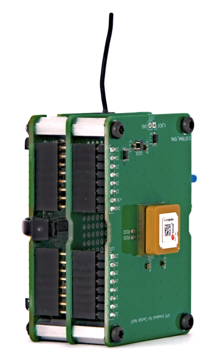

# CanSat NeXT GNSS Modul

A CanSat NeXT GNSS modul kiterjeszti a CanSat NeXT-et helymeghatározási és pontos valós idejű óra képességekkel. A modul az U-Blox SAM-M10Q GNSS vevőn alapul, amelyet az U-Blox gyárt.

## Hardver

A modul a GNSS vevőt a CanSat NeXT-hez csatlakoztatja az UART-on keresztül a kiterjesztési fejlécben. Az eszköz a kiterjesztési fejléc 16 és 17-es lábait használja az UART RX és TX számára, és a tápellátást is a +3V3 vonalról veszi a kiterjesztési fejlécben.

Alapértelmezés szerint a GNSS modul tartalék regiszterei a +3V3 vonalról kapják az áramot. Bár ez megkönnyíti a modul használatát, azt is jelenti, hogy a modulnak mindig újra kell kezdenie, amikor megpróbál fixet találni. Ennek enyhítésére lehetőség van külső áramforrás biztosítására a tartalék feszültségvonalon keresztül a J103 fejlécen keresztül. A V_BCK lábra adott feszültségnek 2-6,5 volt között kell lennie, és az áramfelvétel állandó 65 mikroamper, még akkor is, ha a fő áramellátás ki van kapcsolva. A tartalék feszültség biztosítása lehetővé teszi a GNSS vevő számára, hogy megőrizze az összes beállítást, de ami még fontosabb, az almanach és az efemerisz adatokat is - csökkentve a fix megszerzésének idejét ~30 másodpercről 1-2 másodpercre, ha az eszköz nem mozdult jelentősen az áramkapcsolások között.

Számos más GNSS breakout és modul elérhető olyan cégektől, mint a Sparkfun és az Adafruit, többek között. Ezek csatlakoztathatók a CanSat NeXT-hez ugyanazon az UART interfészen keresztül, vagy SPI és I2C használatával, a modultól függően. A CanSat NeXT könyvtárnak támogatnia kell más breakouteket is, amelyek U-blox modulokat használnak. Amikor GNSS breakouteket keres, próbáljon meg olyat találni, ahol az alap PCB a lehető legnagyobb - a legtöbb túl kicsi PCB-vel rendelkezik, ami miatt az antennateljesítményük nagyon gyenge a nagyobb PCB-vel rendelkező modulokhoz képest. Bármilyen méret, amely kisebb, mint 50x50 mm, elkezdi akadályozni a teljesítményt és a fix megtalálásának és fenntartásának képességét.

További információkért a GNSS modulról és a rendelkezésre álló számos beállításról és funkcióról, tekintse meg a GNSS vevő adatlapját az [U-Blox weboldalán](https://www.u-blox.com/en/product/sam-m10q-module).

A modul hardveres integrációja a CanSat NeXT-hez nagyon egyszerű - miután távtartókat helyezett a csavarhelyekre, óvatosan helyezze be a fejléc lábait a láb foglalatokba. Ha több rétegű elektronikai halmot kíván készíteni, győződjön meg róla, hogy a GNSS-t a legfelső modulnak helyezi el, hogy lehetővé tegye 

## Szoftver

A legegyszerűbb módja a CanSat NeXT GNSS használatának megkezdéséhez a saját Arduino könyvtárunk, amelyet megtalálhat az Arduino könyvtárkezelőben. A könyvtár telepítésére vonatkozó utasításokért tekintse meg a [kezdő lépések](./../course/lesson1) oldalt.

A könyvtár tartalmaz példákat arra, hogyan lehet olvasni a pozíciót és az aktuális időt, valamint hogyan lehet továbbítani az adatokat a CanSat NeXT-tel.

Egy gyors megjegyzés a beállításokról - a modulnak meg kell mondani, hogy milyen környezetben fogják használni, hogy a lehető legjobban meg tudja közelíteni a felhasználó pozícióját. Általában az a feltételezés, hogy a felhasználó a talajszinten lesz, és bár mozoghat, a gyorsulás valószínűleg nem túl magas. Ez természetesen nem igaz a CanSat-ek esetében, amelyek rakétákkal indíthatók, vagy meglehetősen nagy sebességgel érhetik el a talajt. Ezért a könyvtár alapértelmezés szerint a pozíciót úgy számítja ki, hogy feltételezi a nagy dinamikus környezetet, ami lehetővé teszi a fix fenntartását legalább részben a gyors gyorsulás során, de a pozíciót a talajon jelentősen kevésbé pontosá teszi. Ha ehelyett a nagy pontosság a leszállás után kívánatosabb, inicializálhatja a GNSS modult a `GNSS_init(DYNAMIC_MODEL_GROUND)` paranccsal, helyettesítve az alapértelmezett `GNSS_init(DYNAMIC_MODEL_ROCKET)` = `GNSS_init()`-t. Ezenkívül létezik `DYNAMIC_MODEL_AIRBORNE`, amely kissé pontosabb, mint a rakéta modell, de csak mérsékelt gyorsulást feltételez.

Ez a könyvtár az egyszerű használatot helyezi előtérbe, és csak alapvető funkciókat tartalmaz, mint például a hely és az idő megszerzése a GNSS-ből. Azoknak a felhasználóknak, akik fejlettebb GNSS funkciókat keresnek, a kiváló SparkFun_u-blox_GNSS_Arduino_Library jobb választás lehet.

## Könyvtár specifikáció

Itt vannak a CanSat GNSS könyvtár elérhető parancsai.

### GNSS_Init

| Funkció              | uint8_t GNSS_Init(uint8_t dynamic_model)                          |
|----------------------|--------------------------------------------------------------------|
| **Visszatérési típus** | `uint8_t`                                                          |
| **Visszatérési érték** | 1-et ad vissza, ha az inicializálás sikeres volt, vagy 0-t, ha hiba történt. |
| **Paraméterek**       |                                                                    |
|                      | `uint8_t dynamic_model`                                           |
|                      | Ez választja ki a dinamikus modellt, vagy a környezetet, amelyet a GNSS modul feltételez. Lehetséges választások: DYNAMIC_MODEL_GROUND, DYNAMIC_MODEL_AIRBORNE és DYNAMIC_MODEL_ROCKET. |
| **Leírás**           | Ez a parancs inicializálja a GNSS modult, és ezt a setup függvényben kell meghívni. |

### readPosition

| Funkció              | uint8_t readPosition(float &x, float &y, float &z)          |
|----------------------|--------------------------------------------------------------------|
| **Visszatérési típus** | `uint8_t`                                                          |
| **Visszatérési érték** | 0-t ad vissza, ha a mérés sikeres volt.                           |
| **Paraméterek**       |                                                                    |
|                      | `float &latitude, float &longitude, float &altitude`                                    |
|                      | `float &x`: Egy float változó címét adja meg, ahol az adatokat tárolni fogja. |
| **Használt példa vázlatban** | Mind                                                  |
| **Leírás**           | Ez a funkció használható az eszköz pozíciójának koordinátaként történő leolvasására. Az értékek félig véletlenszerűek lesznek, mielőtt a fix megszerzésre kerülne. A magasság a tengerszinttől mért méterekben van, bár nem túl pontos. |

### getSIV

| Funkció              | uint8_t getSIV()                  |
|----------------------|--------------------------------------------------------------------|
| **Visszatérési típus** | `uint8_t`                                                          |
| **Visszatérési érték** | A látható műholdak száma |
| **Használt példa vázlatban** | AdditionalFunctions                                          |
| **Leírás**           | Visszaadja a látható műholdak számát. Általában a 3 alatti értékek nem jelentenek fixet. |

### getTime

| Funkció              | uint32_t getTime()                  |
|----------------------|--------------------------------------------------------------------|
| **Visszatérési típus** | `uint32_t`                                                          |
| **Visszatérési érték** | Aktuális Epoch idő |
| **Használt példa vázlatban** | AdditionalFunctions                                          |
| **Leírás**           | Visszaadja az aktuális epoch-időt, ahogy azt a GNSS műholdak jelei jelzik. Más szavakkal, ez az eltelt másodpercek száma 1970. január 1-jének csütörtök 00:00:00 UTC óta. |