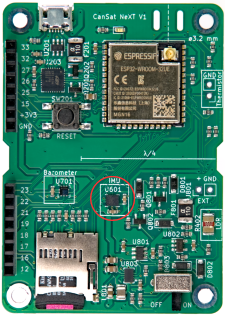
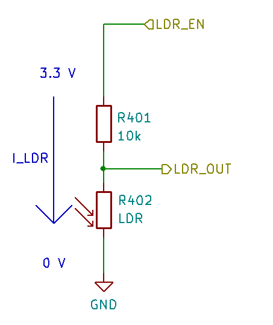

# Fedélzeti szenzorok

Ez a cikk bemutatja a CanSat NeXT fő panelbe integrált szenzorokat. A szenzorok használatát a szoftver dokumentációja tárgyalja, míg ez a cikk magukról a szenzorokról nyújt bővebb információt.

Három fedélzeti szenzor található a CanSat NeXT fő panelen. Ezek az IMU LSM6DS3, a nyomásérzékelő LPS22HB és az LDR. Ezenkívül a panelen van egy furat a külső termisztor hozzáadásához. Mivel az LPS22HB már rendelkezik mind nyomás-, mind hőmérsékletmérési képességekkel, elméletileg önmagában elegendő a CanSat versenyek elsődleges küldetési kritériumainak teljesítéséhez. Azonban mivel a belső csomópont hőmérsékletét méri, vagyis alapvetően a PCB hőmérsékletét azon a ponton, a legtöbb konfigurációban nem jó légköri hőmérsékletmérés. Ezenkívül a nyomásérzékelő abszolút mérését támogathatja az IMU gyorsulásmérő további adatai. Az LDR elsősorban azért került hozzáadásra, hogy segítse a diákokat az analóg szenzorokkal kapcsolatos fogalmak elsajátításában, mivel a válasz a stimulációra szinte azonnali, míg a termisztor időt vesz igénybe a felmelegedéshez és lehűléshez. Ennek ellenére támogathatja a diákok által kitalált kreatív küldetéseket is, akárcsak az IMU gyorsulásmérője és giroszkópja. Továbbá, a fedélzeti szenzor mellett a CanSat NeXT ösztönzi a további szenzorok használatát a kiterjesztési interfészen keresztül.

## Inerciális mérőegység {#IMU}

Az IMU, az STMicroelectronics által gyártott LSM6DS3 egy SiP (system-in-package) stílusú MEMS szenzor eszköz, amely egy gyorsulásmérőt, giroszkópot és a kiolvasó elektronikát integrál egy kis csomagba. A szenzor támogatja az SPI és I2C soros interfészeket, és tartalmaz egy belső hőmérséklet-érzékelőt is.

Az LSM6DS3 váltható gyorsulásmérési tartományai ±2/±4/±8/±16 G, és szögsebesség mérési tartományai ±125/±250/±500/±1000/±2000 fok/s. A magasabb tartomány használata csökkenti az eszköz felbontását is.

A CanSat NeXT-ben az LSM6DS3 I2C módban van használva. Az I2C cím 1101010b (0x6A), de a következő verzió támogatni fogja a hardver módosítását, hogy a címet 1101011b (0x6B)-re változtassa, ha egy haladó felhasználónak szüksége van az eredeti cím más célra történő használatára.

A mérési tartományok alapértelmezés szerint maximálisra lesznek állítva a könyvtárban, hogy a rakéta heves indításából származó legtöbb adatot rögzítsék. Az adatok tartományai a felhasználó által is módosíthatók.

## Barométer {#barometer}

Az STMicroelectronics által gyártott LPS22HB nyomásérzékelő egy másik SiP MEMS eszköz, amelyet 260-1260 hPa közötti nyomás mérésére terveztek. Az általa jelentett adatok tartománya jelentősen nagyobb, de a mérési pontosság a tartományon kívül kérdéses. A MEMS nyomásérzékelők a szenzor membránjában bekövetkező piezorezisztív változások mérésével működnek. Mivel a hőmérséklet is befolyásolja a piezo elem ellenállását, kompenzálni kell. Ennek érdekében a chip egy viszonylag pontos csomópont-hőmérséklet-érzékelőt is tartalmaz közvetlenül a piezorezisztív elem mellett. Ez a hőmérsékletmérés is kiolvasható a szenzorból, de figyelembe kell venni, hogy ez a belső chip hőmérsékletének mérése, nem a környező levegőé.

Hasonlóan az IMU-hoz, az LPS22HB is kommunikálható vagy SPI, vagy I2C interfészen keresztül. A CanSat NeXT-ben ugyanahhoz az I2C interfészhez van csatlakoztatva, mint az IMU. Az LPS22HB I2C címe 1011100b (0x5C), de támogatni fogjuk a cím 0x5D-re történő változtatását, ha szükséges.

## Analóg-digitális átalakító

Ez a feszültségmérésre utal az analogRead() parancs használatával.

Az ESP32 12 bites analóg-digitális átalakítója (ADC) hírhedten nemlineáris. Ez a legtöbb alkalmazásnál nem számít, például hőmérsékletváltozások vagy LDR ellenállásváltozások észlelésénél, azonban az akkumulátor feszültségének vagy az NTC ellenállásának abszolút mérése kissé trükkös lehet. Egy megoldás erre a gondos kalibrálás, amely elegendően pontos adatokat eredményez például a hőmérséklethez. Azonban a CanSat könyvtár is biztosít egy kalibrált korrekciós függvényt. A függvény egy harmadfokú polinomiális korrekciót valósít meg az ADC-re, az ADC olvasást korrelálva az ADC tűn jelen lévő tényleges feszültséggel. A korrekciós függvény:

$$V = -1.907217e \times 10^{-11} \times a^3 + 8.368612 \times 10^{-8} \times a^2 + 7.081732e \times 10^{-4} \times a + 0.1572375$$

Ahol V a mért feszültség, és a az analogRead() által adott 12 bites ADC olvasás. A függvény a könyvtárban található, és adcToVoltage néven hívható. Ennek a képletnek a használatával az ADC olvasási hiba kevesebb, mint 1% egy 0,1 V - 3,2 V feszültségtartományban.

## Fényérzékeny ellenállás

A CanSat NeXT fő panel egy LDR-t is tartalmaz a szenzorkészlet részeként. Az LDR egy speciális ellenállás, amelynek ellenállása a megvilágítással változik. A pontos jellemzők változhatnak, de az általunk jelenleg használt LDR esetében az ellenállás 5-10 kΩ 10 luxnál, és 300 kΩ sötétben.

A CanSat NeXT-ben úgy használják, hogy 3,3 V feszültséget alkalmaznak az MCU-ból egy összehasonlító ellenállásra. Ez azt eredményezi, hogy az LDR_OUT feszültsége

$$V_{LDR} = V_{EN} \frac{R402}{R401+R402} $$.

És ahogy az R402 ellenállás változik, az LDR_OUT feszültsége is változik. Ezt a feszültséget az ESP32 ADC-vel lehet olvasni, majd korrelálni az LDR ellenállásával. A gyakorlatban azonban általában az LDR-eknél a változás érdekesebb, mint az abszolút érték. Például általában elegendő egy nagy feszültségváltozás észlelése, amikor az eszköz fénynek van kitéve a rakétából való kibocsátás után. A küszöbértékeket általában kísérletileg állítják be, nem analitikusan számítják ki. Vegye figyelembe, hogy a CanSat NeXT-ben engedélyeznie kell az analóg fedélzeti szenzorokat a MEAS_EN tű HIGH-ra írásával. Ez látható a példakódokban.

## Termisztor

A külső termisztor olvasására használt áramkör nagyon hasonló az LDR kiolvasó áramköréhez. Ugyanaz a logika érvényes, hogy amikor feszültséget alkalmaznak az összehasonlító ellenállásra, a TEMP_OUT feszültsége a következőképpen változik:

$$V_{TEMP} = V_{EN} \frac{TH501}{TH501+R501} $$.

Ebben az esetben azonban általában a termisztor ellenállásának abszolút értéke érdekes. Ezért a VoltageConversion hasznos, mivel linearizálja az ADC olvasásokat, és közvetlenül kiszámítja a V_temp-et is. Így a felhasználó kiszámíthatja a termisztor ellenállását a kódban. Az értéket még mindig korrelálni kell a hőmérséklettel mérések segítségével, bár a termisztor adatlapja is tartalmazhat néhány utalást arra, hogyan lehet kiszámítani a hőmérsékletet az ellenállásból. Vegye figyelembe, hogy ha mindent analitikusan végez, figyelembe kell vennie az R501 ellenállásának változását is. Ezt a legkönnyebben úgy lehet megtenni, hogy az ellenállást multiméterrel mérjük, ahelyett, hogy feltételeznénk, hogy 10 000 ohm.

A PCB-n lévő összehasonlító ellenállás viszonylag stabil egy hőmérséklet-tartományban, azonban kissé változik. Ha nagyon pontos hőmérsékletmérésekre van szükség, ezt kompenzálni kell. Ehhez a nyomásérzékelő csomópont-hőmérséklet mérése használható. Ennek ellenére ez nem szükséges a CanSat versenyekhez. Az érdeklődők számára az R501 hőmérsékleti együtthatóját a gyártó 100 PPM/°C-ként adja meg.

Míg a barométer hőmérséklete leginkább a panel saját hőmérsékletét tükrözi, a termisztor úgy szerelhető, hogy reagáljon a panelen kívüli, akár a dobozon kívüli hőmérsékletváltozásokra is. Huzalok is hozzáadhatók, hogy még távolabb kerüljön. Ha használni fogják, a termisztor a megfelelő helyre forrasztható a CanSat NeXT panelen. A polarizáció nem számít, azaz bármelyik irányban felszerelhető.

