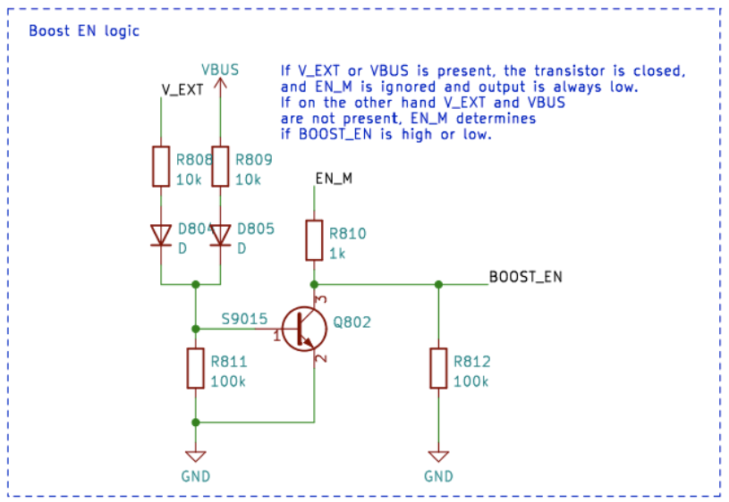
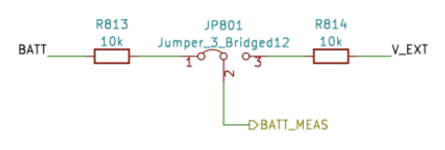

# Elektromos Energia Menedzsment

Ez a cikk bemutatja, hogyan lehet bekapcsolni a CanSat NeXT táblát, hogyan lehet biztonságosan csatlakoztatni külső eszközöket a táblához, és végül hogyan működik az energiarendszer.

## Első lépések

A legtöbb felhasználó számára gyakran elegendő, ha egyszerűen két AAA elemet helyez a fedélzeti elemtartóba és rögzíti azokat. Amikor az USB csatlakoztatva van, a CanSat NeXT automatikusan átvált az USB áramforrás használatára az elemek helyett, így meghosszabbítva az elemek élettartamát. Ne felejtsen el friss elemekre váltani a repülés előtt.

## CanSat NeXT Energia Rendszer

Három módon lehet táplálni a CanSat NeXT-et. Az alapértelmezett mód az USB használata, így amikor a felhasználó fejleszti a szoftvert, a PC táplálja az eszközt, és nincs szükség külső áramforrásra. A második mód a fedélzeti elemek (OBB) használata. Ez úgy történik, hogy két standard 1,5 V-os AAA elemet helyezünk a fő tábla alsó oldalán található elemtartóba. Az USB továbbra is az alapértelmezett mód, még akkor is, ha elemek vannak behelyezve, azaz az elemek kapacitása nem kerül felhasználásra, amikor az USB csatlakoztatva van.

Ezek a szokásos opciók, és a legtöbb felhasználási esetet lefedik. Ezenkívül azonban két „haladó” opció is van a CanSat NeXT táplálására, ha különleges célra van szükség. Először is, a táblán üres átmenő furatú csatlakozók találhatók EXT jelöléssel, amelyek külső akkumulátor csatlakoztatására használhatók. Az akkumulátor feszültsége 3,2-6V lehet. Az EXT vonal automatikusan lekapcsolódik, amikor az USB nincs jelen, hogy meghosszabbítsa az akkumulátor élettartamát és megvédje az akkumulátort. Van egy biztonsági funkció, amely letiltja az OBB-t, ha akkumulátor van csatlakoztatva, de az OBB-nek nem szabad jelen lennie, amikor külső akkumulátorokat használnak.

Van még egy utolsó opció, amely minden felelősséget a felhasználóra hárít, és ez az, hogy 3V3-at viszünk be az eszközbe a bővítő interfészen keresztül. Ez nem biztonságos módja az eszköz táplálásának, de a haladó felhasználók, akik tudják, mit csinálnak, ezt találhatják a legegyszerűbb módnak a kívánt funkciók elérésére.

Összefoglalva, három biztonságos módja van a CanSat NeXT táplálásának:

1. USB használata - fő módszer a fejlesztéshez
2. Fedélzeti elemek használata - ajánlott módszer a repüléshez
3. Külső akkumulátor használata - Haladó felhasználóknak

Normál AAA elemek használatával 4 órás akkumulátor-élettartamot értek el szobahőmérsékleten, és 50 percet -40 Celsius fokon. A teszt során az eszköz minden érzékelőt olvasott és adatukat másodpercenként 10-szer továbbította. Meg kell jegyezni, hogy a normál alkáli elemeket nem tervezték ilyen alacsony hőmérsékleten való működésre, és általában káliumot kezdenek szivárogni az ilyen kínzó tesztek után. Ez nem veszélyes, de az alkáli elemeket mindig biztonságosan kell ártalmatlanítani utána, különösen, ha szokatlan környezetben, például extrém hidegben használták, vagy rakétából ejtették le. Vagy mindkettő.

USB használatakor a bővítő tüskékről származó áramfelvétel nem haladhatja meg a 300 mA-t. Az OBB-k valamivel elnézőbbek, legfeljebb 800 mA-t adnak a bővítő tüskékről. Ha több energiára van szükség, külső akkumulátort kell fontolóra venni. Ez valószínűleg nem fordul elő, hacsak nem futtat motorokat (kis szervók rendben vannak) vagy fűtőtesteket, például. Kis kamerák stb. még mindig rendben vannak.

## Extra - hogyan működik az adaptív többforrású energiarendszer

A kívánt funkciók biztonságos elérése érdekében számos dolgot figyelembe kell venni az energiarendszer tervezésénél. Először is, hogy biztonságosan lehessen csatlakoztatni az USB-t, az EXT-t és az OBB-t egyszerre, az energiarendszernek kapcsolnia kell a különböző energiaforrásokat. Ezt tovább bonyolítja az a tény, hogy ezt nem lehet szoftveresen megtenni, mivel a felhasználónak bármilyen szoftvert kell tudnia használni anélkül, hogy veszélyeztetné a biztonságos működést. Továbbá, az OBB-nek egészen más feszültségtartománya van, mint az USB-nek és a külső akkumulátornak. Ez szükségessé teszi, hogy az OBB boost szabályozót használjon, míg az USB és az EXT vagy buck szabályozót, vagy LDO-t igényel. Az egyszerűség és megbízhatóság érdekében LDO-t használnak ezen a vonalon. Végül, egy áramkapcsolónak képesnek kell lennie az összes energiaforrás lekapcsolására.

Az alábbiakban látható a boost konverter kapcsolási rajza. Az IC a BU33UV7NUX, egy boost konverter, amelyet kifejezetten két alkáli elemből +3.3V előállítására terveztek. Akkor engedélyezett, amikor a BOOST_EN vonal magas, vagy 0,6 V felett van.

Minden OBB, USB és EXT vonal biztosítékkal, túláramvédelemmel, fordított feszültség- és áramvédelemmel, valamint túlmelegedés elleni védelemmel van ellátva. Továbbá, az OBB alacsony feszültségű zárolással és rövidzárlat elleni védelemmel van ellátva, mivel ezeket a helyzeteket el kell kerülni az alkáli elemekkel.

Megjegyzés a következő szakaszban, hogy a külső akkumulátor feszültsége V_EXT, az USB feszültsége VBUS, és az OBB feszültsége BATT.

A BOOST_EN vonalat egy kapcsoló áramkör vezérli, amely vagy az EN_MASTER (EN_M) vonalról veszi a bemenetet, vagy figyelmen kívül hagyja azt, ha V_EXT vagy VBUS van jelen. Ez azért készült, hogy biztosítsa, hogy a boost mindig ki legyen kapcsolva, amikor VBUS és V_EXT van jelen, és csak akkor engedélyezett, ha mind a VBUS, mind a V_EXT 0V, és az EN_M magas.

Vagy mint igazságtábla:

| V_EXT | VBUS | EN_M | BOOST_EN |
|-------|------|------|----------|
| 1     | 1    | 1    | 0        |
| 1     | 1    | 0    | 0        |
| 0     | 0    | 0    | 0        |
| 0     | 0    | 1    | 1        |

Tehát BOOST_EN = EN_M ∧ !(V_EXT ∨ V_BUS).

Ezután le kell választanunk a V_EXT-et, ha a VBUS jelen van, hogy megakadályozzuk a nem kívánt kisülést vagy véletlen töltést. Ezt egy áramkapcsoló IC segítségével végezzük, egy tranzisztor áramkör segítségével, amely leviszi az áramkapcsoló engedélyező vonalát, ha a VBUS jelen van. Ez leválasztja az akkumulátort. Az USB vonal mindig használatban van, ha jelen van, így egy egyszerű schottky diódával van az LDO-hoz vezetve.

Összességében ez az áramkör olyan funkcióhoz vezet, ahol az USB energia használatban van, ha jelen van, és a V_EXT használatban van, amikor az USB nincs jelen. Végül az EN_M az LDO engedélyezésére vagy letiltására szolgál.

Az EN_M-et a felhasználó egy áramkapcsolóval vezérli. A kapcsoló az EN_M-et az USB-hez vagy az EXT-hez, vagy az akkumulátor feszültségéhez csatlakoztatja, amikor csak az OBB van használatban. Amikor a kapcsoló ki van kapcsolva, az EN_M-et a földhöz csatlakoztatja, kikapcsolva mind az LDO-t, mind a boost szabályozót.

Tehát a gyakorlatban az áramkapcsoló be-/kikapcsolja az eszközt, az USB használatban van, ha jelen van, és a V_EXT előnyben részesül az OBB-vel szemben. Végül van még egy részlet, amit figyelembe kell venni. Milyen feszültséget kell mérnie az ESP32-nek akkumulátor feszültségként?

Ezt egyszerű módon oldották meg. Az ESP32 ADC-hez csatlakoztatott feszültség mindig az OBB, de a felhasználó választhatja a V_EXT-et is, ha egy szikével elvágja az átkötőt, és a JP801 átkötőt a 2-3 rövidre forrasztja. Ez a V_EXT-et választja a BATT_MEAS helyett.

Az átkötő a CanSat NeXT fő tábla alsó oldalán található. Az átkötő elég könnyen forrasztható, így ne féljen elvágni az 1-2 vonalat, ha külső akkumulátort használ. Mindig újra forrasztható, hogy ismét az 1-2-t használja.