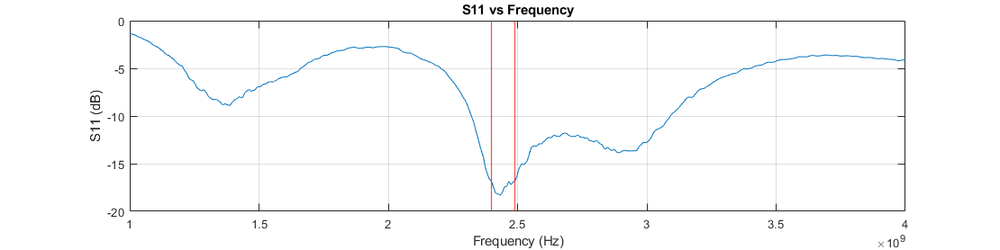

# Antenna Risonatore Metasuperficie

L'Antenna Risonatore Metasuperficie di CanSat NeXT è un modulo antenna esterno, che può essere utilizzato sul lato della stazione di terra per aumentare la portata della comunicazione e rendere la comunicazione più affidabile.

L'[antenna del kit](./../CanSat-hardware/communication#building-a-quarter-wave-monopole-antenna) di CanSat NeXT è stata utilizzata con successo per operare missioni CanSat dove il CanSat è stato lanciato a un'altitudine di 1 chilometro. Tuttavia, a queste distanze l'antenna monopolo inizia a essere al limite della portata operativa e potrebbe anche perdere il segnale a volte a causa di errori di polarizzazione derivanti dalla polarizzazione lineare dell'antenna monopolo. Il kit antenna risonatore metasuperficie è progettato per consentire un funzionamento più affidabile in questo tipo di condizioni estreme e anche per consentire operazioni con portate significativamente più lunghe.

L'antenna risonatore metasuperficie è composta da due schede. L'antenna principale si trova sulla scheda del radiatore, dove un'antenna di tipo slot è stata incisa nel PCB. Questa scheda da sola fornisce circa 3 dBi di guadagno e presenta [polarizzazione circolare](https://en.wikipedia.org/wiki/Circular_polarization), il che in pratica significa che la forza del segnale non dipende più dall'orientamento dell'antenna del satellite. Questa scheda può quindi essere utilizzata come antenna stessa, se si desidera una maggiore *larghezza del fascio*.

L'altra scheda, da cui l'antenna prende il nome, è la caratteristica speciale di questo kit antenna. Dovrebbe essere posizionata a 10-15 mm dalla prima scheda e presenta una serie di elementi risonatori. Gli elementi sono energizzati dall'antenna slot sottostante, e questo a sua volta rende l'antenna più *direttiva*. Con questa aggiunta, il guadagno raddoppia a 6 dBi.

L'immagine sottostante mostra il *coefficiente di riflessione* dell'antenna misurato con un analizzatore di rete vettoriale (VNA). Il grafico mostra le frequenze alle quali l'antenna è in grado di trasmettere energia. Sebbene l'antenna abbia prestazioni a banda larga piuttosto buone, il grafico mostra una buona corrispondenza di impedenza nell'intervallo di frequenza operativa di 2400-2490 MHz. Ciò significa che a queste frequenze, la maggior parte della potenza viene trasmessa come onde radio anziché essere riflessa indietro. I valori di riflessione più bassi al centro della banda sono intorno a -18,2 dB, il che significa che solo l'1,51 % della potenza è stata riflessa indietro dall'antenna. Sebbene più difficile da misurare, le simulazioni suggeriscono che un ulteriore 3 % della potenza di trasmissione viene convertito in calore nell'antenna stessa, ma l'altro 95,5 % - l'efficienza di radiazione dell'antenna - viene irradiato come radiazione elettromagnetica.

Come accennato in precedenza, il guadagno dell'antenna è di circa 6 dBi. Questo può essere ulteriormente aumentato con l'uso di un *riflettore* dietro l'antenna, che riflette le onde radio indietro nell'antenna, migliorando la direttività. Sebbene un disco parabolico sarebbe un riflettore ideale, anche solo un piano metallico piatto può essere molto utile per aumentare le prestazioni dell'antenna. Secondo simulazioni e test sul campo, un piano metallico - come un pezzo di lamiera d'acciaio - posizionato a 50-60 mm dietro l'antenna aumenta il guadagno a circa 10 dBi. Il piano metallico dovrebbe essere di almeno 200 x 200 mm di dimensione - piani più grandi dovrebbero essere migliori, ma solo marginalmente. Tuttavia, non dovrebbe essere molto più piccolo di questo. Il piano dovrebbe idealmente essere di metallo solido, come una lamiera d'acciaio, ma anche una rete metallica funzionerà, purché i fori siano inferiori a 1/10 della lunghezza d'onda (~1,2 cm) in dimensione.