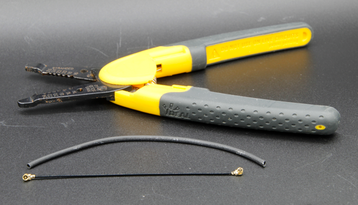
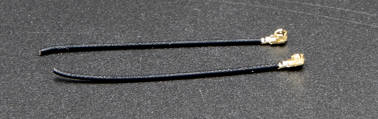

# Comunicazione e Antenne

Questo articolo introduce i concetti chiave necessari per la trasmissione dati wireless con CanSat NeXT. Prima viene discusso il sistema di comunicazione a livello generale, successivamente vengono presentate alcune opzioni diverse per la selezione dell'antenna quando si utilizza CanSat NeXT. Infine, l'ultima parte dell'articolo presenta un semplice tutorial per costruire un'antenna monopolo a quarto d'onda dai componenti inclusi nel kit.

## Iniziare

CanSat NeXT è quasi pronto per iniziare la comunicazione wireless appena estratto dalla confezione. L'unica cosa necessaria è il software adeguato e un'antenna sia per il trasmettitore che per il ricevitore. Per il primo, fare riferimento ai materiali software su questa pagina. Per il secondo, questa pagina include istruzioni su come selezionare un'antenna esterna e su come costruire una semplice antenna monopolo dai materiali inclusi con il CanSat NeXT.

Sebbene la scheda sia piuttosto resistente a tali cose grazie ai controlli software, non si dovrebbe mai tentare di trasmettere nulla da una radio senza un'antenna. Anche se improbabile a causa delle basse potenze coinvolte con questo sistema, l'onda radio riflessa può causare danni reali all'elettronica.

## Sistema di Comunicazione CanSat NeXT

CanSat NeXT gestisce il trasferimento dati wireless in modo leggermente diverso rispetto ai vecchi kit CanSat. Invece di un modulo radio separato, CanSat NeXT utilizza la radio WiFi integrata dell'MCU per la comunicazione. La radio WiFi è normalmente utilizzata per trasferire dati tra un ESP32 e internet, abilitare l'uso di ESP32 come un semplice server, o persino connettere ESP32 a un dispositivo bluetooth, ma con alcuni trucchi di configurazione TCP-IP intelligenti, possiamo abilitare la comunicazione diretta peer-to-peer tra dispositivi ESP32. Il sistema si chiama ESP-NOW ed è sviluppato e mantenuto da EspressIf, che sono gli sviluppatori dell'hardware ESP32. Inoltre, ci sono schemi di comunicazione a bassa velocità speciali, che aumentando l'energia per bit della trasmissione, aumentano significativamente la portata possibile della radio wifi rispetto ai soliti pochi decine di metri.

La velocità di trasmissione di ESP-NOW è significativamente più veloce di quanto sarebbe possibile con la vecchia radio. Anche semplicemente diminuendo il tempo tra i pacchetti nel codice di esempio, CanSat NeXT è in grado di trasmettere ~20 pacchetti completi alla GS in un secondo. Teoricamente la velocità di trasmissione può arrivare fino a 250 kbit/s in modalità a lungo raggio, ma questo può essere difficile da raggiungere nel software. Detto ciò, la trasmissione di, ad esempio, immagini complete da una fotocamera durante il volo dovrebbe essere del tutto fattibile con il software corretto.

Anche con semplici antenne monopolo a quarto d'onda (un pezzo di filo di 31 mm) a entrambe le estremità, CanSat NeXT è stato in grado di inviare dati alla stazione di terra da 1,3 km di distanza, a quel punto la linea di vista è stata persa. Durante i test con un drone, la portata era limitata a circa 1 km. È possibile che il drone abbia interferito con la radio abbastanza da limitare un po' la portata. Tuttavia, con un'antenna migliore, la portata potrebbe essere aumentata ancora di più. Una piccola antenna yagi avrebbe teoricamente aumentato la portata operativa di 10 volte.

Ci sono un paio di dettagli pratici che differiscono dal vecchio sistema di comunicazione radio. Innanzitutto, l'"accoppiamento" dei satelliti ai ricevitori della stazione di terra avviene con indirizzi Media Access Control (MAC), che sono impostati nel codice. Il sistema WiFi è abbastanza intelligente da gestire i problemi di temporizzazione, collisione e frequenza dietro le quinte. L'utente deve semplicemente assicurarsi che la GS stia ascoltando l'indirizzo MAC con cui il satellite sta trasmettendo.
In secondo luogo, la frequenza della radio è diversa. La radio WiFi opera sulla banda a 2,4 GHz (la frequenza centrale è 2,445 GHz), il che significa che sia le caratteristiche di propagazione che i requisiti per la progettazione dell'antenna sono diversi rispetto a prima. Il segnale è un po' più sensibile alla pioggia e ai problemi di linea di vista e potrebbe non essere in grado di trasmettere in alcuni casi in cui il vecchio sistema avrebbe funzionato.

Anche la lunghezza d'onda del segnale radio è diversa. Poiché

$$\lambda = \frac{c}{f} \approx \frac{3*10^8 \text{ m/s}}{2.445 * 10^9 \text {Hz}} = 0.12261 \text{ m,}$$

un'antenna monopolo a quarto d'onda dovrebbe avere una lunghezza di 0,03065 m o 30,65 mm. Questa lunghezza è anche segnata sul PCB di CanSat NeXT per facilitare il taglio del cavo. L'antenna dovrebbe essere tagliata con precisione, ma entro ~0,5 mm va ancora bene.

Un'antenna a quarto d'onda ha prestazioni RF sufficienti per le competizioni CanSat. Detto ciò, potrebbe essere di interesse per alcuni utenti ottenere una portata ancora migliore. Un possibile miglioramento è nella lunghezza dell'antenna monopolo. In pratica, la risonanza a quarto d'onda potrebbe non essere esattamente alla frequenza giusta, poiché altri parametri come l'ambiente, gli elementi metallici circostanti o la parte del filo ancora coperta con metallo a terra potrebbero influenzare un po' la risonanza. L'antenna potrebbe essere sintonizzata con l'uso di un analizzatore di rete vettoriale (VNA). Penso che dovrei farlo a un certo punto e correggere i materiali di conseguenza.

Una soluzione più robusta sarebbe utilizzare uno stile diverso di antenna. A 2,4 GHz, ci sono molte idee divertenti per antenne su internet. Queste includono un'antenna a elica, un'antenna yagi, un'antenna "pringles" e molte altre. Molte di queste, se ben costruite, supereranno facilmente il semplice monopolo. Anche solo un dipolo sarebbe un miglioramento rispetto a un semplice filo.

Il connettore utilizzato sulla maggior parte dei moduli ESP32 è un connettore Hirose U.FL. Questo è un connettore RF in miniatura di buona qualità, che fornisce buone prestazioni RF per segnali deboli. Un problema con questo connettore tuttavia è che il cavo è piuttosto sottile, rendendolo un po' poco pratico in alcuni casi. Porta anche a perdite RF maggiori del desiderato se il cavo è lungo, come potrebbe essere quando si utilizza un'antenna esterna. In questi casi, potrebbe essere utilizzato un cavo adattatore U.FL a SMA. Vedrò se potremmo fornire questi nel nostro negozio online. Questo permetterebbe ai team di utilizzare un connettore SMA più familiare. Detto ciò, è completamente possibile costruire buone antenne utilizzando solo U.FL.

A differenza di SMA, tuttavia, U.FL si basa meccanicamente su caratteristiche di ritenzione a scatto per mantenere il connettore in posizione. Questo è di solito sufficiente, tuttavia per maggiore sicurezza è una buona idea aggiungere una fascetta per una sicurezza extra. Il PCB di CanSat NeXT ha slot accanto al connettore dell'antenna per ospitare una piccola fascetta. Idealmente, dovrebbe essere aggiunto un manicotto di supporto stampato in 3D o costruito in altro modo per il cavo prima della fascetta. Un file per il supporto stampato in 3D è disponibile dalla pagina GitHub.

## Opzioni per l'Antenna

Un'antenna è essenzialmente un dispositivo che trasforma onde elettromagnetiche non guidate in onde guidate, e viceversa. A causa della natura semplice del dispositivo, ci sono una moltitudine di opzioni tra cui selezionare l'antenna per il tuo dispositivo. Da un punto di vista pratico, la selezione dell'antenna ha molta libertà e molte cose da considerare. Devi considerare almeno

1. Frequenza operativa dell'antenna (dovrebbe includere 2,45 GHz)
2. Larghezza di banda dell'antenna (almeno 35 MHz)
3. Impedenza dell'antenna (50 ohm)
4. Connettore (U.FL o puoi usare adattatori)
5. Dimensioni fisiche (Si adatta al contenitore)
6. Costo
7. Metodi di produzione, se stai costruendo l'antenna da solo.
8. Polarizzazione dell'antenna.

La selezione dell'antenna può sembrare opprimente, e spesso lo è, tuttavia in questo caso è resa molto più semplice dal fatto che stiamo effettivamente utilizzando una radio Wi-Fi - possiamo effettivamente utilizzare quasi qualsiasi antenna Wi-Fi a 2,4 GHz con il sistema. La maggior parte di esse tuttavia sono troppo grandi, e tendono anche a utilizzare connettori chiamati RP-SMA, piuttosto che U.FL. Tuttavia, con un adattatore adatto possono essere buone scelte da utilizzare con la stazione di terra. Ci sono anche antenne direttive disponibili, il che significa che puoi ottenere un guadagno extra per migliorare il collegamento radio.

Le antenne Wi-Fi sono una scelta solida, tuttavia hanno un significativo svantaggio - la polarizzazione. Sono quasi sempre polarizzate linearmente, il che significa che la forza del segnale varia significativamente a seconda dell'orientamento del trasmettitore e del ricevitore. Nei casi peggiori, le antenne perpendicolari tra loro potrebbero persino vedere il segnale svanire completamente. Pertanto, un'opzione alternativa è utilizzare antenne per droni, che tendono ad essere polarizzate circolarmente. In pratica, questo significa che abbiamo alcune perdite di polarizzazione costanti, ma sono meno drammatiche. Una soluzione alternativa intelligente per aggirare il problema della polarizzazione è utilizzare due ricevitori, con antenne montate perpendicolarmente tra loro. In questo modo almeno una di esse avrà sempre un orientamento adatto per ricevere il segnale.

Ovviamente, un vero maker vorrà sempre costruire la propria antenna. Alcune costruzioni interessanti adatte alla produzione fai-da-te includono un'antenna a elica, un'antenna "pringles", un'antenna yagi, un dipolo o un'antenna monopolo. Ci sono molte istruzioni online per costruire la maggior parte di queste. L'ultima parte di questo articolo mostra come realizzare la propria antenna monopolo, adatta per le competizioni CanSat, dai materiali spediti con CanSat NeXT.

## Costruire un'antenna monopolo a quarto d'onda

Questa sezione dell'articolo descrive come costruire un'antenna monopolo a quarto d'onda ragionevolmente efficace dai materiali inclusi nel kit. L'antenna si chiama così perché ha solo un polo (rispetto a un dipolo) e la sua lunghezza è un quarto della lunghezza d'onda che stiamo trasmettendo.

Oltre al cavo coassiale e al pezzo di tubo termoretraibile, avrai bisogno di un tipo di spelafili e tronchesi. Quasi qualsiasi tipo funzionerà. Inoltre, avrai bisogno di una fonte di calore per il termoretraibile, come una pistola ad aria calda, un saldatore o anche un accendino.

Per prima cosa, inizia tagliando il cavo a metà.

Successivamente, costruiremo l'antenna vera e propria. Questa parte dovrebbe essere eseguita con la massima precisione possibile. Entro 0,2 mm o giù di lì andrà bene, ma cerca di ottenere la lunghezza il più vicino possibile a quella corretta, poiché ciò aiuterà con le prestazioni.

Un cavo coassiale è composto da quattro parti - un conduttore centrale, un dielettrico, uno schermo e una guaina esterna. Di solito, questi cavi sono utilizzati per trasmettere segnali a radiofrequenza tra dispositivi, in modo che le correnti sul conduttore centrale siano bilanciate da quelle nello schermo. Tuttavia, rimuovendo il conduttore dello schermo, le correnti sul conduttore interno creeranno un'antenna. La lunghezza di quest'area esposta determinerà la lunghezza d'onda o la frequenza operativa dell'antenna, e ora vogliamo che corrisponda alla nostra frequenza operativa di 2,445 GHz, quindi dobbiamo rimuovere lo schermo dalla lunghezza di 30,65 mm.

Spela con attenzione la guaina esterna dal cavo. Idealmente, cerca di rimuovere solo la guaina e lo schermo dalla lunghezza desiderata. Tuttavia, tagliare l'isolante non è una catastrofe. Di solito è più facile rimuovere la guaina esterna in parti, piuttosto che tutta in una volta. Inoltre, potrebbe essere più facile rimuovere prima troppo e poi tagliare il conduttore interno alla lunghezza giusta, piuttosto che cercare di farlo esattamente giusto al primo tentativo.

L'immagine qui sotto mostra i cavi spelati. Cerca di farlo come quello superiore, ma anche quello inferiore funzionerà - potrebbe solo essere più sensibile all'umidità. Se ci sono pezzi penzolanti dello schermo rimasti, tagliali con cura. Assicurati che non ci sia possibilità che il conduttore interno e lo schermo si tocchino - anche un solo filo renderebbe l'antenna inutilizzabile.

L'antenna è ora completamente funzionale a questo punto, tuttavia potrebbe essere sensibile all'umidità. Pertanto, vogliamo ora aggiungere una nuova guaina a questo, che è ciò per cui serve il tubo termoretraibile. Taglia due pezzi, leggermente più lunghi dell'antenna che hai realizzato, e posizionali sopra l'antenna e usa una fonte di calore per restringerli in posizione. Fai attenzione a non bruciare il tubo termoretraibile, specialmente se usi qualcosa di diverso da una pistola ad aria calda.

Dopo questo, le antenne sono pronte. Sul lato della stazione di terra, l'antenna va probabilmente bene così. D'altra parte, mentre il connettore è abbastanza sicuro, è una buona idea supportare il connettore in qualche modo sul lato CanSat. Un modo molto robusto è utilizzare un supporto stampato in 3D e una fascetta, tuttavia molti altri metodi funzioneranno altrettanto bene. Ricorda anche di considerare come l'antenna sarà posizionata all'interno del contenitore. Idealmente, dovrebbe essere in una posizione in cui la trasmissione non è bloccata da parti metalliche.

### Supporto per l'antenna

Infine, ecco un file step del supporto mostrato nell'immagine. Puoi importarlo nella maggior parte dei software CAD, modificarlo o stamparlo con una stampante 3D.

[Scarica il file step](/assets/3d-files/uFl-support.step)