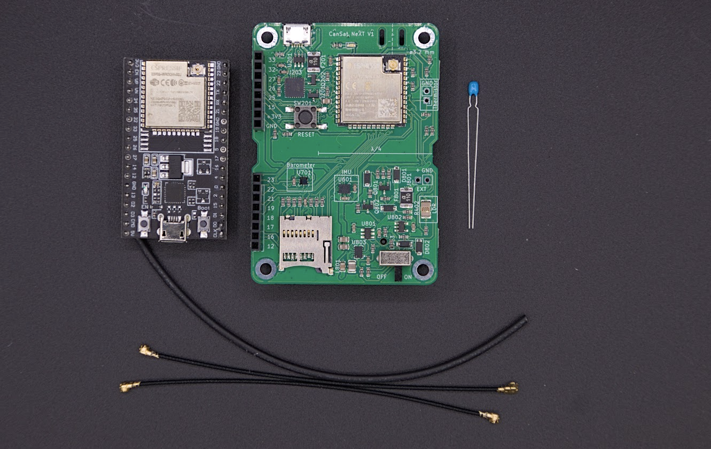

# Corso CanSat NeXT

## Benvenuti a CanSat NeXT!

CanSat NeXT è una nuova variante del kit CanSat, che integra le caratteristiche necessarie per un lancio CanSat di successo direttamente su una scheda, permettendoti di iniziare immediatamente con lo sviluppo software e le tue missioni. Tuttavia, CanSat NeXT non dimentica la tua missione secondaria, poiché puoi collegare qualsiasi sensore o dispositivo esterno agli header di estensione. Puoi pensare a CanSat NeXT come un Arduino, solo con sensori e altre funzionalità già incluse direttamente nella confezione.

## Il Tuo Kit

Se non hai ancora un kit CanSat NeXT, puoi acquistarne uno dal nostro negozio online: https://spacelabnextdoor.com/. In alternativa, le scuole che partecipano a competizioni e programmi CanSat di solito possono ottenere kit tramite la rete ESERO.

Il kit include una scheda CanSat, con cui lavorerai principalmente. Inoltre, c'è un'altra scheda, che verrà utilizzata come radio della stazione di terra - la userai per trasmettere messaggi tra un computer e il CanSat.

Mentre CanSat NeXT ha già un termometro a bordo, il kit include anche un termistore, che può essere saldato alla scheda per misurare la temperatura al di fuori della scheda stessa.

Infine, il kit include due cavi radio, che possono essere utilizzati per costruire antenne di base per abilitare la comunicazione fino a un chilometro di distanza. È necessario solo un cavo, ma è utile avere un ricambio. Il tubo termoretraibile è incluso per aggiungere protezione dalle intemperie alle antenne. Per istruzioni su come costruire l'antenna, fare riferimento all'articolo [Comunicazione e Antenne](./../CanSat-hardware/communication).

## Lezioni

Questa pagina include un numero crescente di semplici lezioni per iniziare senza problemi con il tuo kit CanSat NeXT. La prima lezione riguarda la configurazione del tuo computer per iniziare la programmazione CanSat, e le lezioni successive presentano varie caratteristiche hardware di CanSat NeXT. Inoltre, abbiamo un blog per mostrare vari progetti realizzati con CanSat NeXT, che potrebbero essere interessanti quando pianifichi la tua missione CanSat.

[Clicca qui per la prima lezione!](./lesson1).