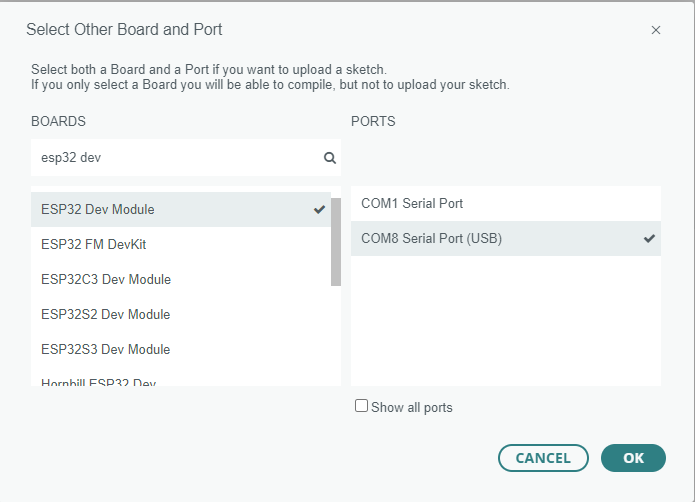

# Lezione 1: Hello World!

Questa prima lezione ti introduce a CanSat NeXT mostrando come scrivere ed eseguire il tuo primo programma sulla scheda.

Dopo questa lezione, avrai gli strumenti necessari per iniziare a sviluppare software per il tuo CanSat.

## Installazione degli strumenti

Si consiglia di utilizzare CanSat NeXT con Arduino IDE, quindi iniziamo installando quello e le librerie e schede necessarie.

### Installare Arduino IDE

Se non l'hai già fatto, scarica e installa l'Arduino IDE dal sito ufficiale https://www.arduino.cc/en/software.

### Aggiungere il supporto per ESP32

CanSat NeXT si basa sul microcontrollore ESP32, che non è incluso nell'installazione predefinita di Arduino IDE. Se non hai mai utilizzato microcontrollori ESP32 con Arduino prima, il supporto per la scheda deve essere installato prima. Può essere fatto in Arduino IDE da *Strumenti->Scheda->Gestione schede* (o semplicemente premi (Ctrl+Shift+B) ovunque). Nel gestore delle schede, cerca ESP32 e installa esp32 di Espressif.

### Installare la libreria Cansat NeXT

La libreria CanSat NeXT può essere scaricata dal Gestore Librerie di Arduino IDE da *Sketch > Includi Librerie > Gestione Librerie*.


*Fonte immagine: Arduino Docs, https://docs.arduino.cc/software/ide-v1/tutorials/installing-libraries*

Nella barra di ricerca del Gestore Librerie, digita "CanSatNeXT" e scegli "Installa". Se l'IDE chiede se vuoi anche installare le dipendenze, clicca su sì.

## Collegamento al PC

Dopo aver installato la libreria software CanSat NeXT, puoi collegare il CanSat NeXT al tuo computer. Nel caso in cui non venga rilevato, potrebbe essere necessario installare prima i driver necessari. L'installazione dei driver viene eseguita automaticamente nella maggior parte dei casi, tuttavia, su alcuni PC deve essere eseguita manualmente. I driver possono essere trovati sul sito di Silicon Labs: https://www.silabs.com/developers/usb-to-uart-bridge-vcp-drivers
Per ulteriore aiuto con la configurazione dell'ESP32, consulta il seguente tutorial: https://docs.espressif.com/projects/esp-idf/en/latest/esp32/get-started/establish-serial-connection.html

## Esecuzione del tuo primo programma

Ora, utilizziamo le librerie appena installate per iniziare a eseguire del codice su CanSat NeXT. Come da tradizione, iniziamo facendo lampeggiare il LED e scrivendo "Hello World!" al computer.

### Selezionare la porta corretta

Dopo aver collegato il CanSat NeXT al tuo computer (e acceso l'alimentazione), devi selezionare la porta corretta. Se non sai quale sia quella corretta, semplicemente scollega il dispositivo e vedi quale porta scompare.


Arduino IDE ora ti chiede il tipo di dispositivo. Seleziona ESP32 Dev Module.



### Scegliere un esempio

La libreria CanSat NeXT ha diversi codici di esempio che mostrano come utilizzare le varie funzionalità sulla scheda. Puoi trovare questi sketch di esempio da File -> Esempi -> CanSat NeXT. Scegli "Hello_world".

Dopo aver aperto il nuovo sketch, puoi caricarlo sulla scheda premendo il pulsante di caricamento.


Dopo un po', il LED sulla scheda dovrebbe iniziare a lampeggiare. Inoltre, il dispositivo sta inviando un messaggio al PC. Puoi vedere questo aprendo il monitor seriale e scegliendo il baud rate 115200.

Prova anche a premere il pulsante sulla scheda. Dovrebbe resettare il processore, o in altre parole, riavviare il codice dall'inizio.

### Spiegazione di Hello World

Vediamo cosa succede effettivamente in questo codice esaminandolo riga per riga. Innanzitutto, il codice inizia **includendo** la libreria CanSat. Questa riga dovrebbe essere all'inizio di quasi tutti i programmi scritti per CanSat NeXT, poiché dice al compilatore che vogliamo utilizzare le funzionalità della libreria CanSat NeXT.

```Cpp title="Include CanSat NeXT"
#include "CanSatNeXT.h"
```
Dopo questo, il codice passa alla funzione di setup. Lì abbiamo due chiamate - prima, serial è l'interfaccia che usiamo per inviare messaggi al PC tramite USB. Il numero all'interno della chiamata di funzione, 115200, si riferisce al baud-rate, cioè quanti uno e zeri vengono inviati ogni secondo. La successiva chiamata, `CanSatInit()`, proviene dalla libreria CanSat NeXT e avvia tutti i sensori e le altre funzionalità a bordo. Simile al comando `#include`, questo si trova di solito negli sketch per CanSat NeXT. Qualsiasi cosa tu voglia eseguire solo una volta all'avvio dovrebbe essere inclusa nella funzione di setup.

```Cpp title="Setup"
void setup() {
  // Avvia la linea seriale per stampare dati sul terminale
  Serial.begin(115200);
  // Avvia tutti i sistemi a bordo di CanSatNeXT.
  CanSatInit();
}
```

Dopo il setup, il codice inizia a ripetere la funzione loop all'infinito. Prima, il programma scrive il pin di output LED per essere alto, cioè avere una tensione di 3,3 volt. Questo accende il LED a bordo. Dopo 100 millisecondi, la tensione su quel pin di output viene riportata a zero. Ora il programma attende per 400 ms, e poi invia un messaggio al PC. Dopo che il messaggio è stato inviato, la funzione loop ricomincia dall'inizio.

```Cpp title="Loop"
void loop() {
  // Facciamo lampeggiare il LED
  digitalWrite(LED, HIGH);
  delay(100);
  digitalWrite(LED, LOW);
  delay(400);
  Serial.println("Questo è un messaggio!");
}
```

Puoi anche provare a cambiare i valori di delay o il messaggio per vedere cosa succede. Congratulazioni per essere arrivato fin qui! Configurare gli strumenti può essere complicato, ma dovrebbe diventare più divertente da questo punto in poi.

---

Nella prossima lezione, inizieremo a leggere i dati dai sensori a bordo.

[Clicca qui per la seconda lezione!](./lesson2)