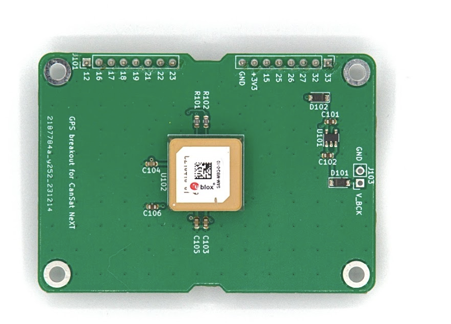
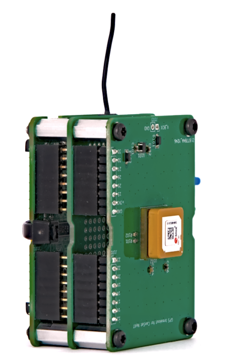

# Moduł GNSS CanSat NeXT

Moduł GNSS CanSat NeXT rozszerza możliwości CanSat NeXT o śledzenie lokalizacji oraz precyzyjny zegar czasu rzeczywistego. Moduł oparty jest na odbiorniku GNSS U-Blox SAM-M10Q firmy U-Blox.

## Sprzęt

Moduł łączy odbiornik GNSS z CanSat NeXT poprzez UART w złączu rozszerzeń. Urządzenie korzysta z pinów 16 i 17 złącza rozszerzeń dla UART RX i TX, a także pobiera zasilanie z linii +3V3 w złączu rozszerzeń.

Domyślnie rejestry zapasowe modułu GNSS są zasilane z linii +3V3. Choć to ułatwia korzystanie z modułu, oznacza to, że moduł zawsze musi zaczynać od zera, próbując znaleźć pozycję. Aby temu zaradzić, można dostarczyć zewnętrzne źródło zasilania przez linię napięcia zapasowego poprzez złącza J103. Napięcie dostarczane do pinu V_BCK powinno wynosić 2-6,5 wolta, a pobór prądu to stałe 65 mikroamperów, nawet gdy główne zasilanie jest wyłączone. Dostarczanie napięcia zapasowego umożliwia odbiornikowi GNSS utrzymanie wszystkich ustawień, ale co najważniejsze, danych almanachu i efemeryd - skracając czas uzyskania pozycji z ~30 sekund do 1-2 sekund, jeśli urządzenie nie przemieściło się znacząco między przełączeniami zasilania.

Istnieje wiele innych modułów i breakoutów GNSS dostępnych od firm takich jak Sparkfun i Adafruit, między innymi. Można je podłączyć do CanSat NeXT przez ten sam interfejs UART, lub używając SPI i I2C, w zależności od modułu. Biblioteka CanSat NeXT powinna również obsługiwać inne breakouts korzystające z modułów U-blox. Szukając breakoutów GNSS, staraj się znaleźć taki, gdzie podstawowa płytka PCB jest jak największa - większość ma zbyt małe PCB, co sprawia, że ich wydajność anteny jest bardzo słaba w porównaniu do modułów z większymi PCB. Każdy rozmiar mniejszy niż 50x50 mm zacznie ograniczać wydajność i zdolność do znalezienia i utrzymania pozycji.

Więcej informacji o module GNSS oraz dużej liczbie dostępnych ustawień i funkcji można znaleźć w karcie katalogowej odbiornika GNSS na [stronie U-Blox](https://www.u-blox.com/en/product/sam-m10q-module).

Integracja sprzętowa modułu z CanSat NeXT jest naprawdę prosta - po dodaniu dystansów do otworów na śruby, ostrożnie wsuń piny złącza w gniazda pinów. Jeśli zamierzasz stworzyć wielowarstwowy stos elektroniczny, upewnij się, że GNSS jest umieszczony jako najwyższy moduł, aby umożliwić 

## Oprogramowanie

Najłatwiejszym sposobem na rozpoczęcie korzystania z CanSat NeXT GNSS jest nasza własna biblioteka Arduino, którą można znaleźć w menedżerze bibliotek Arduino. Instrukcje dotyczące instalacji biblioteki znajdują się na stronie [pierwsze kroki](./../course/lesson1).

Biblioteka zawiera przykłady, jak odczytywać pozycję i aktualny czas, a także jak przesyłać dane za pomocą CanSat NeXT.

Jedna szybka uwaga dotycząca ustawień - moduł musi być poinformowany, w jakim środowisku będzie używany, aby mógł najlepiej oszacować pozycję użytkownika. Zazwyczaj zakłada się, że użytkownik będzie na poziomie gruntu, a choć może się poruszać, przyspieszenie prawdopodobnie nie jest zbyt duże. Oczywiście nie jest to prawdą w przypadku CanSatów, które mogą być wystrzeliwane rakietami lub uderzać w ziemię z dość dużymi prędkościami. Dlatego biblioteka domyślnie ustawia pozycję do obliczania przy założeniu środowiska o wysokiej dynamice, co pozwala na utrzymanie pozycji przynajmniej częściowo podczas szybkiego przyspieszenia, ale także sprawia, że pozycja na ziemi jest znacznie mniej precyzyjna. Jeśli zamiast tego bardziej pożądana jest wysoka dokładność po wylądowaniu, można zainicjować moduł GNSS poleceniem `GNSS_init(DYNAMIC_MODEL_GROUND)`, zastępując domyślne `GNSS_init(DYNAMIC_MODEL_ROCKET)` = `GNSS_init()`. Dodatkowo, istnieje `DYNAMIC_MODEL_AIRBORNE`, który jest nieco bardziej dokładny niż model rakietowy, ale zakłada tylko umiarkowane przyspieszenie.

Ta biblioteka priorytetowo traktuje łatwość użytkowania i posiada tylko podstawowe funkcje, takie jak uzyskiwanie lokalizacji i czasu z GNSS. Dla użytkowników poszukujących bardziej zaawansowanych funkcji GNSS, doskonała SparkFun_u-blox_GNSS_Arduino_Library może być lepszym wyborem.

## Specyfikacja biblioteki

Oto dostępne polecenia z biblioteki CanSat GNSS.

### GNSS_Init

| Funkcja              | uint8_t GNSS_Init(uint8_t dynamic_model)                          |
|----------------------|--------------------------------------------------------------------|
| **Typ zwracany**     | `uint8_t`                                                          |
| **Wartość zwracana** | Zwraca 1, jeśli inicjalizacja zakończyła się sukcesem, lub 0, jeśli wystąpił błąd. |
| **Parametry**        |                                                                    |
|                      | `uint8_t dynamic_model`                                           |
|                      | Wybiera model dynamiczny, czyli środowisko, które zakłada moduł GNSS. Możliwe wybory to DYNAMIC_MODEL_GROUND, DYNAMIC_MODEL_AIRBORNE i DYNAMIC_MODEL_ROCKET. |
| **Opis**             | To polecenie inicjalizuje moduł GNSS i powinno być wywołane w funkcji setup. |

### readPosition

| Funkcja              | uint8_t readPosition(float &x, float &y, float &z)          |
|----------------------|--------------------------------------------------------------------|
| **Typ zwracany**     | `uint8_t`                                                          |
| **Wartość zwracana** | Zwraca 0, jeśli pomiar zakończył się sukcesem.                           |
| **Parametry**        |                                                                    |
|                      | `float &latitude, float &longitude, float &altitude`                                    |
|                      | `float &x`: Adres zmiennej typu float, w której dane zostaną zapisane. |
| **Używane w przykładzie** | Wszystkie                                                  |
| **Opis**             | Ta funkcja może być używana do odczytu pozycji urządzenia jako współrzędnych. Wartości będą pół-losowe przed uzyskaniem pozycji. Wysokość to metry nad poziomem morza, choć nie jest bardzo dokładna. |

### getSIV

| Funkcja              | uint8_t getSIV()                  |
|----------------------|--------------------------------------------------------------------|
| **Typ zwracany**     | `uint8_t`                                                          |
| **Wartość zwracana** | Liczba satelitów w zasięgu |
| **Używane w przykładzie** | AdditionalFunctions                                          |
| **Opis**             | Zwraca liczbę satelitów w zasięgu. Zazwyczaj wartości poniżej 3 wskazują brak pozycji. |

### getTime

| Funkcja              | uint32_t getTime()                  |
|----------------------|--------------------------------------------------------------------|
| **Typ zwracany**     | `uint32_t`                                                          |
| **Wartość zwracana** | Aktualny czas Epoch |
| **Używane w przykładzie** | AdditionalFunctions                                          |
| **Opis**             | Zwraca aktualny czas epoch, jak wskazują sygnały z satelitów GNSS. Innymi słowy, jest to liczba sekund, które upłynęły od 00:00:00 UTC, czwartek, pierwszego stycznia 1970 roku. |