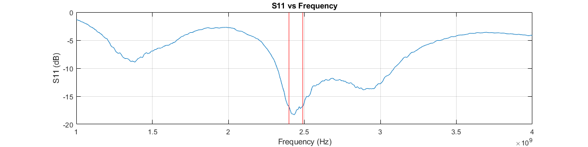

# Antena Rezonatorowa z Metapowierzchnią

Antena Rezonatorowa z Metapowierzchnią CanSat NeXT to zewnętrzny moduł antenowy, który można używać po stronie stacji naziemnej, aby zwiększyć zasięg komunikacji i uczynić ją bardziej niezawodną.

[Antena zestawu](./../CanSat-hardware/communication#quarter-wave-antenna) CanSat NeXT była używana do pomyślnego przeprowadzania misji CanSat, gdzie CanSat był wystrzeliwany na wysokość 1 kilometra. Jednak na tych odległościach antena monopolarna zaczyna znajdować się na granicy zasięgu operacyjnego i czasami może tracić sygnał z powodu błędów polaryzacji wynikających z liniowej polaryzacji anteny monopolarnej. Zestaw antenowy z metapowierzchnią został zaprojektowany, aby umożliwić bardziej niezawodną pracę w takich ekstremalnych warunkach, a także umożliwić działanie na znacznie większych odległościach.

Antena rezonatorowa z metapowierzchnią składa się z dwóch płytek. Główna antena znajduje się na płytce radiatora, gdzie w PCB została wytrawiona antena szczelinowa. Sama ta płytka zapewnia zysk rzędu 3 dBi i charakteryzuje się [polaryzacją kołową](https://en.wikipedia.org/wiki/Circular_polarization), co w praktyce oznacza, że siła sygnału nie zależy już od orientacji anteny satelitarnej. Ta płytka może być zatem używana jako sama antena, jeśli pożądana jest szersza *szerokość wiązki*.

Druga płytka, od której antena bierze swoją nazwę, jest specjalną cechą tego zestawu antenowego. Powinna być umieszczona 10-15 mm od pierwszej płytki i zawiera szereg elementów rezonatorowych. Elementy te są zasilane przez antenę szczelinową pod nimi, co z kolei sprawia, że antena staje się bardziej *kierunkowa*. Dzięki temu dodatkowemu elementowi zysk podwaja się do 6 dBi.

Poniższy obraz pokazuje *współczynnik odbicia* anteny mierzony za pomocą wektorowego analizatora sieci (VNA). Wykres pokazuje częstotliwości, na których antena jest w stanie transmitować energię. Chociaż antena ma całkiem dobrą wydajność szerokopasmową, wykres pokazuje dobre dopasowanie impedancji w zakresie częstotliwości operacyjnych 2400-2490 MHz. Oznacza to, że przy tych częstotliwościach większość mocy jest transmitowana jako fale radiowe, a nie odbijana z powrotem. Najniższe wartości odbicia w centrum pasma wynoszą około -18,2 dB, co oznacza, że tylko 1,51 % mocy zostało odbite z powrotem od anteny. Chociaż trudniejsze do zmierzenia, symulacje sugerują, że dodatkowe 3 % mocy transmisji jest przekształcane w ciepło w samej antenie, ale pozostałe 95,5 % - efektywność promieniowania anteny - jest emitowane jako promieniowanie elektromagnetyczne.

Jak wspomniano wcześniej, zysk anteny wynosi około 6 dBi. Można go jeszcze zwiększyć, stosując *reflektor* za anteną, który odbija fale radiowe z powrotem do anteny, poprawiając kierunkowość. Chociaż idealnym reflektorem byłby paraboliczny dysk, nawet płaska metalowa płaszczyzna może być bardzo pomocna w zwiększaniu wydajności anteny. Według symulacji i testów terenowych, metalowa płaszczyzna - taka jak kawałek blachy stalowej - umieszczona 50-60 mm za anteną zwiększa zysk do około 10 dBi. Płaszczyzna metalowa powinna mieć co najmniej 200 x 200 mm - większe płaszczyzny powinny być lepsze, ale tylko marginalnie. Jednak nie powinna być znacznie mniejsza niż ta. Płaszczyzna powinna być idealnie z litego metalu, takiego jak blacha stalowa, ale nawet siatka druciana będzie działać, o ile otwory mają mniej niż 1/10 długości fali (~1,2 cm).