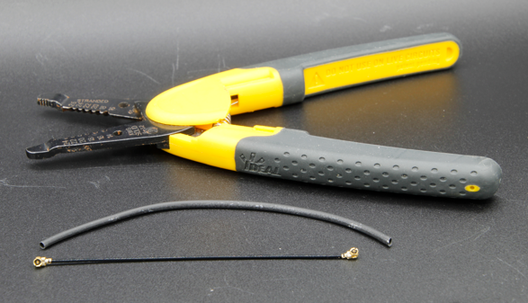
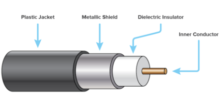

# Komunikacja i Anteny

Ten artykuł wprowadza kluczowe pojęcia potrzebne do bezprzewodowej transmisji danych z CanSat NeXT. Najpierw omówiony zostanie system komunikacji na ogólnym poziomie, następnie przedstawione zostaną różne opcje wyboru anteny przy użyciu CanSat NeXT. Na koniec, ostatnia część artykułu prezentuje prosty tutorial budowy anteny ćwierćfalowej monopole z części zawartych w zestawie.

## Rozpoczęcie

CanSat NeXT jest prawie gotowy do rozpoczęcia komunikacji bezprzewodowej od razu po wyjęciu z pudełka. Jedyne, co jest potrzebne, to odpowiednie oprogramowanie i antena zarówno dla nadajnika, jak i odbiornika. W przypadku pierwszego, odnieś się do materiałów oprogramowania na tej stronie. W przypadku drugiego, ta strona zawiera instrukcje dotyczące wyboru zewnętrznej anteny oraz jak zbudować prostą antenę monopole z materiałów dołączonych do CanSat NeXT.

Chociaż płytka jest dość odporna na takie rzeczy dzięki kontrolom oprogramowania, nigdy nie powinieneś próbować nadawać czegokolwiek z radia bez anteny. Chociaż mało prawdopodobne z powodu niskich mocy związanych z tym systemem, odbite fale radiowe mogą spowodować realne uszkodzenie elektroniki.

## System Komunikacji CanSat NeXT

CanSat NeXT obsługuje bezprzewodowy transfer danych nieco inaczej niż starsze zestawy CanSat. Zamiast oddzielnego modułu radiowego, CanSat NeXT wykorzystuje zintegrowane radio WiFi MCU do komunikacji. Radio WiFi jest zwykle używane do przesyłania danych między ESP32 a internetem, umożliwiając użycie ESP32 jako prostego serwera, a nawet połączenie ESP32 z urządzeniem bluetooth, ale dzięki pewnym sprytnym sztuczkom konfiguracji TCP-IP, możemy umożliwić bezpośrednią komunikację peer-to-peer między urządzeniami ESP32. System nazywa się ESP-NOW i jest rozwijany oraz utrzymywany przez EspressIf, którzy są twórcami sprzętu ESP32. Ponadto istnieją specjalne schematy komunikacji o niskiej szybkości, które poprzez zwiększenie energii na bit transmisji, znacznie zwiększają możliwy zasięg radia wifi ponad zwykłe kilkadziesiąt metrów.

Szybkość transmisji danych ESP-NOW jest znacznie szybsza niż to, co byłoby możliwe ze starym radiem. Nawet przy prostym zmniejszeniu czasu między pakietami w przykładowym kodzie, CanSat NeXT jest w stanie przesłać ~20 pełnych pakietów do GS w ciągu sekundy. Teoretycznie szybkość transmisji danych może wynosić do 250 kbit/s w trybie dalekiego zasięgu, ale może to być trudne do osiągnięcia w oprogramowaniu. To powiedziawszy, transmisja na przykład pełnych zdjęć z kamery podczas lotu powinna być całkowicie wykonalna z odpowiednim oprogramowaniem.

Nawet przy prostych antenach monopole ćwierćfalowych (31 mm kawałek drutu) na obu końcach, CanSat NeXT był w stanie przesłać dane do stacji naziemnej z odległości 1,3 km, w którym to momencie linia widzenia została utracona. Podczas testowania z dronem, zasięg był ograniczony do około 1 km. Możliwe, że dron zakłócał radio na tyle, aby nieco ograniczyć zasięg. Jednak z lepszą anteną zasięg mógłby być jeszcze większy. Mała antena yagi teoretycznie zwiększyłaby zasięg operacyjny dziesięciokrotnie.

Istnieje kilka praktycznych szczegółów, które różnią się od starszego systemu komunikacji radiowej. Po pierwsze, "parowanie" satelitów z odbiornikami stacji naziemnej odbywa się za pomocą adresów Media Access Control (MAC), które są ustawiane w kodzie. System WiFi jest na tyle inteligentny, aby obsługiwać kwestie związane z czasem, kolizjami i częstotliwością w tle. Użytkownik musi jedynie upewnić się, że GS nasłuchuje adresu MAC, z którym satelita nadaje.
Po drugie, częstotliwość radia jest inna. Radio WiFi działa w paśmie 2,4 GHz (częstotliwość środkowa to 2,445 GHz), co oznacza, że zarówno charakterystyki propagacji, jak i wymagania dotyczące projektowania anteny są inne niż wcześniej. Sygnał jest nieco bardziej wrażliwy na deszcz i problemy z linią widzenia i może nie być w stanie przesyłać w niektórych przypadkach, w których stary system by działał.

Długość fali sygnału radiowego jest również inna. Ponieważ

$$\lambda = \frac{c}{f} \approx \frac{3*10^8 \text{ m/s}}{2.445 * 10^9 \text {Hz}} = 0.12261 \text{ m,}$$

antena monopole ćwierćfalowa powinna mieć długość 0,03065 m lub 30,65 mm. Ta długość jest również oznaczona na PCB CanSat NeXT, aby ułatwić cięcie kabla. Antena powinna być przycięta precyzyjnie, ale w granicach ~0,5 mm jest w porządku.

Antena ćwierćfalowa ma wystarczającą wydajność RF dla zawodów CanSat. To powiedziawszy, niektórym użytkownikom może zależeć na uzyskaniu jeszcze lepszego zasięgu. Jednym z możliwych miejsc do poprawy jest długość anteny monopole. W praktyce rezonans ćwierćfalowy może nie być dokładnie na właściwej częstotliwości, ponieważ inne parametry, takie jak środowisko, otaczające elementy metalowe lub część drutu nadal pokryta uziemionym metalem mogą nieco wpływać na rezonans. Antena mogłaby być dostrojona za pomocą analizatora sieci wektorowej (VNA). Myślę, że powinienem to zrobić w pewnym momencie i odpowiednio poprawić materiały.

Bardziej solidnym rozwiązaniem byłoby użycie innego stylu anteny. Przy 2,4 GHz istnieje mnóstwo ciekawych pomysłów na anteny w internecie. Obejmują one antenę helikalną, antenę yagi, antenę pringles i wiele innych. Wiele z nich, jeśli zostaną dobrze skonstruowane, z łatwością przewyższy prosty monopole. Nawet zwykły dipol byłby ulepszeniem w porównaniu do prostego drutu.

Złącze używane w większości modułów ESP32 to złącze Hirose U.FL. Jest to wysokiej jakości miniaturowe złącze RF, które zapewnia dobrą wydajność RF dla słabych sygnałów. Jednym z problemów z tym złączem jest jednak to, że kabel jest dość cienki, co czyni go nieco niepraktycznym w niektórych przypadkach. Prowadzi to również do większych niż pożądane strat RF, jeśli kabel jest długi, jak to może być w przypadku używania zewnętrznej anteny. W takich przypadkach można użyć kabla adaptera U.FL do SMA. Zobaczę, czy moglibyśmy dostarczyć je w naszym sklepie internetowym. To umożliwiłoby zespołom użycie bardziej znanego złącza SMA. To powiedziawszy, całkowicie możliwe jest zbudowanie dobrych anten przy użyciu tylko U.FL.

W przeciwieństwie do SMA, U.FL polega mechanicznie na funkcjach zatrzaskowych, aby utrzymać złącze na miejscu. Zwykle jest to wystarczające, jednak dla dodatkowego bezpieczeństwa warto dodać opaskę zaciskową dla dodatkowego zabezpieczenia. PCB CanSat NeXT ma szczeliny obok złącza antenowego, aby pomieścić małą opaskę zaciskową. Idealnie, przed opaską zaciskową powinno się dodać rękaw wspierający wydrukowany w 3D lub w inny sposób skonstruowany. Plik do wydruku 3D wspornika jest dostępny na stronie GitHub.

## Opcje Anten

Antena to zasadniczo urządzenie, które przekształca fale elektromagnetyczne nieprowadzone w prowadzone i odwrotnie. Ze względu na prostą naturę urządzenia, istnieje wiele opcji, z których można wybrać antenę dla swojego urządzenia. Z praktycznego punktu widzenia, wybór anteny ma dużo swobody i wiele rzeczy do rozważenia. Musisz wziąć pod uwagę co najmniej:

1. Częstotliwość pracy anteny (powinna obejmować 2,45 GHz)
2. Szerokość pasma anteny (przynajmniej 35 MHz)
3. Impedancja anteny (50 omów)
4. Złącze (U.FL lub można użyć adapterów)
5. Rozmiar fizyczny (Czy pasuje do puszki)
6. Koszt
7. Metody produkcji, jeśli sam robisz antenę.
8. Polaryzacja anteny.

Wybór anteny może wydawać się przytłaczający i często tak jest, jednak w tym przypadku jest to znacznie łatwiejsze dzięki temu, że faktycznie używamy radia Wi-Fi - możemy faktycznie użyć prawie każdej anteny Wi-Fi 2,4 GHz z systemem. Większość z nich jest jednak zbyt duża, a także mają tendencję do używania złączy zwanych RP-SMA, zamiast U.FL. Jednak z odpowiednim adapterem mogą być dobrymi wyborami do użycia z stacją naziemną. Dostępne są nawet anteny kierunkowe, co oznacza, że możesz uzyskać dodatkowy zysk, aby poprawić połączenie radiowe.

Anteny Wi-Fi są solidnym wyborem, jednak mają jedną znaczącą wadę - polaryzację. Są prawie zawsze liniowo spolaryzowane, co oznacza, że siła sygnału znacznie się różni w zależności od orientacji nadajnika i odbiornika. W najgorszych przypadkach anteny ustawione prostopadle do siebie mogą nawet całkowicie zanikać sygnał. Dlatego alternatywną opcją jest użycie anten dronowych, które mają tendencję do bycia spolaryzowanymi kołowo. W praktyce oznacza to, że mamy pewne stałe straty polaryzacyjne, ale są one mniej dramatyczne. Alternatywnym sprytnym rozwiązaniem problemu polaryzacji jest użycie dwóch odbiorników, z antenami zamontowanymi prostopadle do siebie. W ten sposób przynajmniej jedna z nich zawsze będzie miała odpowiednią orientację do odbioru sygnału.

Oczywiście, prawdziwy twórca zawsze będzie chciał zrobić własną antenę. Niektóre interesujące konstrukcje, które nadają się do samodzielnej produkcji, to antena helikalna, antena "pringles", yagi, dipol lub antena monopole. Istnieje wiele instrukcji online dotyczących budowy większości z nich. Ostatnia część tego artykułu pokazuje, jak zrobić własną antenę monopole, odpowiednią do zawodów CanSat, z materiałów wysyłanych z CanSat NeXT.

## Budowa anteny monopole ćwierćfalowej

Ta część artykułu opisuje, jak zbudować w miarę skuteczną antenę monopole ćwierćfalową z materiałów zawartych w zestawie. Antena nazywa się tak, ponieważ ma tylko jeden biegun (w porównaniu do dipola), a jej długość to ćwierć długości fali, którą nadajemy.

Oprócz kabla koncentrycznego i kawałka rurki termokurczliwej, będziesz potrzebować jakiegoś rodzaju ściągacza izolacji i obcinacza do drutu. Prawie każdy rodzaj będzie działał. Dodatkowo będziesz potrzebować źródła ciepła do rurki termokurczliwej, takiego jak opalarka, lutownica lub nawet zapalniczka.

Najpierw zacznij od przecięcia kabla na pół.

Następnie zbudujemy właściwą antenę. Ta część powinna być wykonana tak precyzyjnie, jak to możliwe. W granicach 0,2 mm będzie w porządku, ale postaraj się uzyskać jak najbliżej poprawnej długości, ponieważ to pomoże w wydajności.

Kabel koncentryczny składa się z czterech części - przewodnika centralnego, dielektryka, ekranu i zewnętrznej osłony. Zwykle te kable są używane do przesyłania sygnałów o częstotliwości radiowej między urządzeniami, tak aby prądy na przewodniku centralnym były zrównoważone przez te w ekranie. Jednak usuwając przewodnik ekranu, prądy na przewodniku wewnętrznym stworzą antenę. Długość tego odsłoniętego obszaru określi długość fali lub częstotliwość pracy anteny, a teraz chcemy, aby pasowała do naszej częstotliwości pracy 2,445 GHz, więc musimy usunąć ekran z długości 30,65 mm.

Ostrożnie zdejmij zewnętrzną osłonę z kabla. Idealnie, spróbuj usunąć tylko osłonę i ekran z pożądanej długości. Jednak przecięcie izolatora nie jest katastrofą. Zwykle łatwiej jest usunąć zewnętrzną osłonę w częściach, niż wszystko naraz. Ponadto może być łatwiej najpierw usunąć zbyt dużo, a następnie przyciąć przewodnik wewnętrzny do odpowiedniej długości, niż próbować uzyskać to dokładnie za pierwszym razem.

Poniższy obraz pokazuje odizolowane kable. Spróbuj zrobić to jak na górnym, ale dolny również będzie działał - może być tylko bardziej wrażliwy na wilgoć. Jeśli pozostały luźne kawałki ekranu, ostrożnie je odetnij. Upewnij się, że nie ma możliwości, aby przewodnik wewnętrzny i ekran dotykały się nawzajem - nawet pojedyncza nitka uczyniłaby antenę nieużyteczną.

Antena jest teraz całkowicie funkcjonalna, jednak może być wrażliwa na wilgoć. Dlatego teraz chcemy dodać nową osłonę, do czego służy rurka termokurczliwa. Odetnij dwa kawałki, nieco dłuższe niż zrobiona antena, i umieść je na antenie, a następnie użyj źródła ciepła, aby je skurczyć na miejscu. Uważaj, aby nie spalić rurki termokurczliwej, zwłaszcza jeśli używasz czegoś innego niż opalarka.

Po tym anteny są gotowe. Po stronie stacji naziemnej antena prawdopodobnie jest w porządku w ten sposób. Z drugiej strony, chociaż złącze jest dość bezpieczne, warto jakoś wesprzeć złącze po stronie CanSat. Bardzo solidnym sposobem jest użycie wspornika wydrukowanego w 3D i opaski zaciskowej, jednak wiele innych metod również będzie działać. Pamiętaj również, aby rozważyć, jak antena będzie umieszczona wewnątrz puszki. Idealnie, powinna być w miejscu, gdzie transmisja nie jest blokowana przez żadne metalowe części.

### Wsparcie anteny

Na koniec, oto plik step wspornika pokazany na obrazku. Możesz go zaimportować do większości oprogramowania CAD i zmodyfikować lub wydrukować za pomocą drukarki 3D.

[Pobierz plik step](/assets/3d-files/uFl-support.step)