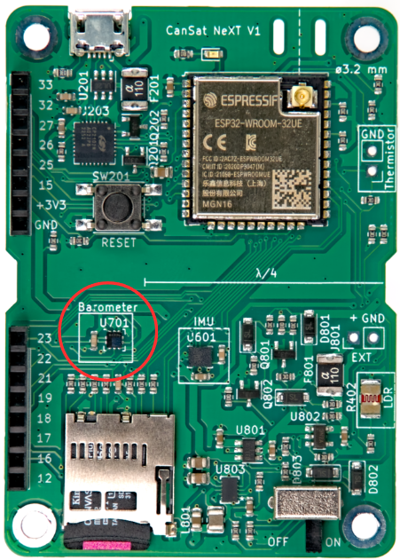

# Czujniki Pokładowe

Ten artykuł wprowadza czujniki zintegrowane z główną płytą CanSat NeXT. Użycie czujników jest omówione w dokumentacji oprogramowania, natomiast ten artykuł dostarcza więcej informacji o samych czujnikach.

Na głównej płycie CanSat NeXT znajdują się trzy czujniki pokładowe. Są to IMU LSM6DS3, czujnik ciśnienia LPS22HB oraz LDR. Dodatkowo, płyta ma otwór przelotowy do dodania zewnętrznego termistora. Ponieważ LPS22HB już posiada zdolności pomiaru ciśnienia i temperatury, teoretycznie wystarcza do spełnienia podstawowych kryteriów misji w zawodach CanSat. Jednakże, ponieważ mierzy temperaturę złącza wewnętrznego, czyli w zasadzie temperaturę PCB w tym miejscu, nie jest to dobre pomiar atmosferycznej temperatury w większości konfiguracji. Dodatkowo, absolutny pomiar czujnika ciśnienia może być wspierany przez dodatkowe dane z akcelerometru IMU. LDR został dodany przede wszystkim, aby pomóc studentom zrozumieć koncepcje dotyczące czujników analogowych, ponieważ reakcja na bodźce jest niemal natychmiastowa, podczas gdy termistor potrzebuje czasu na nagrzanie i ochłodzenie. To powiedziawszy, może również wspierać kreatywne misje, które studenci wymyślą, podobnie jak akcelerometr i żyroskop IMU. Ponadto, oprócz czujników pokładowych, CanSat NeXT zachęca do używania dodatkowych czujników poprzez interfejs rozszerzeń.

## Jednostka Pomiaru Inercyjnego

IMU, LSM6DS3 firmy STMicroelectronics to urządzenie typu SiP (system-in-package) MEMS, integrujące akcelerometr, żyroskop i elektronikę odczytową w małym opakowaniu. Czujnik obsługuje interfejsy szeregowe SPI i I2C, a także zawiera wewnętrzny czujnik temperatury.

LSM6DS3 ma przełączalne zakresy pomiaru przyspieszenia ±2/±4/±8/±16 G oraz zakresy pomiaru prędkości kątowej ±125/±250/±500/±1000/±2000 deg/s. Użycie wyższego zakresu zmniejsza również rozdzielczość urządzenia.

W CanSat NeXT, LSM6DS3 jest używany w trybie I2C. Adres I2C to 1101010b (0x6A), ale w następnej wersji zostanie dodana obsługa modyfikacji sprzętu w celu zmiany adresu na 1101011b (0x6B), jeśli zaawansowany użytkownik potrzebuje użyć oryginalnego adresu do czegoś innego.

Zakresy pomiarowe będą domyślnie ustawione na maksimum w bibliotece, aby uchwycić większość danych z gwałtownego startu rakiety. Zakresy danych są również modyfikowalne przez użytkownika.

## Barometr

Czujnik ciśnienia LPS22HB firmy STMicroelectronics to kolejny urządzenie typu SiP MEMS, zaprojektowane do pomiaru ciśnienia w zakresie 260-1260 hPa. Zakres, w którym raportuje dane, jest znacznie większy, ale dokładność pomiarów poza tym zakresem jest wątpliwa. Czujniki ciśnienia MEMS działają poprzez pomiar zmian piezorezystywnych w membranie czujnika. Ponieważ temperatura wpływa również na opór elementu piezo, musi być kompensowana. Aby to umożliwić, chip ma również stosunkowo dokładny czujnik temperatury złącza tuż obok elementu piezorezystywnego. Ten pomiar temperatury można również odczytać z czujnika, ale należy pamiętać, że jest to pomiar wewnętrznej temperatury chipu, a nie otaczającego powietrza.

Podobnie jak IMU, LPS22HB może być komunikowany za pomocą interfejsu SPI lub I2C. W CanSat NeXT jest podłączony do tego samego interfejsu I2C co IMU. Adres I2C LPS22HB to 1011100b (0x5C), ale dodamy obsługę zmiany go na 0x5D, jeśli będzie to pożądane.

## Przetwornik Analogowo-Cyfrowy

Odnosi się to do pomiaru napięcia za pomocą polecenia analogRead().

12-bitowy przetwornik analogowo-cyfrowy (ADC) w ESP32 jest znany z nieliniowości. Nie ma to znaczenia w większości zastosowań, takich jak wykrywanie zmian temperatury lub zmian oporu LDR, jednak dokonywanie absolutnych pomiarów napięcia baterii lub oporu NTC może być nieco trudne. Jednym ze sposobów obejścia tego jest staranna kalibracja, która zapewni wystarczająco dokładne dane na przykład dla temperatury. Jednak biblioteka CanSat również dostarcza skalibrowaną funkcję korekcji. Funkcja implementuje korekcję trzeciego rzędu dla ADC, korelując odczyt ADC z rzeczywistym napięciem obecnym na pinie ADC. Funkcja korekcji to

$$V = -1.907217e \times 10^{-11} \times a^3 + 8.368612 \times 10^{-8} \times a^2 + 7.081732e \times 10^{-4} \times a + 0.1572375$$

Gdzie V to zmierzone napięcie, a a to 12-bitowy odczyt ADC z analogRead(). Funkcja jest zawarta w bibliotece i jest nazywana adcToVoltage. Użycie tej formuły sprawia, że błąd odczytu ADC jest mniejszy niż 1% w zakresie napięcia 0.1 V - 3.2 V.

## Fotorezystor

Główna płyta CanSat NeXT zawiera również LDR w zestawie czujników. LDR to specjalny rodzaj rezystora, którego opór zmienia się wraz z oświetleniem. Dokładne charakterystyki mogą się różnić, ale w przypadku LDR, którego obecnie używamy, opór wynosi 5-10 kΩ przy 10 luksach i 300 kΩ w ciemności.

Sposób, w jaki jest używany w CanSat NeXT, polega na tym, że napięcie 3.3 V jest przykładane do rezystora porównawczego z MCU. Powoduje to, że napięcie na LDR_OUT wynosi

$$V_{LDR} = V_{EN} \frac{R402}{R401+R402} $$.

A ponieważ opór R402 się zmienia, napięcie na LDR_OUT również się zmienia. To napięcie można odczytać za pomocą ADC ESP32, a następnie skorelować z oporem LDR. W praktyce jednak, zazwyczaj w przypadku LDR interesuje nas zmiana, a nie wartość absolutna. Na przykład, zazwyczaj wystarcza wykrycie dużej zmiany napięcia, gdy urządzenie jest wystawione na światło po wystrzeleniu z rakiety. Wartości progowe są zazwyczaj ustalane eksperymentalnie, a nie obliczane analitycznie. Należy zauważyć, że w CanSat NeXT trzeba włączyć analogowe czujniki pokładowe, ustawiając pin MEAS_EN na HIGH. Jest to pokazane w przykładach kodu.

## Termistor

Obwód używany do odczytu zewnętrznego termistora jest bardzo podobny do obwodu odczytu LDR. Dokładnie ta sama logika ma zastosowanie, że gdy napięcie jest przykładane do rezystora porównawczego, napięcie na TEMP_OUT zmienia się zgodnie z

$$V_{TEMP} = V_{EN} \frac{TH501}{TH501+R501} $$.

W tym przypadku jednak zazwyczaj interesuje nas wartość absolutna oporu termistora. Dlatego VoltageConversion jest przydatne, ponieważ linearizuje odczyty ADC i oblicza bezpośrednio V_temp. W ten sposób użytkownik może obliczyć opór termistora w kodzie. Wartość powinna być nadal skorelowana z temperaturą za pomocą pomiarów, chociaż karta katalogowa termistora może również zawierać wskazówki, jak obliczyć temperaturę z oporu. Należy zauważyć, że jeśli wszystko jest robione analitycznie, należy również uwzględnić zmienność oporu R501. Najłatwiej to zrobić, mierząc opór za pomocą multimetru, zamiast zakładać, że wynosi 10 000 omów.

Rezystor porównawczy na PCB jest stosunkowo stabilny w szerokim zakresie temperatur, jednak również nieznacznie się zmienia. Jeśli pożądane są bardzo dokładne odczyty temperatury, należy to skompensować. Pomiar temperatury złącza z czujnika ciśnienia można do tego wykorzystać. To powiedziawszy, zdecydowanie nie jest to wymagane w zawodach CanSat. Dla zainteresowanych, współczynnik termiczny R501 jest raportowany przez producenta jako 100 PPM/°C.

Podczas gdy temperatura barometru głównie odzwierciedla temperaturę samej płyty, termistor można zamontować tak, aby reagował na zmiany temperatury poza płytą, nawet poza puszką. Można również dodać przewody, aby umieścić go jeszcze dalej. Jeśli będzie używany, termistor można przylutować do odpowiedniego miejsca na płycie CanSat NeXT. Polaryzacja nie ma znaczenia, tzn. można go zamontować w dowolny sposób.

