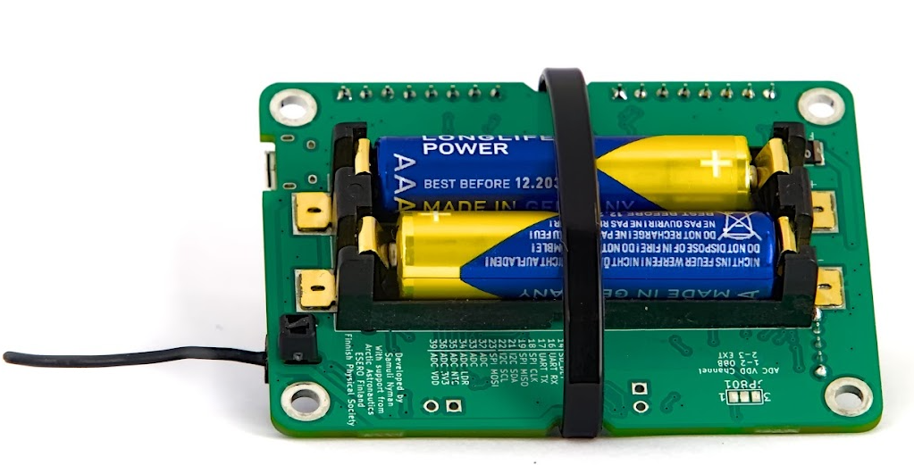
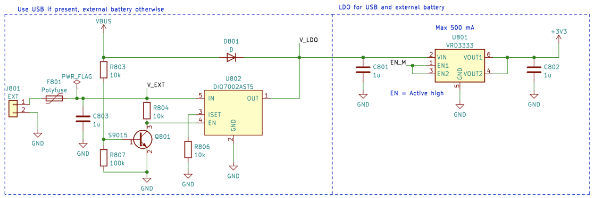

# Zarządzanie Zasilaniem Elektrycznym

Ten artykuł wyjaśnia, jak włączyć płytę CanSat NeXT, jak bezpiecznie podłączyć zewnętrzne urządzenia do płyty oraz jak działa system zasilania.

## Pierwsze Kroki

Dla większości użytkowników wystarczy po prostu dodać dwie baterie AAA do wbudowanego uchwytu na baterie i zabezpieczyć je na miejscu. Gdy USB jest podłączone, CanSat NeXT automatycznie przełącza się na zasilanie z USB zamiast z baterii, co wydłuża żywotność baterii. Pamiętaj, aby przed lotem wymienić baterie na nowe.

## System Zasilania CanSat NeXT

Istnieją trzy sposoby zasilania CanSat NeXT. Domyślnym sposobem jest zasilanie przez USB, dzięki czemu podczas opracowywania oprogramowania komputer zasila urządzenie i nie jest wymagane zewnętrzne zasilanie. Drugim sposobem jest użycie wbudowanych baterii (OBB). W tym celu należy włożyć dwie standardowe baterie AAA 1,5 V do złącza baterii na dolnej stronie głównej płyty. USB jest nadal domyślnym sposobem, nawet jeśli baterie są włożone, tzn. pojemność baterii nie jest używana, gdy USB jest podłączone.

Są to zwykłe opcje i powinny pokrywać większość przypadków użycia. Dodatkowo, istnieją dwie „zaawansowane” opcje zasilania CanSat NeXT, jeśli są potrzebne do specjalnego celu. Po pierwsze, płyta ma puste złącza przelotowe oznaczone jako EXT, które można wykorzystać do podłączenia zewnętrznej baterii. Napięcie baterii może wynosić 3,2-6V. Linia EXT jest automatycznie odłączana, gdy USB nie jest obecne, aby wydłużyć żywotność baterii i chronić baterię. Istnieje funkcja bezpieczeństwa, która wyłącza OBB, jeśli bateria jest podłączona, ale OBB nie powinno być obecne, gdy używane są zewnętrzne baterie.

Istnieje również ostatnia opcja, która przenosi całą odpowiedzialność na użytkownika, a mianowicie wprowadzenie 3V3 do urządzenia przez interfejs rozszerzenia. Nie jest to bezpieczny sposób zasilania urządzenia, ale zaawansowani użytkownicy, którzy wiedzą, co robią, mogą uznać to za najłatwiejszy sposób osiągnięcia pożądanych funkcji.

Podsumowując, istnieją trzy bezpieczne sposoby zasilania CanSat NeXT:

1. Użycie USB - główna metoda używana do rozwoju
2. Użycie wbudowanych baterii - zalecana metoda do lotu
3. Użycie zewnętrznej baterii - dla zaawansowanych użytkowników

Używając zwykłych baterii AAA, osiągnięto żywotność baterii wynoszącą 4 godziny w temperaturze pokojowej i 50 minut w -40 stopniach Celsjusza. Podczas testu urządzenie odczytywało wszystkie czujniki i przesyłało ich dane 10 razy na sekundę. Należy zauważyć, że zwykłe baterie alkaliczne nie są zaprojektowane do pracy w tak niskich temperaturach i zazwyczaj zaczynają przeciekać potasem po takich testach wytrzymałościowych. Nie jest to niebezpieczne, ale baterie alkaliczne powinny być zawsze bezpiecznie utylizowane po użyciu, zwłaszcza jeśli były używane w nietypowym środowisku, takim jak ekstremalne zimno, lub zostały zrzucone z rakiety. Albo oba.

Podczas korzystania z USB, pobór prądu z pinów rozszerzenia nie powinien przekraczać 300 mA. OBB są nieco bardziej wyrozumiałe, dając maksymalnie 800 mA z pinów rozszerzenia. Jeśli potrzebna jest większa moc, należy rozważyć użycie zewnętrznej baterii. Jest to mało prawdopodobne, chyba że uruchamiasz silniki (małe serwomechanizmy są w porządku) lub grzałki, na przykład. Małe kamery itp. są nadal w porządku.

## Dodatkowo - jak działa adaptacyjny schemat zasilania z wielu źródeł

Aby bezpiecznie osiągnąć pożądane funkcje, musimy wziąć pod uwagę wiele rzeczy w projektowaniu systemu zasilania. Po pierwsze, aby bezpiecznie móc podłączyć USB, EXT i OBB jednocześnie, system zasilania musi włączać i wyłączać różne źródła zasilania. Jest to dodatkowo skomplikowane przez fakt, że nie można tego zrobić w oprogramowaniu, ponieważ użytkownik musi mieć możliwość posiadania dowolnego oprogramowania, które sobie życzy, bez narażania bezpiecznej pracy. Ponadto, OBB ma dość inny zakres napięcia niż USB i zewnętrzna bateria. To wymaga, aby OBB używało regulatora boost, podczas gdy USB i EXT potrzebują albo regulatora buck, albo LDO. Dla prostoty i niezawodności, w tej linii użyto LDO. Wreszcie, jeden przełącznik zasilania powinien być w stanie odłączyć wszystkie źródła zasilania.

Poniżej znajduje się schemat konwertera boost. Układ scalony to BU33UV7NUX, konwerter boost specjalnie zaprojektowany do dostarczania +3.3V z dwóch baterii alkalicznych. Jest włączany, gdy linia BOOST_EN jest wysoka, czyli powyżej 0.6 V.

Wszystkie linie OBB, USB i EXT są chronione bezpiecznikiem, ochroną przed nadprądem, ochroną przed odwrotnym napięciem i prądem oraz ochroną przed przegrzaniem. Ponadto, OBB jest chronione przed zbyt niskim napięciem i zwarciem, ponieważ takie sytuacje powinny być unikane z bateriami alkalicznymi.

Zwróć uwagę w poniższej sekcji, że napięcie zewnętrznej baterii to V_EXT, napięcie USB to VBUS, a napięcie OBB to BATT.

Linia BOOST_EN jest kontrolowana przez obwód przełącznika, który albo pobiera wejście z linii EN_MASTER (EN_M), albo ignoruje to, jeśli V_EXT lub VBUS jest obecne. Zostało to zrobione, aby zapewnić, że boost jest zawsze wyłączony, gdy VBUS i V_EXT są obecne, i jest włączany tylko wtedy, gdy zarówno VBUS, jak i V_EXT są na poziomie 0V, a EN_M jest wysoki.

Lub jako tabela prawdy:

| V_EXT | VBUS | EN_M | BOOST_EN |
|-------|------|------|----------|
| 1     | 1    | 1    | 0        |
| 1     | 1    | 0    | 0        |
| 0     | 0    | 0    | 0        |
| 0     | 0    | 1    | 1        |

Więc BOOST_EN = EN_M ∧ !(V_EXT ∨ V_BUS).

Następnie musimy odłączyć V_EXT, jeśli VBUS jest obecne, aby zapobiec niepożądanemu rozładowaniu lub przypadkowemu ładowaniu. Jest to realizowane za pomocą układu przełącznika zasilania z pomocą obwodu tranzystora, który obniża linię włączania przełącznika zasilania, jeśli VBUS jest obecne. To odłącza baterię. Linia USB jest zawsze używana, gdy jest obecna, więc jest kierowana do LDO za pomocą prostego diody Schottky'ego.

Ogólnie rzecz biorąc, ten obwód prowadzi do funkcjonalności, w której zasilanie USB jest używane, jeśli jest obecne, a V_EXT jest używane, gdy USB nie jest obecne. Wreszcie, EN_M jest używane do włączania lub wyłączania LDO.

EN_M jest kontrolowane przez użytkownika za pomocą przełącznika zasilania. Przełącznik łączy EN_M z USB lub EXT, lub z napięciem baterii, gdy używane jest tylko OBB. Gdy przełącznik jest wyłączony, łączy EN_M z masą, wyłączając zarówno LDO, jak i regulator boost.

Tak więc w praktyce przełącznik zasilania włącza/wyłącza urządzenie, USB jest używane, jeśli jest obecne, a V_EXT jest preferowane nad OBB. Wreszcie, jest jeszcze jeden szczegół do rozważenia. Jakie napięcie powinno mierzyć ESP32 jako napięcie baterii?

Zostało to rozwiązane w prosty sposób. Napięcie podłączone do ESP32 ADC jest zawsze OBB, ale użytkownik może wybrać V_EXT zamiast tego, przecinając zworkę skalpelem i lutując zworkę JP801, aby skrócić 2-3 zamiast tego. To wybiera V_EXT do BATT_MEAS zamiast.

Zworkę można znaleźć na dolnej stronie głównej płyty CanSat NeXT. Zworka jest dość łatwa do lutowania, więc nie bój się przeciąć linii 1-2, jeśli używasz zewnętrznej baterii. Zawsze można ją ponownie przylutować, aby ponownie używać 1-2.