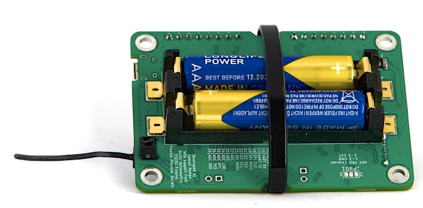

# Lekcja 12: Gotowi do startu?

W tej ostatniej lekcji porozmawiamy o przygotowaniu satelity, stacji naziemnej i zespołu do startu. Po tej lekcji przeprowadzimy również *przegląd* w celu sprawdzenia gotowości do lotu, ale ta lekcja koncentruje się na maksymalizacji szans na udaną misję. W tej lekcji omówimy przygotowanie elektroniki mechanicznie i elektrycznie, sprawdzenie systemu komunikacji radiowej, a na koniec omówimy kilka przydatnych kroków przygotowawczych, które należy wykonać na długo przed faktycznym wydarzeniem startowym.

Ta lekcja jest znów nieco inna, ponieważ zamiast omawiać nowe koncepcje programistyczne, dyskutujemy, jak poprawić niezawodność urządzenia w misji. Ponadto, chociaż prawdopodobnie nie skończyłeś jeszcze budować (lub definiować) misji satelitarnej, jeśli teraz po raz pierwszy przechodzisz przez kurs, warto przeczytać materiały na tej stronie, rozważyć te aspekty podczas planowania urządzenia i misji oraz wrócić do nich podczas faktycznego przygotowania do startu.

## Rozważania mechaniczne

Po pierwsze, jak omówiono w poprzedniej lekcji, **stos** elektroniki powinien być zbudowany w taki sposób, aby pozostał razem nawet przy dużych wibracjach i wstrząsach. Dobrym sposobem na zaprojektowanie elektroniki jest użycie płytek perforowanych, które są utrzymywane razem przez [standoffs](https://spacelabnextdoor.com/electronics/27-cansat-next-rp-sma-ufl) i połączone elektrycznie za pomocą złącza lub dobrze podpartego kabla. Na koniec cały stos elektroniki powinien być przymocowany do ramy satelity w taki sposób, aby się nie poruszał. Sztywne połączenie za pomocą śrub to zawsze solidny wybór (gra słów zamierzona), ale to nie jedyna opcja. Alternatywą może być zaprojektowanie systemu, który złamie się przy uderzeniu, podobnie jak [strefa zgniotu](https://en.wikipedia.org/wiki/Crumple_zone). Alternatywnie, system montażu z amortyzacją z gumy, pianki lub podobnego systemu może zmniejszyć naprężenia doświadczane przez elektronikę, co pomaga w tworzeniu systemów wielokrotnego użytku.

W typowym CanSat istnieją pewne elementy, które są szczególnie podatne na problemy podczas startu lub szybszego niż oczekiwano lądowania. Są to baterie, karta SD i antena.

### Zabezpieczanie baterii

W CanSat NeXT płyta została zaprojektowana w taki sposób, aby można było przymocować opaskę zaciskową wokół płyty, aby zapewnić utrzymanie baterii na miejscu podczas wibracji. W przeciwnym razie mają tendencję do wyskakiwania z gniazd. Innym problemem związanym z bateriami jest to, że niektóre baterie są krótsze niż byłoby to idealne dla uchwytu baterii i możliwe jest, że przy szczególnie dużym wstrząsie styki baterii zginają się pod ciężarem baterii, co powoduje utratę kontaktu. Aby temu zapobiec, styki można podeprzeć, dodając kawałek opaski zaciskowej, pianki lub innego wypełniacza za sprężynowymi stykami. W przypadkowych (i celowych) testach upadku poprawiło to niezawodność, chociaż CanSat NeXT zintegrowane z dobrze zbudowanymi CanSatami przetrwały upadki z wysokości do 1000 metrów (bez spadochronu) nawet bez tych środków ochronnych. Jeszcze lepszym sposobem na podparcie baterii jest zaprojektowanie struktury wsporczej bezpośrednio do ramy CanSat, tak aby to ona przejmowała ciężar baterii przy uderzeniu zamiast uchwytu baterii.



### Zabezpieczanie kabla antenowego

Złącze anteny to U.Fl, które jest typem złącza o ocenie motoryzacyjnej. Radzą sobie dobrze z wibracjami i wstrząsami, mimo że nie mają zewnętrznych podpór mechanicznych. Jednak niezawodność można poprawić, zabezpieczając antenę małymi opaskami zaciskowymi. Płyta CanSat NeXT ma małe szczeliny obok anteny w tym celu. Aby utrzymać antenę w neutralnej pozycji, można dla niej [wydrukować podporę](../CanSat-hardware/communication#quarter-wave-antenna).


### Zabezpieczanie karty SD

Karta SD może wyskoczyć z uchwytu przy dużych wstrząsach. Ponownie, płyty przetrwały upadki i loty, ale niezawodność można poprawić, przyklejając lub przyklejając kartę SD do uchwytu. Nowsze płyty CanSat NeXT (≥1.02) są wyposażone w uchwyty na karty SD o wysokim poziomie bezpieczeństwa, aby dodatkowo złagodzić ten problem.

## Test komunikacji

Jednym z najważniejszych szczegółów, które należy poprawić, aby misja zakończyła się sukcesem, jest posiadanie niezawodnego łącza radiowego. Więcej informacji na temat wyboru i/lub budowy anten można znaleźć w [sekcji sprzętowej](../CanSat-hardware/communication#antenna-options) dokumentacji. Jednak niezależnie od wybranej anteny, testowanie jest istotną częścią każdego systemu radiowego.

Prawidłowe testowanie anteny może być trudne i wymaga specjalistycznego sprzętu, takiego jak [VNA](https://en.wikipedia.org/wiki/Network_analyzer_(electrical)), ale możemy przeprowadzić test funkcjonalny bezpośrednio za pomocą zestawu CanSat NeXT.

Najpierw zaprogramuj satelitę, aby wysyłał dane, na przykład odczyt danych raz na sekundę. Następnie zaprogramuj stację naziemną, aby odbierała dane i drukowała wartości **RSSI** (Received signal strength indicator), jak podano przez funkcję `getRSSI()`, która jest częścią biblioteki CanSat NeXT.

```Cpp title="Read RSSI"
#include "CanSatNeXT.h"

void setup() {
  Serial.begin(115200);
  GroundStationInit(28);
}

void loop() {}

void onDataReceived(String data)
{
  int rssi = getRSSI();
  Serial.print("RSSI: ");
  Serial.println(rssi);
}
```

Ta wartość reprezentuje rzeczywistą moc elektryczną odbieraną przez stację naziemną za pośrednictwem jej anteny podczas odbierania wiadomości. Wartość jest wyrażona w [decibelmiliwatach](https://en.wikipedia.org/wiki/DBm). Typowy odczyt z działającą anteną na obu końcach, gdy urządzenia znajdują się na tym samym stole, wynosi -30 dBm (1000 nanowatów) i powinien szybko spadać wraz ze wzrostem odległości. W wolnej przestrzeni podąża mniej więcej za prawem odwrotności kwadratu, ale nie dokładnie z powodu echa, stref fresnela i innych niedoskonałości. Przy ustawieniach radiowych, które CanSat NeXT używa domyślnie, RSSI można obniżyć do około -100 dBm (0,1 pikowata) i nadal niektóre dane przechodzą.

To zwykle odpowiada odległości około kilometra przy użyciu anten monopole, ale może być znacznie większe, jeśli antena stacji naziemnej ma znaczący [zysk](https://en.wikipedia.org/wiki/Gain_(antenna)), który bezpośrednio dodaje się do odczytu dBm.

## Testy zasilania

Dobrym pomysłem jest zmierzenie poboru prądu przez satelitę za pomocą multimetru. To również łatwe, wystarczy wyjąć jedną z baterii i trzymać ją ręcznie w taki sposób, aby można było użyć pomiaru prądu multimetrem do połączenia między jednym końcem baterii a stykiem baterii. Ten odczyt powinien wynosić około 130-200 mA, jeśli radio CanSat NeXT jest aktywne i nie ma urządzeń zewnętrznych. Pobór prądu wzrasta wraz z rozładowywaniem się baterii, ponieważ potrzeba więcej prądu, aby utrzymać napięcie na poziomie 3,3 wolta przy obniżającym się napięciu baterii.

Typowe baterie AAA mają pojemność około 1200 mAh, co oznacza, że pobór prądu przez urządzenie powinien być mniejszy niż 300 mA, aby zapewnić, że baterie wytrzymają całą misję. To także powód, dla którego warto mieć wiele trybów pracy, jeśli na pokładzie znajdują się urządzenia o dużym zapotrzebowaniu na prąd, ponieważ można je włączyć tuż przed lotem, aby zapewnić dobrą żywotność baterii.

Chociaż matematyczne podejście do szacowania żywotności baterii jest dobrym początkiem, nadal najlepiej jest przeprowadzić rzeczywisty pomiar żywotności baterii, uzyskując świeże baterie i przeprowadzając symulowaną misję.

## Testy lotnicze

W przemyśle lotniczym każdy satelita przechodzi rygorystyczne testy, aby upewnić się, że może przetrwać trudne warunki startu, przestrzeni kosmicznej, a czasem ponownego wejścia. Chociaż CanSaty działają w nieco innym środowisku, można nadal dostosować niektóre z tych testów, aby poprawić niezawodność. Poniżej znajdują się niektóre z powszechnych testów lotniczych stosowanych dla CubeSatów i małych satelitów, wraz z pomysłami na to, jak można wdrożyć podobne testy dla CanSat.

### Testy wibracyjne

Test wibracyjny jest używany w systemach małych satelitów z dwóch powodów. Głównym powodem jest to, że test ma na celu zidentyfikowanie częstotliwości rezonansowych struktury, aby upewnić się, że wibracje rakiety nie zaczną rezonować w żadnej strukturze satelity, co mogłoby prowadzić do awarii systemów satelitarnych. Drugim powodem, który również ma znaczenie dla systemów CanSat, jest potwierdzenie jakości wykonania i zapewnienie, że system przetrwa start rakiety. Testy wibracyjne satelitów są przeprowadzane na specjalistycznych ławkach testowych wibracji, ale efekt można również symulować za pomocą bardziej kreatywnych rozwiązań. Spróbuj wymyślić sposób na naprawdę mocne potrząsanie satelitą (lub najlepiej jego zapasowym egzemplarzem) i zobacz, czy coś się zepsuje. Jak można to poprawić?

### Testy wstrząsowe

Kuzyn testów wibracyjnych, testy wstrząsowe symulują eksplozję podczas separacji stopni rakiety. Przyspieszenie wstrząsowe może wynosić do 100 G, co może łatwo uszkodzić systemy. Można to symulować testem upadku, ale zastanów się, jak zrobić to bezpiecznie, aby satelita, ty lub podłoga się nie uszkodziły.

### Testy termiczne

Testy termiczne obejmują narażenie całego satelity na ekstremalne temperatury planowanego zakresu operacyjnego oraz szybkie przemieszczanie się między tymi temperaturami. W kontekście CanSat może to oznaczać testowanie satelity w zamrażarce, symulując start w zimny dzień, lub w lekko podgrzewanym piekarniku, aby symulować gorący dzień startu. Uważaj, aby elektronika, tworzywa sztuczne lub twoja skóra nie były bezpośrednio narażone na ekstremalne temperatury.

## Ogólne dobre pomysły

Oto kilka dodatkowych wskazówek, które pomogą zapewnić udaną misję. Obejmują one od przygotowań technicznych po praktyki organizacyjne, które poprawią ogólną niezawodność twojego CanSat. Zachęcamy do sugerowania nowych pomysłów do dodania tutaj za pośrednictwem zwykłego kanału (samuli@kitsat.fi).

- Rozważ posiadanie listy kontrolnej, aby uniknąć zapomnienia o czymś tuż przed startem
- Przetestuj całą sekwencję lotu wcześniej w symulowanym locie
- Przetestuj satelitę również w podobnych warunkach środowiskowych, jakie są oczekiwane podczas lotu. Upewnij się, że spadochron również jest w porządku przy oczekiwanych temperaturach.
- Miej zapasowe baterie i pomyśl o tym, jak są instalowane, jeśli zajdzie taka potrzeba
- Miej zapasową kartę SD, czasami się psują
- Miej zapasowy komputer i wyłącz aktualizacje na komputerze przed startem.
- Miej zapasowe opaski zaciskowe, śruby i cokolwiek innego, czego potrzebujesz do złożenia satelity
- Miej pod ręką podstawowe narzędzia, które pomogą w demontażu i montażu
- Miej dodatkowe anteny
- Możesz również mieć wiele stacji naziemnych działających jednocześnie, które mogą być również używane do triangulacji satelity, zwłaszcza jeśli dostępne jest RSSI.
- Miej jasne role dla każdego członka zespołu podczas startu, operacji i odzyskiwania.

---

To koniec lekcji na razie. Na następnej stronie znajduje się przegląd gotowości do lotu, który jest praktyką pomagającą w zapewnieniu udanych misji.

[Kliknij tutaj, aby przejść do przeglądu gotowości do lotu!](./review2)