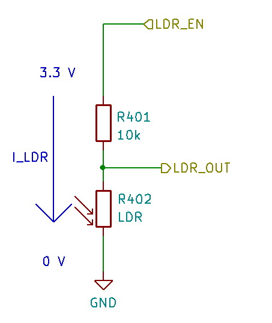

# Lekcja 4: Opór nie jest daremny

Do tej pory skupialiśmy się na używaniu cyfrowych urządzeń sensorycznych do uzyskiwania wartości bezpośrednio w jednostkach SI. Jednak urządzenia elektryczne dokonują pomiaru zazwyczaj w sposób pośredni, a konwersja do pożądanych jednostek odbywa się później. Wcześniej było to realizowane przez same urządzenia sensoryczne (i przez bibliotekę CanSat NeXT), ale wiele czujników, których używamy, jest znacznie prostszych. Jednym z typów czujników analogowych są czujniki rezystancyjne, gdzie rezystancja elementu czujnika zmienia się w zależności od pewnych zjawisk. Czujniki rezystancyjne istnieją dla wielu wielkości - w tym siły, temperatury, natężenia światła, stężeń chemicznych, pH i wielu innych.

W tej lekcji będziemy używać fotorezystora (LDR) na płytce CanSat NeXT do pomiaru natężenia światła otoczenia. Podobnie używa się termistora, ale to będzie tematem przyszłej lekcji. Te same umiejętności mają bezpośrednie zastosowanie do używania LDR i termistora, jak również wielu innych czujników rezystancyjnych.


## Fizyka czujników rezystancyjnych

Zamiast od razu przechodzić do oprogramowania, cofnijmy się o krok i omówmy, jak ogólnie działa odczyt czujnika rezystancyjnego. Rozważmy poniższy schemat. Napięcie na LDR_EN wynosi 3,3 wolta (napięcie robocze procesora), a na jego drodze mamy dwa rezystory połączone szeregowo. Jednym z nich jest **LDR** (R402), a drugim **rezystor referencyjny** (R402). Rezystancja rezystora referencyjnego wynosi 10 kilo-omów, podczas gdy rezystancja LDR zmienia się między 5-300 kilo-omów w zależności od warunków oświetleniowych.



Ponieważ rezystory są połączone szeregowo, całkowita rezystancja wynosi

$$
R = R_{401} + R_{LDR},
$$

a prąd płynący przez rezystory to

$$
I_{LDR} = \frac{V_{OP}}{R},
$$

gdzie $V_{OP}$ to napięcie robocze MCU. Pamiętaj, że prąd musi być taki sam przez oba rezystory. Dlatego możemy obliczyć spadek napięcia na LDR jako

$$
V_{LDR} = R_{LDR} * I_{LDR} =  V_{OP} \frac{R_{LDR}}{R_{401} + R_{LDR}}.
$$

A ten spadek napięcia to napięcie LDR, które możemy zmierzyć za pomocą przetwornika analogowo-cyfrowego. Zazwyczaj to napięcie można bezpośrednio skorelować lub skalibrować, aby odpowiadało mierzonym wartościom, na przykład od napięcia do temperatury lub jasności. Jednak czasami pożądane jest najpierw obliczenie mierzonej rezystancji. Jeśli to konieczne, można ją obliczyć jako:

$$
R_{LDR} = \frac{V_{LDR}}{I_{LDR}} = \frac{V_{LDR}}{V_{OP}} (R_{401} + R_{LDR}) = R_{401} \frac{\frac{V_{LDR}}{V_{OP}}}{1-\frac{V_{LDR}}{V_{OP}}}
$$

## Odczyt LDR w praktyce

Odczyt LDR lub innych czujników rezystancyjnych jest bardzo prosty, ponieważ wystarczy zapytać przetwornik analogowo-cyfrowy o napięcie. Zacznijmy tym razem nowy szkic Arduino od zera. Plik -> Nowy szkic.

Najpierw rozpocznijmy szkic jak wcześniej, dołączając bibliotekę. Robi się to na początku szkicu. W ustawieniach, uruchom serial i zainicjuj CanSat, tak jak wcześniej.

```Cpp title="Podstawowa konfiguracja"
#include "CanSatNeXT.h"

void setup() {
  Serial.begin(115200);
  CanSatInit();
}
```

Podstawowa pętla do odczytu LDR nie jest dużo bardziej skomplikowana. Rezystory R401 i R402 są już na płytce, a my musimy tylko odczytać napięcie z ich wspólnego węzła. Odczytajmy wartość ADC i wydrukujmy ją.

```Cpp title="Podstawowa pętla LDR"
void loop() {
    int value = analogRead(LDR);
    Serial.print("Wartość LDR:");
    Serial.println(value);
    delay(200);
}
```

Dzięki temu programowi wartości wyraźnie reagują na warunki oświetleniowe. Otrzymujemy niższe wartości, gdy LDR jest wystawiony na światło, i wyższe wartości, gdy jest ciemniej. Jednak wartości są w setkach i tysiącach, a nie w oczekiwanym zakresie napięcia. Dzieje się tak, ponieważ teraz odczytujemy bezpośrednie wyjście ADC. Każdy bit reprezentuje drabinkę porównania napięcia będącą jedynką lub zerem w zależności od napięcia. Wartości wynoszą teraz 0-4095 (2^12-1) w zależności od napięcia wejściowego. Ponownie, ten bezpośredni pomiar jest prawdopodobnie tym, czego chcesz użyć, jeśli robisz coś takiego jak [wykrywanie impulsów za pomocą LDR](./../../blog/first-project#pulse-detection), ale często zwykłe wolty są wygodniejsze do pracy. Chociaż obliczanie napięcia samodzielnie jest dobrym ćwiczeniem, biblioteka zawiera funkcję konwersji, która uwzględnia również nieliniowość ADC, co oznacza, że wynik jest dokładniejszy niż z prostej konwersji liniowej.

```Cpp title="Odczyt napięcia LDR"
void loop() {
    float LDR_voltage = analogReadVoltage(LDR);
    Serial.print("Wartość LDR:");
    Serial.println(LDR_voltage);
    delay(200);
}
```

:::note

Ten kod jest kompatybilny z ploterem szeregowym w Arduino Code. Wypróbuj go!

:::

:::tip[Ćwiczenie]

Może być przydatne wykrycie, że CanSat został wystrzelony z rakiety, aby na przykład spadochron mógł zostać otwarty w odpowiednim momencie. Czy możesz napisać program, który wykrywa symulowane wystrzelenie? Zasymuluj start, najpierw zakrywając LDR (integracja rakiety), a następnie odkrywając go (wystrzelenie). Program mógłby wyświetlić wystrzelenie na terminalu lub migać diodą LED, aby pokazać, że wystrzelenie nastąpiło.

:::

---

Następna lekcja dotyczy używania karty SD do przechowywania pomiarów, ustawień i nie tylko!

[Kliknij tutaj, aby przejść do następnej lekcji!](./lesson5)