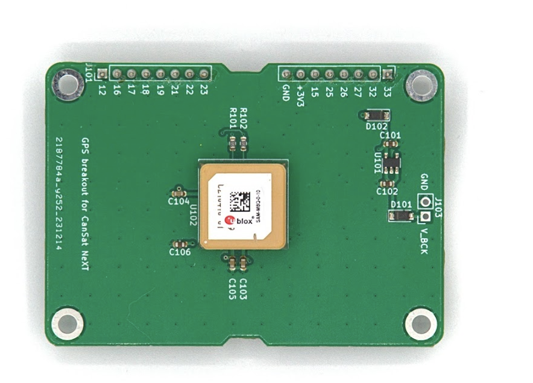

# Módulo GNSS CanSat NeXT

O módulo GNSS CanSat NeXT estende o CanSat NeXT com capacidades de rastreamento de localização e relógio de tempo real preciso. O módulo é baseado no receptor GNSS U-Blox SAM-M10Q da U-Blox.

## Hardware

O módulo conecta o receptor GNSS ao CanSat NeXT através do UART no cabeçalho de extensão. O dispositivo usa os pinos 16 e 17 do cabeçalho de extensão para UART RX e TX, e também obtém a fonte de alimentação da linha +3V3 no cabeçalho de extensão.

Por padrão, os registros de backup do módulo GNSS são alimentados pela linha +3V3. Embora isso torne o módulo fácil de usar, significa que o módulo sempre tem que começar do zero ao tentar encontrar uma posição fixa. Para mitigar isso, é possível fornecer uma fonte de alimentação externa através da linha de tensão de backup através dos cabeçalhos J103. A tensão fornecida ao pino V_BCK deve ser de 2-6,5 volts, e o consumo de corrente é constante de 65 microamperes, mesmo quando a alimentação principal está desligada. Fornecer a tensão de backup permite que o receptor GNSS mantenha todas as configurações, mas também, crucialmente, os dados de almanaque e efemérides - reduzindo o tempo para obter uma posição fixa de ~30 segundos para 1-2 segundos se o dispositivo não tiver se movido significativamente entre as trocas de energia.

Existem muitos outros módulos e breakouts GNSS disponíveis de empresas como Sparkfun e Adafruit, entre outros. Estes podem ser conectados ao CanSat NeXT através da mesma interface UART, ou usando SPI e I2C, dependendo do módulo. A biblioteca CanSat NeXT também deve suportar outros breakouts que usam módulos U-blox. Ao procurar por breakouts GNSS, tente encontrar um onde a PCB base seja o maior possível - a maioria apresenta PCBs muito pequenas, o que torna o desempenho da antena muito fraco em comparação com módulos com PCBs maiores. Qualquer tamanho menor que 50x50 mm começará a prejudicar o desempenho e a capacidade de encontrar e manter uma posição fixa.

Para mais informações sobre o módulo GNSS e o grande número de configurações e recursos disponíveis, consulte a ficha técnica do receptor GNSS no [site da U-Blox](https://www.u-blox.com/en/product/sam-m10q-module).

A integração de hardware do módulo ao CanSat NeXT é realmente simples - após adicionar espaçadores aos furos de parafuso, insira cuidadosamente os pinos do cabeçalho nos soquetes de pinos. Se você pretende fazer uma pilha eletrônica de várias camadas, certifique-se de colocar o GNSS como o módulo mais superior para permitir 

## Software

A maneira mais fácil de começar a usar o CanSat NeXT GNSS é com nossa própria biblioteca Arduino, que você pode encontrar no gerenciador de bibliotecas Arduino. Para instruções sobre como instalar a biblioteca, consulte a página de [introdução](./../course/lesson1).

A biblioteca inclui exemplos de como ler a posição e a hora atual, bem como como transmitir os dados com o CanSat NeXT.

Uma nota rápida sobre as configurações - o módulo precisa ser informado sobre o tipo de ambiente em que será usado, para que possa melhor aproximar a posição do usuário. Normalmente, a suposição é que o usuário estará ao nível do solo, e embora possa estar se movendo, a aceleração provavelmente não é muito alta. Este não é o caso com CanSats, que podem ser lançados com foguetes ou atingir o solo com velocidades bastante altas. Portanto, a biblioteca define por padrão que a posição deve ser calculada assumindo um ambiente de alta dinâmica, o que permite que a posição fixa seja mantida pelo menos um pouco durante a aceleração rápida, mas também torna a posição no solo notavelmente menos precisa. Se, em vez disso, uma alta precisão após o pouso for mais desejável, você pode inicializar o módulo GNSS com o comando `GNSS_init(DYNAMIC_MODEL_GROUND)`, substituindo o padrão `GNSS_init(DYNAMIC_MODEL_ROCKET)` = `GNSS_init()`. Além disso, há `DYNAMIC_MODEL_AIRBORNE`, que é ligeiramente mais preciso do que o modelo de foguete, mas assume apenas uma aceleração modesta.

Esta biblioteca prioriza a facilidade de uso e possui apenas funcionalidades básicas, como obter localização e hora do GNSS. Para usuários que procuram recursos GNSS mais avançados, a excelente SparkFun_u-blox_GNSS_Arduino_Library pode ser uma escolha melhor.

## Especificação da Biblioteca

Aqui estão os comandos disponíveis da biblioteca CanSat GNSS.

### GNSS_Init

| Função               | uint8_t GNSS_Init(uint8_t dynamic_model)                          |
|----------------------|--------------------------------------------------------------------|
| **Tipo de Retorno**  | `uint8_t`                                                          |
| **Valor de Retorno** | Retorna 1 se a inicialização foi bem-sucedida, ou 0 se houve um erro. |
| **Parâmetros**       |                                                                    |
|                      | `uint8_t dynamic_model`                                           |
|                      | Isso escolhe o modelo dinâmico, ou o ambiente que o módulo GNSS assume. As escolhas possíveis são DYNAMIC_MODEL_GROUND, DYNAMIC_MODEL_AIRBORNE e DYNAMIC_MODEL_ROCKET. |
| **Descrição**        | Este comando inicializa o módulo GNSS, e você deve chamá-lo na função de configuração. |

### readPosition

| Função               | uint8_t readPosition(float &x, float &y, float &z)          |
|----------------------|--------------------------------------------------------------------|
| **Tipo de Retorno**  | `uint8_t`                                                          |
| **Valor de Retorno** | Retorna 0 se a medição foi bem-sucedida.                           |
| **Parâmetros**       |                                                                    |
|                      | `float &latitude, float &longitude, float &altitude`                                    |
|                      | `float &x`: Endereço de uma variável float onde os dados serão armazenados. |
| **Usado no exemplo de esboço** | Todos                                                  |
| **Descrição**        | Esta função pode ser usada para ler a posição do dispositivo como coordenadas. Os valores serão semi-aleatórios antes que a posição fixa seja obtida. A altitude é em metros acima do nível do mar, embora não seja muito precisa. |

### getSIV

| Função               | uint8_t getSIV()                  |
|----------------------|--------------------------------------------------------------------|
| **Tipo de Retorno**  | `uint8_t`                                                          |
| **Valor de Retorno** | Número de satélites à vista |
| **Usado no exemplo de esboço** | AdditionalFunctions                                          |
| **Descrição**        | Retorna o número de satélites à vista. Tipicamente, valores abaixo de 3 indicam nenhuma posição fixa. |

### getTime

| Função               | uint32_t getTime()                  |
|----------------------|--------------------------------------------------------------------|
| **Tipo de Retorno**  | `uint32_t`                                                          |
| **Valor de Retorno** | Tempo Epoch atual |
| **Usado no exemplo de esboço** | AdditionalFunctions                                          |
| **Descrição**        | Retorna o tempo epoch atual, conforme indicado pelos sinais dos satélites GNSS. Em outras palavras, este é o número de segundos decorridos desde 00:00:00 UTC, quinta-feira, primeiro de janeiro de 1970. |