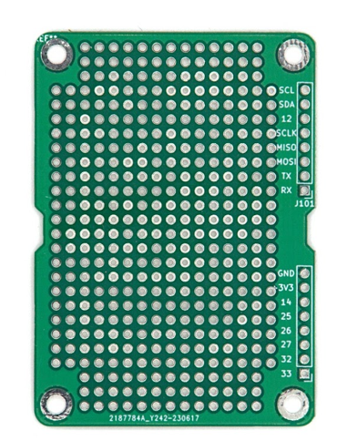

import perfboard_render from './img/perf_render.png';

# CanSat NeXT Perf Board

A CanSat NeXT Perf Board é um acessório destinado a facilitar a integração de dispositivos externos ao CanSat e a tornar seus próprios componentes eletrônicos mecanicamente mais seguros e melhor organizados. Essencialmente, é uma placa perfurada que compartilha o formato da placa CanSat NeXT e também oferece conectividade fácil ao cabeçalho de pinos de extensão.

A principal característica da placa perfurada são os furos metalizados, espaçados a 0,1 polegadas (2,54 mm) de distância, que é o **pitch** padrão usado em eletrônica, especialmente em eletrônica de hobby. Isso facilita a integração da maioria dos módulos comerciais e de muitos CIs comerciais, pois podem ser diretamente soldados aos contatos na placa perfurada.

No lado superior, os furos têm um pequeno anel metalizado para auxiliar na conectividade, mas no lado inferior há grandes retângulos metalizados, que facilitam muito a criação de pontes de solda entre os quadrados, auxiliando na criação da conectividade elétrica entre os dispositivos na sua placa e entre os dispositivos adicionados e o CanSat NeXT.

Além disso, alguns dos furos metalizados mais próximos do cabeçalho já estão conectados aos cabeçalhos de pinos de extensão. Isso ajuda a evitar a necessidade de adicionar cabos entre o cabeçalho de pinos e a área principal da placa perfurada, ajudando também na sobreposição de várias placas perfuradas umas sobre as outras, especialmente ao usar [stacking pin headers](https://spacelabnextdoor.com/electronics/32-cansat-next-stacking-header). Para verificar qual pino de extensão faz o quê, consulte o [Pinout](../CanSat-hardware/pin_out)

