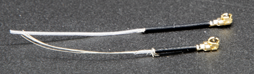
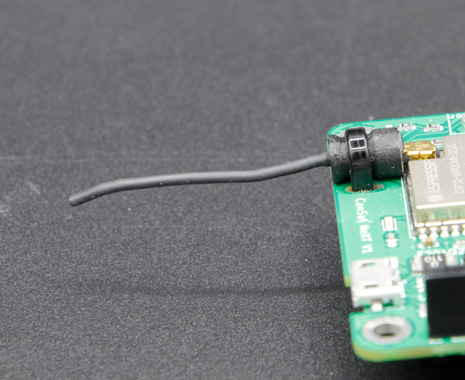

# Comunicação e Antenas

Este artigo introduz os conceitos-chave necessários para a transmissão de dados sem fio com o CanSat NeXT. Primeiro, o sistema de comunicação é discutido em um nível geral, em seguida, algumas opções diferentes são apresentadas para a seleção de antenas ao usar o CanSat NeXT. Finalmente, a última parte do artigo apresenta um tutorial simples para construir uma antena monopolo de um quarto de onda a partir das peças incluídas no kit.

## Introdução

O CanSat NeXT está quase pronto para iniciar a comunicação sem fio diretamente da caixa. A única coisa necessária é o software adequado e uma antena para o transmissor e o receptor. Para o primeiro, consulte os materiais de software nesta página. Para o último, esta página inclui instruções sobre como selecionar uma antena externa e como construir uma antena monopolo simples a partir dos materiais incluídos com o CanSat NeXT.

Embora a placa seja bastante resistente a essas coisas graças às verificações de software, você nunca deve tentar transmitir qualquer coisa de um rádio sem uma antena. Embora improvável devido às baixas potências envolvidas com este sistema, a onda de rádio refletida pode causar danos reais à eletrônica.

## Sistema de Comunicação do CanSat NeXT

O CanSat NeXT lida com a transferência de dados sem fio de forma um pouco diferente dos kits CanSat mais antigos. Em vez de um módulo de rádio separado, o CanSat NeXT usa o rádio WiFi integrado do MCU para a comunicação. O rádio WiFi é normalmente usado para transferir dados entre um ESP32 e a internet, permitir o uso do ESP32 como um servidor simples ou até mesmo conectar o ESP32 a um dispositivo Bluetooth, mas com certos truques de configuração TCP-IP inteligentes, podemos habilitar a comunicação direta ponto a ponto entre dispositivos ESP32. O sistema é chamado ESP-NOW, e é desenvolvido e mantido pela EspressIf, que são os desenvolvedores do hardware ESP32. Além disso, existem esquemas de comunicação de baixa taxa especiais, que ao aumentar a energia por bit da transmissão, aumentam significativamente o alcance possível do rádio WiFi além das habituais poucas dezenas de metros.

A taxa de dados do ESP-NOW é significativamente mais rápida do que seria possível com o antigo rádio. Mesmo simplesmente diminuindo o tempo entre pacotes no código de exemplo, o CanSat NeXT é capaz de transmitir ~20 pacotes completos para a GS em um segundo. Teoricamente, a taxa de dados pode ser de até 250 kbit/s no modo de longo alcance, mas isso pode ser difícil de alcançar no software. Dito isso, a transmissão de, por exemplo, imagens completas de uma câmera durante o voo deve ser totalmente viável com o software correto.

Mesmo com antenas monopolo de um quarto de comprimento (um pedaço de fio de 31 mm) em ambas as extremidades, o CanSat NeXT foi capaz de enviar dados para a estação terrestre a 1,3 km de distância, ponto em que a linha de visão foi perdida. Ao testar com um drone, o alcance foi limitado a aproximadamente 1 km. É possível que o drone tenha interferido com o rádio o suficiente para limitar um pouco o alcance. No entanto, com uma antena melhor, o alcance poderia ser aumentado ainda mais. Uma pequena antena yagi teria teoricamente aumentado o alcance operacional em 10 vezes.

Existem alguns detalhes práticos que diferem do sistema de comunicação de rádio mais antigo. Primeiro, o "emparelhamento" de satélites com receptores de estação terrestre acontece com endereços de Controle de Acesso de Mídia (MAC), que são definidos no código. O sistema WiFi é inteligente o suficiente para lidar com questões de tempo, colisão e frequência nos bastidores. O usuário simplesmente precisa garantir que a GS esteja ouvindo o endereço MAC com o qual o satélite está transmitindo.
Em segundo lugar, a frequência do rádio é diferente. O rádio WiFi opera na banda de 2,4 GHz (a frequência central é 2,445 GHz), o que significa que tanto as características de propagação quanto os requisitos para o design da antena são diferentes de antes. O sinal é um pouco mais sensível à chuva e problemas de linha de visão, e pode não ser capaz de transmitir em alguns casos onde o sistema antigo funcionaria.

O comprimento de onda do sinal de rádio também é diferente. Já que

$$\lambda = \frac{c}{f} \approx \frac{3*10^8 \text{ m/s}}{2.445 * 10^9 \text {Hz}} = 0.12261 \text{ m,}$$

uma antena monopolo de um quarto de comprimento deve ter um comprimento de 0,03065 m ou 30,65 mm. Este comprimento também está marcado na PCB do CanSat NeXT para facilitar o corte do cabo. A antena deve ser cortada com precisão, mas dentro de ~0,5 mm ainda está bom.

Uma antena de um quarto de comprimento tem desempenho RF suficiente para as competições CanSat. Dito isso, pode ser do interesse de alguns usuários obter um alcance ainda melhor. Um possível ponto de melhoria é no comprimento da antena monopolo. Na prática, a ressonância de um quarto de comprimento pode não estar exatamente na frequência certa, já que outros parâmetros como ambiente, elementos metálicos circundantes ou a parte do fio ainda coberta com metal aterrado podem afetar um pouco a ressonância. A antena poderia ser ajustada com o uso de um analisador de rede vetorial (VNA). Acho que devo fazer isso em algum momento e corrigir os materiais de acordo.

Uma solução mais robusta seria usar um estilo diferente de antena. Em 2,4 GHz, há muitas ideias divertidas de antenas na internet. Estas incluem uma antena helicoidal, antena yagi, antena "pringles" e muitas outras. Muitas dessas, se bem construídas, superarão facilmente o simples monopolo. Mesmo apenas um dipolo seria uma melhoria em relação a um simples fio.

O conector usado na maioria dos módulos ESP32 é um conector Hirose U.FL. Este é um conector RF miniatura de boa qualidade, que fornece bom desempenho RF para sinais fracos. Um problema com este conector, no entanto, é que o cabo é bastante fino, tornando-o um pouco impraticável em alguns casos. Também leva a perdas RF maiores do que o desejado se o cabo for longo, como pode ser ao usar uma antena externa. Nesses casos, um cabo adaptador U.FL para SMA poderia ser usado. Vou ver se podemos fornecer esses em nossa loja online. Isso permitiria que as equipes usassem um conector SMA mais familiar. Dito isso, é completamente possível construir boas antenas usando apenas U.FL.

Ao contrário do SMA, no entanto, o U.FL depende mecanicamente de recursos de retenção de encaixe para manter o conector no lugar. Isso geralmente é suficiente, no entanto, para segurança extra, é uma boa ideia adicionar uma braçadeira para segurança extra. A PCB do CanSat NeXT tem slots próximos ao conector da antena para acomodar uma pequena braçadeira. Idealmente, um suporte de manga impresso em 3D ou construído de outra forma seria adicionado ao cabo antes da braçadeira. Um arquivo para o suporte impresso em 3D está disponível na página do GitHub.

## Opções de Antena {#antenna-options}

Uma antena é essencialmente um dispositivo que transforma ondas eletromagnéticas não guiadas em guiadas, e vice-versa. Devido à natureza simples do dispositivo, há uma infinidade de opções das quais selecionar a antena para seu dispositivo. Do ponto de vista prático, a seleção da antena tem muita liberdade e muitas coisas a considerar. Você precisa considerar pelo menos

1. Frequência de operação da antena (deve incluir 2,45 GHz)
2. Largura de banda da antena (pelo menos 35 MHz)
3. Impedância da antena (50 ohms)
4. Conector (U.FL ou você pode usar adaptadores)
5. Tamanho físico (Cabe na lata?)
6. Custo
7. Métodos de fabricação, se você estiver fazendo a antena você mesmo.
8. Polarização da antena.

A seleção de antenas pode parecer esmagadora, e muitas vezes é, no entanto, neste caso, é muito mais fácil pelo fato de que estamos de fato usando um rádio Wi-Fi - podemos realmente usar quase qualquer antena Wi-Fi de 2,4 GHz com o sistema. A maioria delas, no entanto, é muito grande, e também tendem a usar conectores chamados RP-SMA, em vez de U.FL. No entanto, com um adaptador adequado, elas podem ser boas escolhas para usar com a estação terrestre. Existem até antenas direcionais disponíveis, o que significa que você pode obter ganho extra para melhorar o link de rádio.

Antenas Wi-Fi são uma escolha sólida, no entanto, elas têm uma desvantagem significativa - polarização. Elas são quase sempre linearmente polarizadas, o que significa que a força do sinal varia significativamente dependendo da orientação do transmissor e do receptor. Nos piores casos, as antenas perpendiculares entre si podem até ver o sinal desaparecer completamente. Portanto, uma opção alternativa é usar antenas de drones, que tendem a ser circularmente polarizadas. Na prática, isso significa que temos algumas perdas de polarização constantes, mas elas são menos dramáticas. Uma solução alternativa inteligente para contornar o problema de polarização é usar dois receptores, com antenas montadas perpendicularmente entre si. Desta forma, pelo menos uma delas sempre terá uma orientação adequada para receber o sinal.

Claro, um verdadeiro maker sempre vai querer fazer sua própria antena. Algumas construções interessantes que são adequadas para fabricação DIY incluem uma antena helicoidal, antena "pringles", yagi, dipolo ou uma antena monopolo. Existem muitas instruções online para construir a maioria delas. A última parte deste artigo mostra como fazer sua própria antena monopolo, adequada para competições CanSat, a partir dos materiais enviados com o CanSat NeXT.

## Construindo uma antena monopolo de um quarto de onda {#quarter-wave-antenna}

Esta seção do artigo descreve como construir uma antena monopolo de um quarto de onda razoavelmente eficaz a partir dos materiais incluídos no kit. A antena é chamada assim porque tem apenas um pólo (compare com um dipolo), e seu comprimento é um quarto do comprimento de onda que estamos transmitindo.

Além do cabo coaxial e do pedaço de tubo termorretrátil, você precisará de algum tipo de descascador de fios e cortador de fios. Quase qualquer tipo funcionará. Além disso, você precisará de uma fonte de calor para o tubo termorretrátil, como um soprador de ar quente, ferro de solda ou até mesmo um isqueiro.

Primeiro, comece cortando o cabo aproximadamente pela metade.

Em seguida, construiremos a antena propriamente dita. Esta parte deve ser feita com a maior precisão possível. Dentro de 0,2 mm ou mais funcionará bem, mas tente chegar o mais próximo possível do comprimento correto, pois isso ajudará no desempenho.

Um cabo coaxial consiste em quatro partes - um condutor central, dielétrico, blindagem e uma capa externa. Normalmente, esses cabos são usados para transmitir sinais de radiofrequência entre dispositivos, de modo que as correntes no condutor central sejam equilibradas pelas da blindagem. No entanto, ao remover o condutor de blindagem, as correntes no condutor interno criarão uma antena. O comprimento desta área exposta determinará o comprimento de onda ou a frequência de operação da antena, e agora queremos que ela corresponda à nossa frequência de operação de 2,445 GHz, então precisamos remover a blindagem de um comprimento de 30,65 mm.

Cuidadosamente, retire a capa externa do cabo. Idealmente, tente remover apenas a capa e a blindagem do comprimento desejado. No entanto, cortar o isolante não é uma catástrofe. Geralmente é mais fácil remover a capa externa em partes, em vez de tudo de uma vez. Além disso, pode ser mais fácil primeiro remover muito, e depois cortar o condutor interno no comprimento certo, em vez de tentar acertar exatamente na primeira tentativa.

A imagem abaixo mostra os cabos descascados. Tente fazer como o superior, mas o inferior também funcionará - ele apenas pode ser mais sensível à umidade. Se houver pedaços soltos da blindagem, corte-os cuidadosamente. Certifique-se de que não há possibilidade de que o condutor interno e a blindagem estejam se tocando - mesmo um único fio tornaria a antena inutilizável.

A antena agora está totalmente funcional neste ponto, no entanto, pode ser sensível à umidade. Portanto, queremos agora adicionar uma nova capa a isso, que é para o que serve o tubo termorretrátil. Corte duas peças, ligeiramente mais longas do que a antena que você fez, e coloque sobre a antena e use uma fonte de calor para encolher no lugar. Tenha cuidado para não queimar o tubo termorretrátil, especialmente se estiver usando algo diferente de um soprador de ar quente.

Depois disso, as antenas estão prontas. No lado da estação terrestre, a antena provavelmente está bem assim. Por outro lado, enquanto o conector é bastante seguro, é uma boa ideia suportar o conector de alguma forma no lado do CanSat. Uma maneira muito robusta é usar um suporte impresso em 3D e algumas braçadeiras, no entanto, muitos outros métodos também funcionarão. Lembre-se também de considerar como a antena será colocada dentro da lata. Idealmente, ela deve estar em um local onde a transmissão não seja bloqueada por nenhuma parte metálica.

### Suporte de Antena

Finalmente, aqui está um arquivo step do suporte mostrado na imagem. Você pode importá-lo na maioria dos softwares CAD, modificá-lo ou imprimi-lo com uma impressora 3D.

[Baixar arquivo step](/assets/3d-files/uFl-support.step)