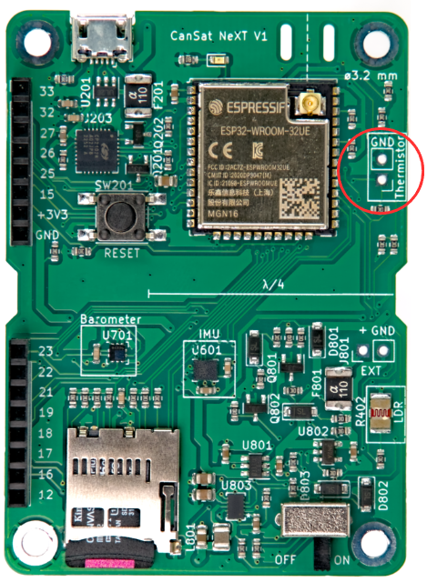

# Sensores Integrados

Este artigo apresenta os sensores integrados à placa principal do CanSat NeXT. O uso dos sensores é abordado na documentação de software, enquanto este artigo fornece mais informações sobre os próprios sensores.

Existem três sensores integrados na placa principal do CanSat NeXT. Estes são o IMU LSM6DS3, o sensor de pressão LPS22HB e o LDR. Além disso, a placa possui um slot para adicionar um termistor externo. Como o LPS22HB já possui capacidades de medição de pressão e temperatura, teoricamente ele é suficiente para cumprir os critérios da missão primária das competições CanSat por conta própria. No entanto, como ele mede a temperatura de junção interna, ou basicamente a temperatura da PCB naquele ponto, não é uma boa medição de temperatura atmosférica na maioria das configurações. Além disso, a medição absoluta do sensor de pressão pode ser apoiada pelos dados adicionais do acelerômetro IMU. O LDR foi adicionado principalmente para ajudar os alunos a aprender os conceitos relacionados a sensores analógicos, pois a resposta aos estímulos é quase instantânea, enquanto um termistor leva tempo para aquecer e esfriar. Dito isso, ele também pode apoiar as missões criativas que os alunos desenvolverão, assim como o acelerômetro e o giroscópio dos IMUs. Além disso, além do sensor integrado, o CanSat NeXT incentiva o uso de sensores adicionais através da interface de extensão.

## Unidade de Medição Inercial

O IMU, LSM6DS3 da STMicroelectronics é um dispositivo sensor MEMS estilo SiP (sistema em pacote), integrando um acelerômetro, giroscópio e a eletrônica de leitura em um pequeno pacote. O sensor suporta interfaces seriais SPI e I2C, e também inclui um sensor de temperatura interno.

O LSM6DS3 possui faixas de medição de aceleração comutáveis de ±2/±4/±8/±16 G e faixas de medição de taxa angular de ±125/±250/±500/±1000/±2000 deg/s. O uso de uma faixa maior também diminui a resolução do dispositivo.

No CanSat NeXT, o LSM6DS3 é usado no modo I2C. O endereço I2C é 1101010b (0x6A), mas a próxima versão adicionará suporte para modificar o hardware para mudar o endereço para 1101011b (0x6B) se um usuário avançado precisar usar o endereço original para outra coisa.

As faixas de medição serão configuradas para o máximo por padrão na biblioteca para capturar a maioria dos dados do lançamento violento do foguete. As faixas de dados também são modificáveis pelo usuário.

## Barômetro

O sensor de pressão LPS22HB da STMicroelectronics é outro dispositivo MEMS SiP, projetado para medição de pressão de 260-1260 hPa. A faixa em que ele relata dados é significativamente maior, mas a precisão das medições fora dessa faixa é questionável. Os sensores de pressão MEMS funcionam medindo mudanças piezoresistivas no diafragma do sensor. Como a temperatura afeta a resistência do elemento piezo, ela precisa ser compensada. Para permitir isso, o chip também possui um sensor de temperatura de junção relativamente preciso ao lado do elemento piezoresistivo. Esta medição de temperatura também pode ser lida do sensor, mas deve-se ter em mente que é uma medição da temperatura interna do chip, não do ar circundante.

Semelhante ao IMU, o LPS22HB também pode ser comunicado usando a interface SPI ou I2C. No CanSat NeXT, ele está conectado à mesma interface I2C que o IMU. O endereço I2C do LPS22HB é 1011100b (0x5C), mas adicionaremos suporte para mudá-lo para 0x5D se desejado.

## Conversor Analógico para Digital

Isso se refere à medição de tensão usando o comando analogRead().

O conversor analógico-digital (ADC) de 12 bits no ESP32 é notoriamente não linear. Isso não importa para a maioria das aplicações, como usá-lo para detectar mudanças de temperatura ou mudanças na resistência do LDR, no entanto, fazer medições absolutas de tensão de bateria ou resistência NTC pode ser um pouco complicado. Uma maneira de contornar isso é uma calibração cuidadosa, que proporcionaria dados suficientemente precisos para a temperatura, por exemplo. No entanto, a biblioteca CanSat também fornece uma função de correção calibrada. A função implementa uma correção polinomial de terceira ordem para o ADC, correlacionando a leitura do ADC com a tensão real presente no pino do ADC. A função de correção é

$$V = -1.907217e \times 10^{-11} \times a^3 + 8.368612 \times 10^{-8} \times a^2 + 7.081732e \times 10^{-4} \times a + 0.1572375$$

Onde V é a tensão medida e a é a leitura do ADC de 12 bits do analogRead(). A função está incluída na biblioteca e é chamada de adcToVoltage. Usar esta fórmula faz com que o erro de leitura do ADC seja inferior a 1% dentro de uma faixa de tensão de 0.1 V - 3.2 V.

## Resistor Dependente de Luz

A placa principal do CanSat NeXT incorpora um LDR ao conjunto de sensores também. O LDR é um tipo especial de resistor, em que a resistência varia com a iluminação. As características exatas podem variar, mas com o LDR que estamos usando atualmente, a resistência é de 5-10 kΩ a 10 lux e 300 kΩ no escuro.

A forma como isso é usado no CanSat NeXT é que uma tensão de 3.3 V é aplicada a um resistor de comparação do MCU. Isso faz com que a tensão em LDR_OUT seja

$$V_{LDR} = V_{EN} \frac{R402}{R401+R402} $$.

E à medida que a resistência R402 muda, a tensão em LDR_OUT também mudará. Esta tensão pode ser lida com o ADC do ESP32 e então correlacionada à resistência do LDR. Na prática, no entanto, geralmente com LDRs estamos interessados na mudança em vez do valor absoluto. Por exemplo, geralmente é suficiente detectar uma grande mudança na tensão quando o dispositivo é exposto à luz após ser implantado do foguete, por exemplo. Os valores de limiar geralmente são definidos experimentalmente, em vez de calculados analiticamente. Note que no CanSat NeXT, você precisa habilitar os sensores analógicos integrados escrevendo o pino MEAS_EN como HIGH. Isso é mostrado nos códigos de exemplo.

## Termistor

O circuito usado para ler o termistor externo é muito semelhante ao circuito de leitura do LDR. A mesma lógica exata se aplica, que quando uma tensão é aplicada ao resistor de comparação, a tensão em TEMP_OUT muda de acordo com

$$V_{TEMP} = V_{EN} \frac{TH501}{TH501+R501} $$.

Neste caso, no entanto, geralmente estamos interessados no valor absoluto da resistência do termistor. Portanto, a VoltageConversion é útil, pois lineariza as leituras do ADC e também calcula o V_temp diretamente. Desta forma, o usuário pode calcular a resistência do termistor no código. O valor ainda deve ser correlacionado com a temperatura usando medições, embora a folha de dados do termistor também possa incluir algumas pistas sobre como calcular a temperatura a partir da resistência. Note que se fizer tudo analiticamente, você também deve levar em conta a variação de resistência de R501. Isso é feito mais facilmente medindo a resistência com um multímetro, em vez de assumir que é 10 000 ohms.

O resistor de comparação na PCB é relativamente estável em uma faixa de temperatura, no entanto, ele também muda ligeiramente. Se leituras de temperatura muito precisas forem desejadas, isso deve ser compensado. A medição de temperatura de junção do sensor de pressão pode ser usada para isso. Dito isso, definitivamente não é necessário para competições CanSat. Para os interessados, o coeficiente térmico do R501 é relatado pelo fabricante como 100 PPM/°C.

Enquanto a temperatura do barômetro reflete principalmente a temperatura da própria placa, o termistor pode ser montado de forma que reaja a mudanças de temperatura fora da placa, até mesmo fora da lata. Você também pode adicionar fios para levá-lo ainda mais longe. Se for usado, o termistor pode ser soldado no local apropriado na placa CanSat NeXT. A polarização não importa, ou seja, pode ser montado de qualquer maneira.

