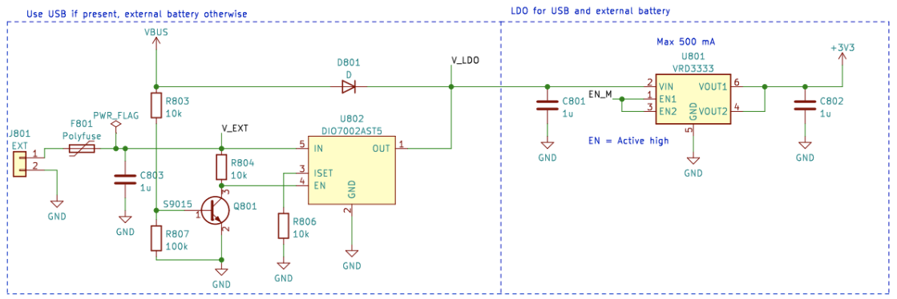

# Gerenciamento de Energia Elétrica

Este artigo explica como ligar a placa CanSat NeXT, como conectar dispositivos externos à placa com segurança e, por fim, como o sistema de energia funciona.

## Introdução

Para a maioria dos usuários, geralmente é suficiente simplesmente adicionar duas pilhas AAA ao suporte de pilhas da placa e fixá-las no lugar. Quando o USB está conectado, o CanSat NeXT muda automaticamente para usar a energia do USB em vez das pilhas, para que a vida útil das pilhas seja prolongada. Lembre-se de trocar por pilhas novas antes de um voo.

## Sistema de Energia do CanSat NeXT

Existem três maneiras de alimentar o CanSat NeXT. A maneira padrão é alimentá-lo com USB, de modo que, quando o usuário estiver desenvolvendo o software, o PC alimenta o dispositivo e nenhuma energia externa é necessária. A segunda maneira é usar as pilhas integradas (OBB). Isso é feito inserindo duas pilhas AAA padrão de 1,5 V no conector de pilhas na parte inferior da placa principal. O USB ainda é o modo padrão, mesmo se as pilhas estiverem inseridas, ou seja, a capacidade das pilhas não é usada quando o USB está conectado.

Essas são as opções usuais e devem cobrir a maioria dos casos de uso. Além disso, no entanto, existem duas opções "avançadas" para alimentar o CanSat NeXT, se necessário para um propósito especial. Primeiro, a placa possui cabeçalhos de orifício passante vazios rotulados como EXT, que podem ser usados para conectar uma bateria externa. A tensão da bateria pode ser de 3,2-6V. A linha EXT é automaticamente desconectada quando o USB não está presente para prolongar a vida útil da bateria e proteger a bateria. Existe um recurso de segurança que desativa o OBB se uma bateria estiver conectada, mas o OBB ainda não deve estar presente quando baterias externas forem usadas.

Há também uma última opção que dá toda a responsabilidade ao usuário, que é inserir 3V3 no dispositivo através da interface de extensão. Esta não é uma maneira segura de alimentar o dispositivo, mas usuários avançados que sabem o que estão fazendo podem achar essa a maneira mais fácil de alcançar as funcionalidades desejadas.

Em resumo, existem três maneiras seguras de alimentar o CanSat NeXT:

1. Usando USB - método principal usado para desenvolvimento
2. Usando pilhas integradas - método recomendado para voo
3. Usando uma bateria externa - Para usuários avançados

Usando pilhas AAA comuns, foi alcançada uma vida útil de 4 horas em temperatura ambiente e 50 minutos a -40 graus Celsius. Durante o teste, o dispositivo leu todos os sensores e transmitiu seus dados 10 vezes por segundo. Deve-se notar que pilhas alcalinas comuns não são projetadas para funcionar em temperaturas tão baixas, e geralmente começam a vazar potássio após esse tipo de teste de resistência. Isso não é perigoso, mas as pilhas alcalinas devem sempre ser descartadas com segurança posteriormente, especialmente se foram usadas em um ambiente incomum, como frio extremo, ou se foram lançadas de um foguete. Ou ambos.

Ao usar USB, a corrente retirada dos pinos de extensão não deve exceder 300 mA. As OBB são um pouco mais tolerantes, fornecendo no máximo 800 mA dos pinos de extensão. Se mais energia for necessária, uma bateria externa deve ser considerada. Isso provavelmente não é o caso, a menos que você esteja operando motores (pequenos servos estão bem) ou aquecedores, por exemplo. Pequenas câmeras etc. ainda estão bem.

## Extra - como funciona o esquema de energia multi-fonte adaptativo

Para alcançar as funcionalidades desejadas com segurança, precisamos considerar muitos aspectos no design do sistema de energia. Primeiro, para poder conectar USB, EXT e OBB com segurança ao mesmo tempo, o sistema de energia precisa ligar e desligar as várias fontes de energia. Isso é ainda mais complicado pelo fato de que não pode ser feito em software, pois o usuário precisa poder ter qualquer software que desejar sem comprometer operações seguras. Além disso, o OBB tem uma faixa de tensão bastante diferente do USB e da bateria externa. Isso exige que o OBB use um regulador de aumento, enquanto o USB e o EXT precisam de um regulador buck ou um LDO. Para simplicidade e confiabilidade, um LDO é usado nessa linha. Finalmente, um interruptor de energia deve ser capaz de desconectar todas as fontes de energia.

Abaixo está o esquema para o conversor boost. O CI é o BU33UV7NUX, um conversor boost especificamente projetado para fornecer +3.3V a partir de duas pilhas alcalinas. Ele é ativado quando a linha BOOST_EN está alta, ou acima de 0.6 V.

Todas as linhas OBB, USB e EXT são protegidas com um fusível, proteção contra sobrecorrente, proteção contra tensão reversa e corrente e proteção contra sobretemperatura. Além disso, o OBB é protegido com bloqueio de subtensão e proteção contra curto-circuito, pois essas situações devem ser evitadas com pilhas alcalinas.

Note na seção a seguir que a tensão da bateria externa é V_EXT, a tensão USB é VBUS e a tensão OBB é BATT.

A linha BOOST_EN é controlada por um circuito de chave, que ou pega a entrada da linha EN_MASTER (EN_M), ou ignora isso se V_EXT ou VBUS estiver presente. Isso é feito para garantir que o boost esteja sempre desligado quando VBUS e V_EXT estiverem presentes, e ele só é ativado se ambos VBUS e V_EXT estiverem a 0V e o EN_M estiver alto.

Ou como uma tabela verdade:

| V_EXT | VBUS | EN_M | BOOST_EN |
|-------|------|------|----------|
| 1     | 1    | 1    | 0        |
| 1     | 1    | 0    | 0        |
| 0     | 0    | 0    | 0        |
| 0     | 0    | 1    | 1        |

Então BOOST_EN = EN_M ∧ !(V_EXT ∨ V_BUS).

Em seguida, precisamos desconectar V_EXT se VBUS estiver presente para evitar descarga indesejada ou carregamento acidental. Isso é feito usando um CI de chave de energia com a ajuda de um circuito transistor que leva a linha de habilitação da chave de energia para baixo se VBUS estiver presente. Isso desconecta a bateria. A linha USB é sempre usada quando presente, então é roteada para o LDO com um simples diodo schottky.

No geral, este circuito leva a uma funcionalidade onde a energia USB é usada se presente, e V_EXT é usada quando USB não está presente. Finalmente, o EN_M é usado para habilitar ou desabilitar o LDO.

O EN_M é controlado pelo usuário através de um interruptor de energia. O interruptor conecta EN_M a USB ou EXT, ou à tensão da bateria quando apenas OBB é usada. Quando o interruptor é desligado, ele conecta EN_M ao terra, desligando tanto o LDO quanto o regulador boost.

Então, na prática, o interruptor de energia liga/desliga o dispositivo, USB é usado se presente, e V_EXT é preferido sobre OBB. Finalmente, há mais um detalhe a considerar. Qual tensão o ESP32 deve medir como a tensão da bateria?

Isso foi resolvido de uma maneira simples. A tensão conectada ao ADC do ESP32 é sempre o OBB, mas o usuário pode selecionar V_EXT em vez disso cortando o jumper com um bisturi e soldando o jumper JP801 para curto-circuitar 2-3 em vez disso. Isso seleciona V_EXT para o BATT_MEAS em vez disso.

O jumper pode ser encontrado na parte inferior da placa principal do CanSat NeXT. O jumper é bastante fácil de soldar, então não tenha medo de cortar a linha 1-2 se você estiver usando uma bateria externa. Ele sempre pode ser ressoldado para usar 1-2 novamente.