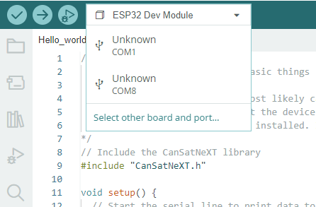
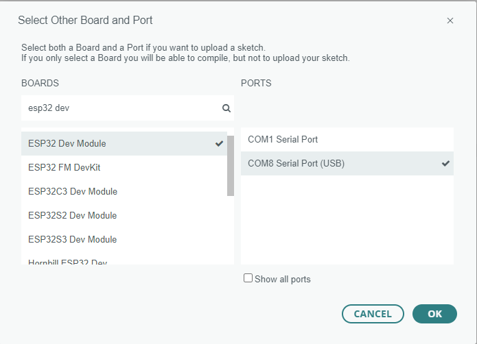

# Aula 1: Olá Mundo!

Esta primeira aula mostra como começar com o CanSat NeXT, mostrando como escrever e executar seu primeiro programa na placa.

Após esta aula, você terá as ferramentas necessárias para começar a desenvolver software para o seu CanSat.

## Instalando as ferramentas

Recomenda-se usar o CanSat NeXT com o Arduino IDE, então vamos começar instalando isso e as bibliotecas e placas necessárias.

### Instalar o Arduino IDE

Se você ainda não fez isso, baixe e instale o Arduino IDE do site oficial https://www.arduino.cc/en/software.

### Adicionar suporte ao ESP32

O CanSat NeXT é baseado no microcontrolador ESP32, que não está incluído na instalação padrão do Arduino IDE. Se você ainda não usou microcontroladores ESP32 com Arduino antes, o suporte para a placa precisa ser instalado primeiro. Isso pode ser feito no Arduino IDE em *Tools->board->Board Manager* (ou apenas pressione (Ctrl+Shift+B) em qualquer lugar). No gerenciador de placas, procure por ESP32 e instale o esp32 da Espressif.

### Instalar a biblioteca CanSat NeXT

A biblioteca CanSat NeXT pode ser baixada do Gerenciador de Bibliotecas do Arduino IDE em *Sketch > Include Libraries > Manage Libraries*.


*Fonte da imagem: Arduino Docs, https://docs.arduino.cc/software/ide-v1/tutorials/installing-libraries*

Na barra de pesquisa do Gerenciador de Bibliotecas, digite "CanSatNeXT" e escolha "Instalar". Se o IDE perguntar se você também deseja instalar as dependências, clique em sim.

## Conectando ao PC

Após instalar a biblioteca de software CanSat NeXT, você pode conectar o CanSat NeXT ao seu computador. Caso não seja detectado, pode ser necessário instalar os drivers necessários primeiro. A instalação do driver é feita automaticamente na maioria dos casos, no entanto, em alguns PCs, precisa ser feita manualmente. Os drivers podem ser encontrados no site da Silicon Labs: https://www.silabs.com/developers/usb-to-uart-bridge-vcp-drivers
Para ajuda adicional na configuração do ESP32, consulte o seguinte tutorial: https://docs.espressif.com/projects/esp-idf/en/latest/esp32/get-started/establish-serial-connection.html

## Executando seu primeiro programa

Agora, vamos usar as bibliotecas recém-instaladas para começar a executar algum código no CanSat NeXT. Como é tradição, vamos começar piscando o LED e escrevendo "Olá Mundo!" para o computador.

### Selecionando a porta correta

Depois de conectar o CanSat NeXT ao seu computador (e ligar a energia), você precisa selecionar a porta correta. Se você não souber qual é a correta, simplesmente desconecte o dispositivo e veja qual porta desaparece.



O Arduino IDE agora solicita o tipo de dispositivo. Selecione ESP32 Dev Module.



### Escolhendo um exemplo

A biblioteca CanSat NeXT tem vários códigos de exemplo mostrando como usar os vários recursos na placa. Você pode encontrar esses esboços de exemplo em File -> Examples -> CanSat NeXT. Escolha "Hello_world".

Após abrir o novo esboço, você pode carregá-lo na placa pressionando o botão de upload.


Depois de um tempo, o LED na placa deve começar a piscar. Além disso, o dispositivo está enviando uma mensagem para o PC. Você pode ver isso abrindo o monitor serial e escolhendo a taxa de transmissão 115200.

Tente também pressionar o botão na placa. Isso deve reiniciar o processador, ou em outras palavras, reiniciar o código desde o início.

### Olá Mundo explicado

Vamos ver o que realmente acontece neste código, passando por ele linha por linha. Primeiro, o código começa **incluindo** a biblioteca CanSat. Esta linha deve estar no início de quase todos os programas escritos para o CanSat NeXT, pois informa ao compilador que queremos usar os recursos da biblioteca CanSat NeXT.

```Cpp title="Incluir CanSat NeXT"
#include "CanSatNeXT.h"
```
Depois disso, o código salta para a função de configuração. Lá temos duas chamadas - primeiro, serial é a interface que usamos para enviar mensagens para o PC via USB. O número dentro da chamada de função, 115200, refere-se à taxa de transmissão, ou seja, quantos uns e zeros são enviados a cada segundo. A próxima chamada, `CanSatInit()`, é da biblioteca CanSat NeXT e inicia todos os sensores e outros recursos da placa. Semelhante ao comando `#include`, isso geralmente é encontrado em esboços para o CanSat NeXT. Qualquer coisa que você gostaria que fosse executada apenas uma vez na inicialização deve ser incluída na função de configuração.

```Cpp title="Configuração"
void setup() {
  // Iniciar a linha serial para imprimir dados no terminal
  Serial.begin(115200);
  // Iniciar todos os sistemas a bordo do CanSatNeXT.
  CanSatInit();
}
```

Após a configuração, o código começa a repetir a função de loop infinitamente. Primeiro, o programa escreve o pino de saída LED para estar alto, ou seja, ter uma tensão de 3,3 volts. Isso acende o LED a bordo. Após 100 milissegundos, a tensão nesse pino de saída é reduzida para zero. Agora o programa espera por 400 ms e então envia uma mensagem para o PC. Após a mensagem ser enviada, a função de loop começa novamente desde o início.

```Cpp title="Loop"
void loop() {
  // Vamos piscar o LED
  digitalWrite(LED, HIGH);
  delay(100);
  digitalWrite(LED, LOW);
  delay(400);
  Serial.println("Esta é uma mensagem!");
}
```

Você também pode tentar mudar os valores de atraso ou a mensagem para ver o que acontece. Parabéns por chegar até aqui! Configurar as ferramentas pode ser complicado, mas deve ficar mais divertido a partir deste ponto.

---

Na próxima aula, começaremos a ler dados dos sensores a bordo.

[Clique aqui para a segunda aula!](./lesson2)