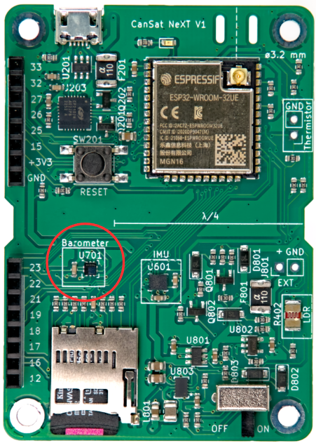

# Ombordmonterade sensorer

Denna artikel introducerar sensorerna som är integrerade på CanSat NeXT huvudkort. Användningen av sensorerna täcks i mjukvarudokumentationen, medan denna artikel ger mer information om sensorerna själva.

Det finns tre ombordmonterade sensorer på CanSat NeXT huvudkort. Dessa är IMU LSM6DS3, trycksensorn LPS22HB och LDR. Dessutom har kortet en genomgående hålplats för att lägga till en extern termistor. Eftersom LPS22HB redan har både tryck- och temperaturmätningskapacitet, räcker det teoretiskt för att uppfylla de primära uppdragskriterierna för CanSat-tävlingarna på egen hand. Men eftersom den mäter den interna junction-temperaturen, eller i princip temperaturen på PCB:n på den platsen, är det inte en bra atmosfärisk temperaturmätning i de flesta konfigurationer. Dessutom kan den absoluta mätningen av trycksensorn stödjas av ytterligare data från IMU-accelerometern. LDR har lagts till först och främst för att hjälpa studenter att lära sig koncepten kring analoga sensorer eftersom responsen på stimuli är nästan omedelbar, medan en termistor tar tid att värmas upp och svalna. Det sagt, kan den också stödja de kreativa uppdrag som studenten kommer att komma på, precis som IMU:ns accelerometer och gyroskop. Vidare, utöver den ombordmonterade sensorn, uppmuntrar CanSat NeXT användningen av ytterligare sensorer genom förlängningsgränssnittet.

## Tröghetsmätningsenhet {#IMU}

IMU, LSM6DS3 av STMicroelectronics är en SiP (system-in-package) stil MEMS-sensorenhet, som integrerar en accelerometer, gyroskop och avläsningselektronik i ett litet paket. Sensorn stöder SPI och I2C seriella gränssnitt, och inkluderar också en intern temperatursensor.

LSM6DS3 har omkopplingsbara accelerationsmätningsområden på ±2/±4/±8/±16 G och vinkelhastighetsmätningsområden på ±125/±250/±500/±1000/±2000 deg/s. Användningen av ett högre område minskar också enhetens upplösning.

I CanSat NeXT används LSM6DS3 i I2C-läge. I2C-adressen är 1101010b (0x6A), men nästa version kommer att lägga till stöd för att modifiera hårdvaran för att ändra adressen till 1101011b (0x6B) om en avancerad användare har behov av att använda den ursprungliga adressen för något annat.

Mätningsområdena kommer att ställas in på max som standard i biblioteket för att fånga mest data från den våldsamma raketuppskjutningen. Dataområdena är också modifierbara av användaren.

## Barometer {#barometer}

Trycksensorn LPS22HB av STMicroelectronics är en annan SiP MEMS-enhet, designad för mätning av tryck från 260-1260 hPa. Området den rapporterar data i är betydligt större, men noggrannheten i mätningarna utanför det området är tveksam. MEMS-trycksensorer fungerar genom att mäta piezoresistiva förändringar i sensordiafragman. Eftersom temperatur påverkar motståndet hos piezoelementet också, måste det kompenseras. För att möjliggöra detta har chipet också en relativt noggrann junction-temperatursensor precis bredvid det piezoresistiva elementet. Denna temperaturmätning kan också läsas från sensorn, men det måste hållas i åtanke att det är en mätning av den interna chiptemperaturen, inte av den omgivande luften.

Precis som IMU kan LPS22HB också kommuniceras med antingen SPI eller I2C-gränssnitt. I CanSat NeXT är den ansluten till samma I2C-gränssnitt som IMU. I2C-adressen för LPS22HB är 1011100b (0x5C), men vi kommer att lägga till stöd för att ändra den till 0x5D om så önskas.

## Analog till digital omvandlare

Detta hänvisar till spänningsmätning med hjälp av analogRead()-kommandot.

Den 12-bitars analog-till-digital-omvandlaren (ADC) i ESP32 är beryktat icke-linjär. Detta spelar ingen roll för de flesta applikationer, såsom att använda den för att upptäcka temperaturförändringar eller förändringar i LDR-motstånd, men att göra absoluta mätningar av batterispänning eller NTC-motstånd kan vara lite knepigt. Ett sätt att kringgå detta är noggrann kalibrering, vilket skulle ge tillräckligt noggranna data för temperaturen till exempel. Men CanSat-biblioteket tillhandahåller också en kalibrerad korrigeringsfunktion. Funktionen implementerar en tredje ordningens polynomkorrigering för ADC, som korrelerar ADC-avläsningen med den faktiska spänningen som finns på ADC-pinnen. Korrigeringsfunktionen är

$$V = -1.907217e \times 10^{-11} \times a^3 + 8.368612 \times 10^{-8} \times a^2 + 7.081732e \times 10^{-4} \times a + 0.1572375$$

Där V är den uppmätta spänningen och a är 12-bitars ADC-avläsningen från analogRead(). Funktionen ingår i biblioteket och kallas adcToVoltage. Användning av denna formel gör att ADC-avläsningsfelet blir mindre än 1% inom ett spänningsområde på 0.1 V - 3.2 V.

## Ljusberoende resistor

CanSat NeXT huvudkort innehåller också en LDR i sensorsetet. LDR är en speciell typ av resistor, där motståndet varierar med belysning. De exakta egenskaperna kan variera, men med den LDR vi för närvarande använder är motståndet 5-10 kΩ vid 10 lux och 300 kΩ i mörker.

Så här används det i CanSat NeXT, är att en spänning på 3.3 V appliceras på en jämförelseresistor från MCU:n. Detta gör att spänningen vid LDR_OUT blir

$$V_{LDR} = V_{EN} \frac{R402}{R401+R402} $$.

Och eftersom R402-motståndet ändras, kommer spänningen vid LDR_OUT också att ändras. Denna spänning kan läsas med ESP32 ADC, och sedan korreleras till LDR:ns motstånd. I praktiken är vi dock vanligtvis intresserade av förändringen snarare än det absoluta värdet med LDR:er. Till exempel räcker det vanligtvis att upptäcka en stor förändring i spänningen när enheten utsätts för ljus efter att ha släppts från raketen, till exempel. Tröskelvärdena ställs vanligtvis in experimentellt, snarare än beräknas analytiskt. Observera att i CanSat NeXT måste du aktivera de analoga ombordmonterade sensorerna genom att skriva MEAS_EN pin HIGH. Detta visas i exempel koderna.

## Termistor

Kretsen som används för att läsa den externa termistorn är mycket lik LDR-avläsningskretsen. Exakt samma logik gäller, att när en spänning appliceras på jämförelseresistorn, ändras spänningen vid TEMP_OUT enligt

$$V_{TEMP} = V_{EN} \frac{TH501}{TH501+R501} $$.

I detta fall är vi dock vanligtvis intresserade av det absoluta värdet av termistorns motstånd. Därför är VoltageConversion användbar, eftersom den linjäriserar ADC-avläsningarna och också beräknar V_temp direkt. På detta sätt kan användaren beräkna termistorns motstånd i koden. Värdet bör fortfarande korreleras med temperatur med hjälp av mätningar, även om termistorns datablad också kan innehålla några ledtrådar om hur man beräknar temperaturen från motståndet. Observera att om du gör allt analytiskt bör du också ta hänsyn till motståndsvariansen hos R501. Detta görs enklast genom att mäta motståndet med en multimeter, istället för att anta att det är 10 000 ohm.

Jämförelseresistorn på PCB:n är relativt stabil över ett temperaturområde, men den ändras också något. Om mycket noggranna temperaturavläsningar önskas bör detta kompenseras för. Junction-temperaturmätningen från trycksensorn kan användas för detta. Det sagt, det är definitivt inte nödvändigt för CanSat-tävlingar. För de intresserade rapporteras den termiska koefficienten för R501 av tillverkaren vara 100 PPM/°C.

Medan barometertemperaturen mestadels återspeglar temperaturen på själva kortet, kan termistorn monteras så att den reagerar på temperaturförändringar utanför kortet, även utanför burken. Du kan också lägga till kablar för att få den ännu längre bort. Om den kommer att användas kan termistorn lödas till rätt plats på CanSat NeXT-kortet. Polarisationen spelar ingen roll, dvs. den kan monteras åt vilket håll som helst.

