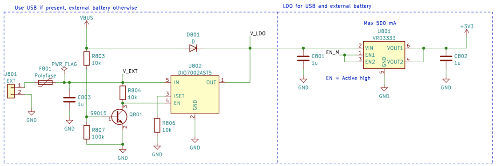
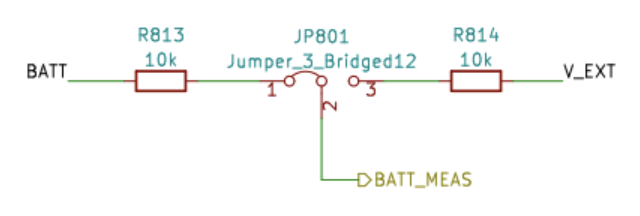

# Elektrisk Effektstyrning

Denna artikel förklarar hur man slår på CanSat NeXT-kortet, hur man säkert ansluter externa enheter till kortet, och slutligen hur strömsystemet fungerar.

## Komma igång

För de flesta användare räcker det ofta att helt enkelt lägga till två AAA-batterier i den inbyggda batterihållaren och säkra dem på plats. När USB är ansluten, växlar CanSat NeXT automatiskt till att använda USB-ström istället för batterierna, så att batteritiden förlängs. Kom ihåg att byta till nya batterier före en flygning.

## CanSat NeXT Strömsystem

Det finns tre sätt att driva CanSat NeXT. Standardsättet är att driva det med USB, så att när användaren utvecklar mjukvaran, driver datorn enheten och ingen extern ström krävs. Det andra sättet är att använda de inbyggda batterierna (OBB). Detta görs genom att sätta in två standard 1,5 V AAA-batterier i batterikontakten på undersidan av huvudkortet. USB är fortfarande standardsättet även om batterier är isatta, dvs. batterikapaciteten används inte när USB är ansluten.

Dessa är de vanliga alternativen och bör täcka de flesta användningsfall. Dessutom finns det dock två "avancerade" alternativ för att driva CanSat NeXT om det behövs för ett speciellt ändamål. För det första har kortet tomma genomgående hålhuvuden märkta EXT, som kan användas för att ansluta ett externt batteri. Batterispänningen kan vara 3,2-6V. EXT-linjen kopplas automatiskt bort när USB inte är närvarande för att förlänga batteritiden och skydda batteriet. Det finns en säkerhetsfunktion som gör att OBB inaktiveras om ett batteri är anslutet, men OBB bör ändå inte vara närvarande när externa batterier används.

Det finns också ett sista alternativ som ger allt ansvar till användaren, och det är att mata in 3V3 till enheten genom expansionsgränssnittet. Detta är inte ett säkert sätt att driva enheten, men avancerade användare som vet vad de gör kan finna detta som det enklaste sättet att uppnå de önskade funktionaliteterna.

Sammanfattningsvis finns det tre säkra sätt att driva CanSat NeXT:

1. Använda USB - huvudsaklig metod för utveckling
2. Använda inbyggda batterier - rekommenderad metod för flygning
3. Använda ett externt batteri - För avancerade användare

Med vanliga AAA-batterier uppnåddes en batteritid på 4 timmar i rumstemperatur och 50 minuter i -40 grader Celsius. Under testet läste enheten alla sensorer och överförde deras data 10 gånger per sekund. Det bör noteras att vanliga alkaliska batterier inte är designade för att fungera i så låga temperaturer, och de börjar vanligtvis läcka kalium efter denna typ av tortyrtester. Detta är inte farligt, men de alkaliska batterierna bör alltid kasseras säkert efteråt, särskilt om de användes i en ovanlig miljö som extrem kyla, eller efter att ha fallit från en raket. Eller båda.

När USB används bör strömförbrukningen från expansionspinnarna inte överstiga 300 mA. OBB är något mer förlåtande och ger högst 800 mA från expansionspinnarna. Om mer ström krävs bör ett externt batteri övervägas. Detta är troligtvis inte fallet om du inte kör motorer (små servon är okej) eller värmare, till exempel. Små kameror etc. är fortfarande okej.

## Extra - hur det adaptiva multisource-strömschemat fungerar

För att uppnå de önskade funktionaliteterna säkert behöver vi överväga ganska många saker i strömsystemets design. Först, för att säkert kunna ansluta USB, EXT och OBB samtidigt, behöver strömsystemet slå på och av de olika strömkällorna. Detta kompliceras ytterligare av det faktum att det inte kan göras i mjukvara, eftersom användaren behöver kunna ha vilken mjukvara de önskar utan att äventyra säker drift. Dessutom har OBB ett ganska annorlunda spänningsområde jämfört med USB och externt batteri. Detta kräver att OBB använder en boost-regulator, medan USB och EXT behöver antingen en buck-regulator eller en LDO. För enkelhet och tillförlitlighet används en LDO i den linjen. Slutligen bör en strömbrytare kunna koppla bort alla strömkällor.

Nedan är schemat för boost-omvandlaren. IC är BU33UV7NUX, en boost-omvandlare speciellt designad för att ge +3.3V från två alkaliska batterier. Den aktiveras när BOOST_EN-linjen är hög, eller över 0.6 V.

Alla OBB-, USB- och EXT-linjer är skyddade med en säkring, överströmsskydd, omvänd spännings- och strömskydd och övertemperaturskydd. Dessutom är OBB skyddad med under spänningslås och kortslutningsskydd, eftersom dessa situationer bör undvikas med alkaliska batterier.

Observera i följande avsnitt att extern batterispänning är V_EXT, USB-spänning är VBUS och OBB-spänning är BATT.

BOOST_EN-linjen styrs av en switch-krets, som antingen tar ingången från EN_MASTER (EN_M) linjen, eller ignorerar det om V_EXT eller VBUS är närvarande. Detta görs för att säkerställa att boosten alltid är avstängd när VBUS och V_EXT är närvarande, och den aktiveras endast om både VBUS och V_EXT är vid 0V och EN_M är hög.

Eller som en sanningsvärdetabell:

| V_EXT | VBUS | EN_M | BOOST_EN |
|-------|------|------|----------|
| 1     | 1    | 1    | 0        |
| 1     | 1    | 0    | 0        |
| 0     | 0    | 0    | 0        |
| 0     | 0    | 1    | 1        |

Så BOOST_EN = EN_M ∧ !(V_EXT ∨ V_BUS).

Nästa steg är att koppla bort V_EXT om VBUS är närvarande för att förhindra oönskad urladdning eller oavsiktlig laddning. Detta görs med hjälp av en strömbrytare IC med hjälp av en transistorkrets som tar ner aktiveringslinjen för strömbrytaren om VBUS är närvarande. Detta kopplar bort batteriet. USB-linjen används alltid när den är närvarande, så den är kopplad till LDO med en enkel schottky-diod.

Sammantaget leder denna krets till en funktionalitet där USB-ström används om den är närvarande, och V_EXT används när USB inte är närvarande. Slutligen används EN_M för att aktivera eller inaktivera LDO.

EN_M styrs av användaren genom en strömbrytare. Strömbrytaren ansluter EN_M till antingen USB eller EXT, eller batterispänningen när endast OBB används. När strömbrytaren är avstängd ansluter den EN_M till jord, vilket stänger av både LDO och boost-regulatorn.

Så i praktiken slår strömbrytaren på/av enheten, USB används om den är närvarande, och V_EXT föredras framför OBB. Slutligen finns det en detalj till att överväga. Vilken spänning ska ESP32 mäta som batterispänning?

Detta löstes på ett enkelt sätt. Spänningen som är ansluten till ESP32 ADC är alltid OBB, men användaren kan välja V_EXT istället genom att skära av bygeln med en skalpell och löda bygeln JP801 för att kortsluta 2-3 istället. Detta väljer V_EXT till BATT_MEAS istället.

Bygeln finns på undersidan av CanSat NeXT huvudkort. Bygeln är ganska lätt att löda, så var inte rädd för att skära av 1-2 linjen om du använder ett externt batteri. Den kan alltid lödas om för att återigen använda 1-2 istället.