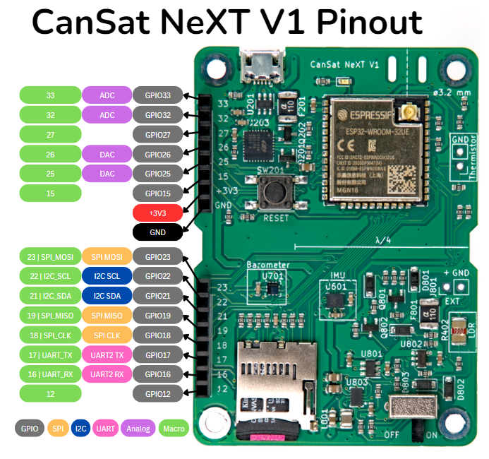

# Välkommen till Dokumentationen

Välkommen till CanSat NeXT dokumentationssida! Denna sida innehåller detaljerad teknisk dokumentation av CanSat NeXT hårdvara och mjukvara, samt lättillgängliga handledningar om hur du sätter upp din CanSat NeXT och använder de olika hårdvarufunktionerna på kortet.

Om du är ny här, gå till [Kom igång-sidan](./course/course.md) för information om hur du börjar använda CanSat NeXT. Du kanske också är intresserad av information om hur man gör den grundläggande antennen från materialen som ingår i kitet. För det, gå till artikeln [Kommunikation och Antenner](./CanSat-hardware/communication).

Medan du är här, glöm inte att också kolla vår [blogg](./../blog/), där vi visar projekt som använder CanSat NeXT för ändamål bortom CanSat. Dessa är inte CanSat-projekt, men visar ändå möjligheterna med vad som kan göras med CanSat NeXT.

Slutligen, om du är något som jag, kom du förmodligen till denna sida för att leta efter [biblioteksspecifikationen](./CanSat-software/library_specification) eller pinouten. Mer information om det i [Pinout](./CanSat-hardware/pin_out), men här är en snabb referens:

# Licens

Detta bibliotek och CanSat NeXT-kortet utvecklas av Samuli Nyman, i samarbete med ESERO Finland och Arctic Astronautics Oy. Utvecklingen stöds också av Finska Fysikersamfundet. Detta mjukvarubibliotek är licensierat under MIT-licensen.

# Bidrag

Om du vill bidra till biblioteket eller om du har feedback, vänligen kontakta mig via samuli@kitsat.fi eller starta ett GitHub-ärende. Du är också välkommen att skapa en pull request.