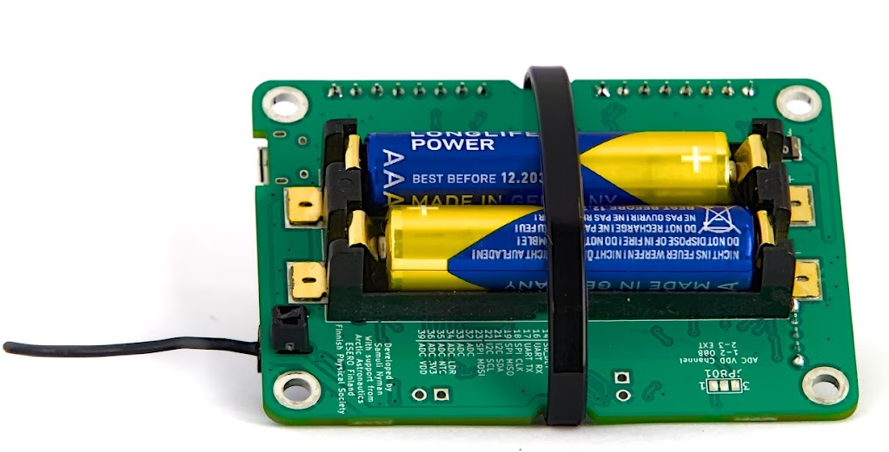

# Gestione dell'alimentazione elettrica

Questo articolo spiega come accendere la scheda CanSat NeXT, come collegare in sicurezza dispositivi esterni alla scheda e infine come funziona il sistema di alimentazione.

## Introduzione

Per la maggior parte degli utenti, è spesso sufficiente aggiungere due batterie AAA al portabatterie integrato e fissarle in posizione. Quando l'USB è collegato, CanSat NeXT passa automaticamente a utilizzare l'alimentazione USB invece delle batterie, in modo da prolungare la durata delle batterie. Ricordati di sostituire le batterie con nuove prima di un volo.

## Sistema di alimentazione di CanSat NeXT

Ci sono tre modi per alimentare il CanSat NeXT. Il modo predefinito è alimentarlo tramite USB, in modo che quando l'utente sviluppa il software, il PC alimenta il dispositivo e non è necessaria un'alimentazione esterna. Il secondo modo è utilizzare le batterie integrate (OBB). Questo si fa inserendo due batterie AAA standard da 1,5 V nel connettore della batteria sul lato inferiore della scheda principale. L'USB rimane il metodo predefinito anche se le batterie sono inserite, cioè la capacità della batteria non viene utilizzata quando l'USB è collegato.

Queste sono le opzioni usuali e dovrebbero coprire la maggior parte dei casi d'uso. Tuttavia, ci sono due opzioni "avanzate" per alimentare CanSat NeXT se necessario per uno scopo speciale. Innanzitutto, la scheda ha intestazioni a foro passante vuote etichettate EXT, che possono essere utilizzate per collegare una batteria esterna. La tensione della batteria può essere 3,2-6V. La linea EXT viene automaticamente disconnessa quando l'USB non è presente per prolungare la durata della batteria e proteggere la batteria. C'è una funzione di sicurezza che disabilita l'OBB se è collegata una batteria, ma l'OBB non dovrebbe comunque essere presente quando si utilizzano batterie esterne.

C'è anche un'ultima opzione che dà tutta la responsabilità all'utente, ed è l'immissione di 3V3 nel dispositivo tramite l'interfaccia di estensione. Questo non è un modo sicuro per alimentare il dispositivo, ma gli utenti avanzati che sanno cosa stanno facendo potrebbero trovare questo il modo più semplice per ottenere le funzionalità desiderate.

In sintesi, ci sono tre modi sicuri per alimentare CanSat NeXT:

1. Utilizzando l'USB - metodo principale utilizzato per lo sviluppo
2. Utilizzando le batterie integrate - metodo consigliato per il volo
3. Utilizzando una batteria esterna - per utenti avanzati

Utilizzando batterie AAA normali, è stata raggiunta una durata della batteria di 4 ore a temperatura ambiente e 50 minuti a -40 gradi Celsius. Durante il test, il dispositivo leggeva tutti i sensori e trasmetteva i loro dati 10 volte al secondo. Va notato che le batterie alcaline normali non sono progettate per funzionare a temperature così basse e di solito iniziano a perdere potassio dopo questo tipo di test di tortura. Questo non è pericoloso, ma le batterie alcaline dovrebbero sempre essere smaltite in sicurezza successivamente, specialmente se sono state utilizzate in un ambiente insolito come il freddo estremo o se sono state fatte cadere da un razzo. O entrambi.

Quando si utilizza l'USB, l'assorbimento di corrente dai pin di estensione non dovrebbe superare i 300 mA. Gli OBB sono leggermente più tolleranti, fornendo al massimo 800 mA dai pin di estensione. Se è necessaria più potenza, dovrebbe essere considerata una batteria esterna. Questo probabilmente non è il caso a meno che non si stiano utilizzando motori (i piccoli servocomandi vanno bene) o riscaldatori, ad esempio. Piccole telecamere ecc. vanno ancora bene.

## Extra - come funziona lo schema di alimentazione multi-sorgente adattivo

Per ottenere le funzionalità desiderate in sicurezza, dobbiamo considerare molte cose nella progettazione del sistema di alimentazione. Innanzitutto, per poter collegare in sicurezza USB, EXT e OBB contemporaneamente, il sistema di alimentazione deve accendere e spegnere le varie fonti di alimentazione. Questo è ulteriormente complicato dal fatto che non può essere fatto tramite software, poiché l'utente deve essere in grado di avere qualsiasi software desideri senza mettere in pericolo le operazioni sicure. Inoltre, l'OBB ha un intervallo di tensione piuttosto diverso rispetto all'USB e alla batteria esterna. Questo richiede che l'OBB utilizzi un regolatore boost, mentre l'USB e l'EXT necessitano di un regolatore buck o di un LDO. Per semplicità e affidabilità, in quella linea viene utilizzato un LDO. Infine, un interruttore di alimentazione dovrebbe essere in grado di disconnettere tutte le fonti di alimentazione.

Di seguito è riportato lo schema per il convertitore boost. L'IC è BU33UV7NUX, un convertitore boost specificamente progettato per fornire +3.3V da due batterie alcaline. È abilitato quando la linea BOOST_EN è alta, o sopra 0.6 V.

Tutte le linee OBB, USB e EXT sono protette con un fusibile, protezione da sovracorrente, protezione da tensione inversa e corrente e protezione da sovratemperatura. Inoltre, l'OBB è protetto con blocco di sottotensione e protezione da cortocircuito, poiché tali situazioni dovrebbero essere evitate con le batterie alcaline.

Nota nella sezione seguente, che la tensione della batteria esterna è V_EXT, la tensione USB è VBUS e la tensione OBB è BATT.

La linea BOOST_EN è controllata da un circuito di commutazione, che prende l'input dalla linea EN_MASTER (EN_M), o lo ignora se V_EXT o VBUS è presente. Questo è fatto per garantire che il boost sia sempre spento quando VBUS e V_EXT sono presenti, ed è abilitato solo se sia VBUS che V_EXT sono a 0V e l'EN_M è alto.

O come tabella di verità:

| V_EXT | VBUS | EN_M | BOOST_EN |
|-------|------|------|----------|
| 1     | 1    | 1    | 0        |
| 1     | 1    | 0    | 0        |
| 0     | 0    | 0    | 0        |
| 0     | 0    | 1    | 1        |

Quindi BOOST_EN = EN_M ∧ !(V_EXT ∨ V_BUS).

Successivamente, dobbiamo disconnettere V_EXT se VBUS è presente per prevenire scariche indesiderate o cariche accidentali. Questo viene fatto utilizzando un IC di commutazione di potenza con l'aiuto di un circuito a transistor che abbassa la linea di abilitazione dell'interruttore di potenza se VBUS è presente. Questo disconnette la batteria. La linea USB viene sempre utilizzata quando presente, quindi è instradata all'LDO con un semplice diodo schottky.

Nel complesso, questo circuito porta a una funzionalità in cui l'alimentazione USB viene utilizzata se presente, e V_EXT viene utilizzato quando l'USB non è presente. Infine, l'EN_M viene utilizzato per abilitare o disabilitare l'LDO.

L'EN_M è controllato dall'utente tramite un interruttore di alimentazione. L'interruttore collega EN_M a USB o EXT, o alla tensione della batteria quando viene utilizzato solo l'OBB. Quando l'interruttore è spento, collega EN_M a terra, spegnendo sia l'LDO che il regolatore boost.

Quindi, in pratica, l'interruttore di alimentazione accende/spegne il dispositivo, l'USB viene utilizzato se presente e V_EXT è preferito rispetto all'OBB. Infine, c'è un altro dettaglio da considerare. Quale tensione dovrebbe misurare l'ESP32 come tensione della batteria?

Questo è stato risolto in modo semplice. La tensione collegata all'ADC dell'ESP32 è sempre l'OBB, ma l'utente può selezionare V_EXT invece tagliando il ponticello con un bisturi e saldando il ponticello JP801 per cortocircuitare 2-3 invece. Questo seleziona V_EXT al BATT_MEAS invece.

Il ponticello si trova sul lato inferiore della scheda principale di CanSat NeXT. Il ponticello è abbastanza facile da saldare, quindi non aver paura di tagliare la linea 1-2 se stai usando una batteria esterna. Può sempre essere risaldato per utilizzare di nuovo 1-2 invece.