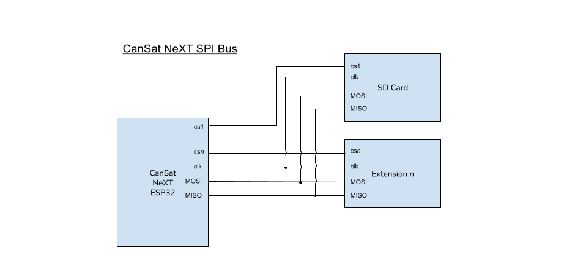

# Interfaccia di estensione

Dispositivi personalizzati possono essere costruiti e utilizzati insieme a CanSat. Questi possono essere usati per realizzare progetti interessanti, per i quali puoi trovare idee nel nostro [Blog](/blog).

L'interfaccia di estensione di CanSat dispone di una linea UART libera, due pin ADC e 5 pin I/O digitali liberi. Inoltre, le linee SPI e I2C sono disponibili per l'interfaccia di estensione, anche se sono condivise rispettivamente con la scheda SD e il suite di sensori.

L'utente può anche scegliere di utilizzare i pin UART2 e ADC come I/O digitali, nel caso in cui la comunicazione seriale o la conversione da analogico a digitale non siano necessarie nella loro soluzione.

| Numero pin | Nome pin | Uso come    | Note                      |
|------------|----------|-------------|---------------------------|
| 12         | GPIO12   | I/O Digitale| Libero                    |
| 15         | GPIO15   | I/O Digitale| Libero                    |
| 16         | GPIO16   | UART2 RX    | Libero                    |
| 17         | GPIO17   | UART2 TX    | Libero                    |
| 18         | SPI_CLK  | SPI CLK     | Uso condiviso con scheda SD|
| 19         | SPI_MISO | SPI MISO    | Uso condiviso con scheda SD|
| 21         | I2C_SDA  | I2C SDA     | Uso condiviso con suite sensori|
| 22         | I2C_SCL  | I2C SCL     | Uso condiviso con suite sensori|
| 23         | SPI_MOSI | SPI MOSI    | Uso condiviso con scheda SD|
| 25         | GPIO25   | I/O Digitale| Libero                    |
| 26         | GPIO26   | I/O Digitale| Libero                    |
| 27         | GPIO27   | I/O Digitale| Libero                    |
| 32         | GPIO32   | ADC         | Libero                    |
| 33         | GPIO33   | ADC         | Libero                    |

*Tabella: Tabella di ricerca dei pin dell'interfaccia di estensione. Il nome del pin si riferisce al nome del pin della libreria.*

# Opzioni di comunicazione

La libreria CanSat non include wrapper di comunicazione per i dispositivi personalizzati. Per la comunicazione UART, I2C e SPI tra CanSat NeXT e il tuo dispositivo di carico utile personalizzato, fai riferimento alle librerie predefinite di Arduino [UART](https://docs.arduino.cc/learn/communication/uart/), [Wire](https://docs.arduino.cc/learn/communication/wire/) e [SPI](https://docs.arduino.cc/learn/communication/spi/), rispettivamente.

## UART

La linea UART2 è una buona alternativa in quanto serve come interfaccia di comunicazione non allocata per carichi utili estesi.

Per inviare dati attraverso la linea UART, fare riferimento ad Arduino

```
       CanSat NeXT
          ESP32                          Dispositivo dell'utente
   +----------------+                 +----------------+
   |                |   TX (Trasmetti)|                |
   |       TX  o----|---------------->| RX  (Ricevi)   |
   |                |                 |                |
   |       RX  o<---|<----------------| TX             |
   |                |   GND (Terra)   |                |
   |       GND  o---|-----------------| GND            |
   +----------------+                 +----------------+
```
*Immagine: Protocollo UART in ASCII*

## I2C

L'uso di I2C è supportato, ma l'utente deve tenere presente che esiste un altro sottosistema sulla linea.

Con più slave I2C, il codice dell'utente deve specificare quale slave I2C il CanSat sta utilizzando in un dato momento. Questo è distinto con un indirizzo slave, che è un codice esadecimale unico per ciascun dispositivo e può essere trovato nel datasheet del dispositivo del sottosistema.

## SPI

L'uso di SPI è supportato, ma l'utente deve tenere presente che esiste un altro sottosistema sulla linea.

Con SPI, la distinzione dello slave è invece fatta specificando un pin di selezione del chip. L'utente deve dedicare uno dei pin GPIO liberi per essere un selettore del chip per il proprio dispositivo di carico utile esteso personalizzato. Il pin di selezione del chip della scheda SD è definito nel file di libreria ``CanSatPins.h`` come ``SD_CS``.


*Immagine: il bus I2C di CanSat NeXT con diversi sottosistemi secondari, o "slave". In questo contesto, il suite di sensori è uno dei sottosistemi slave.*



*Immagine: la configurazione del bus SPI di CanSat NeXT quando sono presenti due sottosistemi secondari, o "slave". In questo contesto, la scheda SD è uno dei sottosistemi slave.*