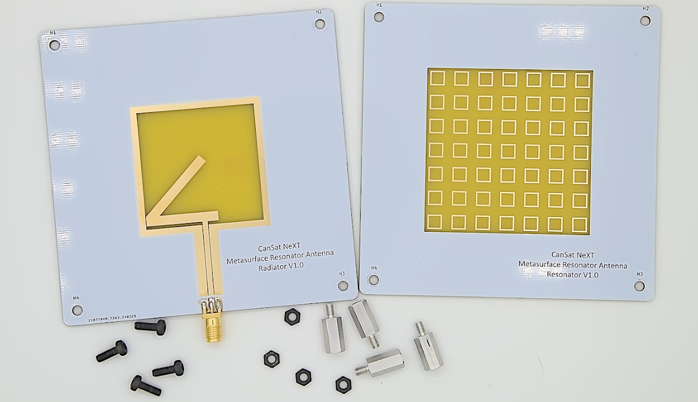

# Metaytresonatorantenn

CanSat NeXT Metaytresonatorantenn är en extern antennmodul som kan användas på markstationssidan för att öka kommunikationsräckvidden och även göra kommunikationen mer tillförlitlig.

[Kitantennen](./../CanSat-hardware/communication#building-a-quarter-wave-monopole-antenna) för CanSat NeXT har använts för att framgångsrikt genomföra CanSat-uppdrag där CanSat sköts upp till en höjd av 1 kilometer. Men på dessa avstånd börjar monopoleantennen närma sig gränsen för det operativa området och kan också ibland tappa signalen på grund av polariseringsfel som uppstår från monopoleantennens linjära polarisation. Metaytresonatorantennkitet är utformat för att möjliggöra mer tillförlitlig drift under sådana extrema förhållanden och även möjliggöra drift med avsevärt längre räckvidder.

Metaytresonatorantennen består av två kort. Huvudantennen finns på radiatorplattan, där en slitsantenn har etsats in i PCB:n. Denna platta ger i sig ungefär 3 dBi förstärkning och har [cirkulär polarisation](https://en.wikipedia.org/wiki/Circular_polarization), vilket i praktiken innebär att signalstyrkan inte längre beror på satellitantennens orientering. Denna platta kan därför användas som en antenn i sig själv, om en bredare *strålningsbredd* är önskvärd.

Den andra plattan, där antennen får sitt namn, är den speciella funktionen hos detta antennkit. Den bör placeras 10-15 mm från den första plattan och har en matris av resonatorelement. Elementen energiseras av slitsantennen under dem, vilket i sin tur gör antennen mer *riktad*. Med detta tillägg fördubblas förstärkningen till 6 dBi.

Bilden nedan visar *reflektionskoefficienten* för antennen mätt med en vektornätverksanalysator (VNA). Diagrammet visar de frekvenser vid vilka antennen kan överföra energi. Även om antennen har ganska bra bredbandsprestanda, visar diagrammet en bra impedansanpassning vid det operativa frekvensområdet 2400-2490 MHz. Detta innebär att vid dessa frekvenser överförs det mesta av kraften som radiovågor istället för att reflekteras tillbaka. De lägsta reflektionsvärdena i mitten av bandet är runt -18,2 dB, vilket innebär att endast 1,51 % av kraften reflekterades tillbaka från antennen. Även om det är svårare att mäta, tyder simuleringar på att ytterligare 3 % av överföringskraften omvandlas till värme i själva antennen, men de andra 95,5 % - antennens strålningsverkningsgrad - strålas ut som elektromagnetisk strålning.

Som nämnts tidigare är antennens förstärkning runt 6 dBi. Detta kan ytterligare ökas med användning av en *reflektor* bakom antennen, som reflekterar radiovågorna tillbaka in i antennen och förbättrar riktverkan. Även om en parabolisk skiva skulle vara en ideal reflektor, kan även en platt metallplatta vara mycket hjälpsam för att öka antennens prestanda. Enligt simuleringar och fälttester ökar en metallplatta - såsom en bit stålplåt - placerad 50-60 mm bakom antennen förstärkningen till ungefär 10 dBi. Metallplattan bör vara minst 200 x 200 mm i storlek - större plattor bör vara bättre, men bara marginellt. Den bör dock inte vara mycket mindre än så. Plattan bör helst vara av solid metall, såsom en stålplåt, men även ett trådnät fungerar, så länge hålen är mindre än 1/10 våglängd (~1,2 cm) i storlek.