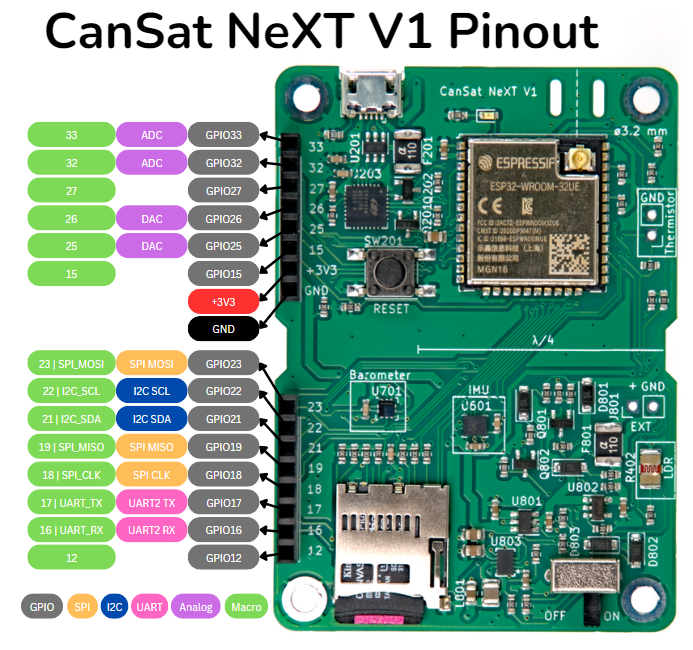

# Pinouts

Denna artikel visar pinnamnen som används av processorn i CanSat NeXT, samt visar vilka pinnar du kan använda för att utöka ditt projekt.

# Pinout

Bilden nedan visar pinnarna för att använda förlängningshuvudet för att lägga till extern elektronik till kortet.

Här är den fullständiga listan över pinnar som används av CanSat NeXT-kortet. Den interna användningen avser att pinnen används för de inbyggda resurserna, och förlängning avser att pinnarna har dirigerats till förlängningsgränssnittet. Vissa pinnar, de för I2C och SPI, används både internt och externt. Biblioteksnamnet avser ett makronamn, som kan användas istället för pinnumret när CanSatNeXT-biblioteket har inkluderats.

| Pinnummer | Biblioteksnamn | Notering                                                | Intern/Extern       |
|-----------|----------------|---------------------------------------------------------|---------------------|
|          0 | BOOT           |                                                         | Används internt     |
|          1 | USB_UART_TX    | Används för USB                                         | Används internt     |
|          3 | USB_UART_RX    | Används för USB                                         | Används internt     |
|          4 | SD_CS          | SD-kort chip select                                     | Används internt     |
|          5 | LED            | Kan användas för att blinka inbyggd LED                 | Används internt     |
|         12 | GPIO12         |                                                         | Förlängningsgränssnitt |
|         13 | MEAS_EN        | Driv hög för att aktivera LDR och termistor             | Används internt     |
|         14 | GPIO14         | Kan användas för att läsa om SD-kort är på plats        | Används internt     |
|         15 | GPIO15         |                                                         | Förlängningsgränssnitt |
|         16 | GPIO16         | UART2 RX                                                | Förlängningsgränssnitt |
|         17 | GPIO17         | UART2 TX                                                | Förlängningsgränssnitt |
|         18 | SPI_CLK        | Används av SD-kortet, även tillgänglig externt          | Båda                |
|         19 | SPI_MISO       | Används av SD-kortet, även tillgänglig externt          | Båda                |
|         21 | I2C_SDA        | Används av de inbyggda sensorerna, även tillgänglig externt | Båda                |
|         22 | I2C_SCL        | Används av de inbyggda sensorerna, även tillgänglig externt | Båda                |
|         23 | SPI_MOSI       | Används av SD-kortet, även tillgänglig externt          | Båda                |
|         25 | GPIO25         |                                                         | Förlängningsgränssnitt |
|         26 | GPIO26         |                                                         | Förlängningsgränssnitt |
|         27 | GPIO27         |                                                         | Förlängningsgränssnitt |
|         32 | GPIO32         | ADC                                                     | Förlängningsgränssnitt |
|         33 | GPIO33         | ADC                                                     | Förlängningsgränssnitt |
|         34 | LDR            | ADC för den inbyggda LDR                                | Används internt     |
|         35 | NTC            | ADC för termistorn                                      | Används internt     |
|         36 | VDD            | ADC används för att övervaka matningsspänning           | Används internt     |
|         39 | BATT           | ADC används för att övervaka batterispänning            | Används internt     |