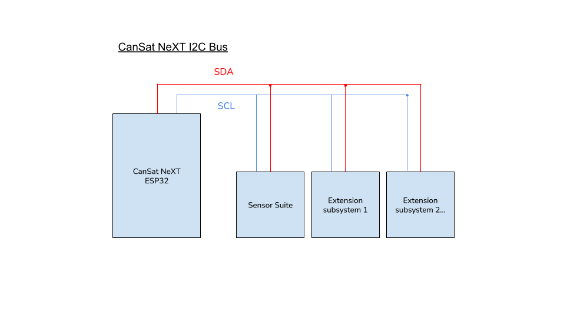

# Förlängningsgränssnitt

Anpassade enheter kan byggas och användas tillsammans med CanSat. Dessa kan användas för att skapa intressanta projekt, som du kan hitta idéer för på vår [Blogg](/blog).

CanSats förlängningsgränssnitt har en fri UART-linje, två ADC-pinnar och 5 fria digitala I/O-pinnar. Dessutom är SPI- och I2C-linjer tillgängliga för förlängningsgränssnittet, även om de delas med SD-kortet respektive sensorsviten.

Användaren kan också välja att använda UART2 och ADC-pinnarna som digitala I/O, om seriell kommunikation eller analog till digital omvandling inte behövs i deras lösning.

| Pinnummer | Pinnamn  | Använd som   | Anmärkningar              |
|-----------|----------|--------------|---------------------------|
| 12        | GPIO12   | Digital I/O  | Fri                       |
| 15        | GPIO15   | Digital I/O  | Fri                       |
| 16        | GPIO16   | UART2 RX     | Fri                       |
| 17        | GPIO17   | UART2 TX     | Fri                       |
| 18        | SPI_CLK  | SPI CLK      | Samanvändning med SD-kort |
| 19        | SPI_MISO | SPI MISO     | Samanvändning med SD-kort |
| 21        | I2C_SDA  | I2C SDA      | Samanvändning med sensorsvit |
| 22        | I2C_SCL  | I2C SCL      | Samanvändning med sensorsvit |
| 23        | SPI_MOSI | SPI MOSI     | Samanvändning med SD-kort |
| 25        | GPIO25   | Digital I/O  | Fri                       |
| 26        | GPIO26   | Digital I/O  | Fri                       |
| 27        | GPIO27   | Digital I/O  | Fri                       |
| 32        | GPIO32   | ADC          | Fri                       |
| 33        | GPIO33   | ADC          | Fri                       |

*Tabell: Förlängningsgränssnittets pin-uppslagstabell. Pinnamn hänvisar till bibliotekets pinnamn.*

# Kommunikationsalternativ

CanSat-biblioteket inkluderar inte kommunikationsomslag för de anpassade enheterna. För UART, I2C och SPI-kommunikation mellan CanSat NeXT och din anpassade nyttolastenhet, hänvisa till Arduinos standard [UART](https://docs.arduino.cc/learn/communication/uart/), [Wire](https://docs.arduino.cc/learn/communication/wire/), och [SPI](https://docs.arduino.cc/learn/communication/spi/) bibliotek, respektive.

## UART

UART2-linjen är ett bra alternativ eftersom den fungerar som ett oallokerat kommunikationsgränssnitt för utökade nyttolaster.

För att skicka data genom UART-linjen, vänligen hänvisa till Arduino 

```
       CanSat NeXT
          ESP32                          Användarens enhet
   +----------------+                 +----------------+
   |                |   TX (Transmit) |                |
   |       TX  o----|---------------->| RX  (Receive)  |
   |                |                 |                |
   |       RX  o<---|<----------------| TX             |
   |                |   GND (Ground)  |                |
   |       GND  o---|-----------------| GND            |
   +----------------+                 +----------------+
```
*Bild: UART-protokoll i ASCII*


## I2C

Användning av I2C stöds, men användaren måste ha i åtanke att ett annat delsystem finns på linjen.

Med flera I2C-slavar måste användarkoden specificera vilken I2C-slav CanSat använder vid en given tidpunkt. Detta särskiljs med en slavadress, som är en unik hexadecimal kod för varje enhet och kan hittas i delsystemenhetens datablad.

## SPI

Användning av SPI stöds också, men användaren måste ha i åtanke att ett annat delsystem finns på linjen.

Med SPI görs slavdistinktionen istället genom att specificera en chip select-pin. Användaren måste dedikera en av de fria GPIO-pinnarna till att vara en chip select för deras anpassade utökade nyttolastenhet. SD-kortets chip select-pin definieras i ``CanSatPins.h`` bibliotekfilen som ``SD_CS``.



*Bild: CanSat NeXT I2C-buss med flera sekundära, eller "slav"-delsystem. I detta sammanhang är sensorsviten ett av slavdelsystemen.*


*Bild: CanSat NeXT SPI-busskonfiguration när två sekundära, eller "slav"-delsystem är närvarande. I detta sammanhang är SD-kortet ett av slavdelsystemen.*