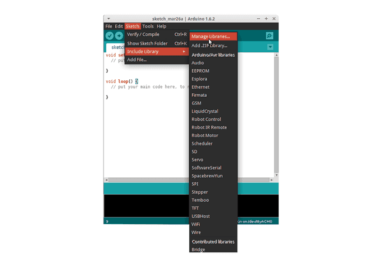

# Lektion 1: Hej Världen!

Denna första lektion hjälper dig att komma igång med CanSat NeXT genom att visa hur du skriver och kör ditt första program på kortet.

Efter denna lektion kommer du att ha de nödvändiga verktygen för att börja utveckla programvara för din CanSat.

## Installera verktygen

CanSat NeXT rekommenderas att användas med Arduino IDE, så låt oss börja med att installera det och de nödvändiga biblioteken och korten.

### Installera Arduino IDE

Om du inte redan har gjort det, ladda ner och installera Arduino IDE från den officiella webbplatsen https://www.arduino.cc/en/software.

### Lägg till ESP32-stöd

CanSat NeXT är baserad på ESP32-mikrokontrollern, som inte ingår i Arduino IDE:s standardinstallation. Om du inte har använt ESP32-mikrokontroller med Arduino tidigare, måste stödet för kortet installeras först. Det kan göras i Arduino IDE från *Tools->board->Board Manager* (eller tryck bara (Ctrl+Shift+B) var som helst). I kortadministratören, sök efter ESP32 och installera esp32 av Espressif.

### Installera Cansat NeXT-biblioteket

CanSat NeXT-biblioteket kan laddas ner från Arduino IDE:s Library Manager från *Sketch > Include Libraries > Manage Libraries*.



*Bildkälla: Arduino Docs, https://docs.arduino.cc/software/ide-v1/tutorials/installing-libraries*

I Library Manager-sökfältet, skriv "CanSatNeXT" och välj "Install". Om IDE:n frågar om du också vill installera beroenden, klicka ja.

## Ansluta till PC

Efter att ha installerat CanSat NeXT-programvarubiblioteket kan du ansluta CanSat NeXT till din dator. Om den inte upptäcks kan du behöva installera de nödvändiga drivrutinerna först. Drivrutinsinstallationen görs automatiskt i de flesta fall, men på vissa datorer måste det göras manuellt. Drivrutiner kan hittas på Silicon Labs webbplats: https://www.silabs.com/developers/usb-to-uart-bridge-vcp-drivers
För ytterligare hjälp med att ställa in ESP32, se följande handledning: https://docs.espressif.com/projects/esp-idf/en/latest/esp32/get-started/establish-serial-connection.html

## Köra ditt första program

Nu, låt oss använda de nyinstallerade biblioteken för att börja köra lite kod på CanSat NeXT. Som tradition, låt oss börja med att blinka LED och skriva "Hello World!" till datorn.

### Välja rätt port

Efter att ha anslutit CanSat NeXT till din dator (och slagit på strömmen) behöver du välja rätt port. Om du inte vet vilken som är rätt, koppla bara ur enheten och se vilken port som försvinner.


Arduino IDE uppmanar dig nu att välja enhetstyp. Välj ESP32 Dev Module.


### Välja ett exempel

CanSat NeXT-biblioteket har flera exempel på koder som visar hur man använder de olika funktionerna på kortet. Du kan hitta dessa exempel från File -> Examples -> CanSat NeXT. Välj "Hello_world".

Efter att ha öppnat det nya sketchen kan du ladda upp det till kortet genom att trycka på uppladdningsknappen.


Efter ett tag bör LED-lampan på kortet börja blinka. Dessutom skickar enheten ett meddelande till datorn. Du kan se detta genom att öppna den seriella monitorn och välja baud rate 115200.

Försök också att trycka på knappen på kortet. Det bör återställa processorn, eller med andra ord, starta om koden från början.

### Hej Världen förklarat

Låt oss se vad som faktiskt händer i denna kod genom att gå igenom den rad för rad. Först börjar koden med att **inkludera** CanSat-biblioteket. Denna rad bör vara i början av nästan alla program skrivna för CanSat NeXT, eftersom den talar om för kompilatorn att vi vill använda funktionerna från CanSat NeXT-biblioteket.

```Cpp title="Include CanSat NeXT"
#include "CanSatNeXT.h"
```
Efter detta hoppar koden till setup-funktionen. Där har vi två anrop - först är serial gränssnittet som vi använder för att skicka meddelanden till datorn via USB. Numret inuti funktionsanropet, 115200, hänvisar till baud-rate, dvs. hur många ettor och nollor som skickas varje sekund. Nästa anrop, `CanSatInit()`, är från CanSat NeXT-biblioteket och det initierar alla ombord sensorer och andra funktioner. Likt `#include`-kommandot, finns detta vanligtvis i skisser för CanSat NeXT. Allt du vill köra bara en gång vid start bör inkluderas i setup-funktionen.

```Cpp title="Setup"
void setup() {
  // Starta den seriella linjen för att skriva ut data till terminalen
  Serial.begin(115200);
  // Starta alla CanSatNeXT ombord-system.
  CanSatInit();
}
```

Efter setup börjar koden upprepa loop-funktionen oändligt. Först skriver programmet utgångspinnen LED till hög, dvs. har en spänning på 3,3 volt. Detta tänder den ombord LED. Efter 100 millisekunder återställs spänningen på den utgångspinnen till noll. Nu väntar programmet i 400 ms och skickar sedan ett meddelande till datorn. Efter att meddelandet har skickats börjar loop-funktionen igen från början.

```Cpp title="Loop"
void loop() {
  // Låt oss blinka LED
  digitalWrite(LED, HIGH);
  delay(100);
  digitalWrite(LED, LOW);
  delay(400);
  Serial.println("Detta är ett meddelande!");
}
```

Du kan också försöka ändra fördröjningsvärdena eller meddelandet för att se vad som händer. Grattis till att ha kommit så här långt! Att ställa in verktygen kan vara knepigt, men det borde bli roligare från och med nu.

---

I nästa lektion kommer vi att börja läsa data från de ombord sensorerna.

[Klicka här för den andra lektionen!](./lesson2)